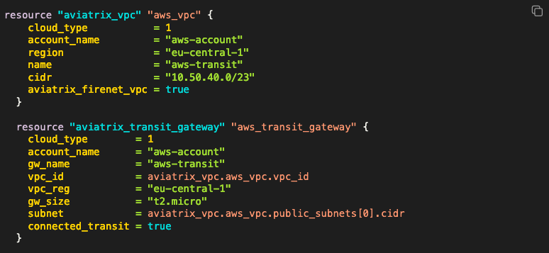

# avxlabs-docs

Repository for lab guides for avxlabs-hosted classes including ACE, Flightschool, and Build workshops. These guides are written in [markdown](https://www.markdownguide.org/) and formatted in [jupyter{book}](https://jupyterbook.org/en/stable/intro.html). `Jupyter{book}` runs with a modified version of markdown called [MyST](https://jupyterbook.org/en/stable/content/myst.html) - markdown with added features.

[MyST Cheatsheet](https://jupyterbook.org/en/stable/reference/cheatsheet.html)

## Prerequisites

- Python >= 3.10
- pip3 install -r requirements.txt

## Folder structure

- **docs** - published guide contents in subfolders (subfolder is the navigation uri for each guide).
- **docs/_logos** - shared images across all lab guides.
- **images** - images for the readme
- The rest of the folders contain the raw markdown content for each guide

## Url

Guides are hosted at: https://docs.aviatrixlab.com/[guide-name]

## Building a new lab guide

1. Clone this repository:

```bash
git clone https://github.com/AviatrixSystems/avxlabs-docs.git
```

2. Create a new branch for your work.

```bash
git checkout -b new_branch_name
```

3. Create a new folder for the new guide using the naming convention `[ace || flightschool || build]_[version]`. Example: `ace_associate`
4. Create a folder call `docs` inside your new folder. This will be the location for your markdown files. Create as many or few files as needed. Each file will be a new section in the table of contents (toc).
5. Copy the `_config.yml` and `_toc.yml` files from an existing lab guide folder and edit the files appropriately. The `toc.yml` file has references to your markdown files (without the `.md` extension) located in the `[your_folder]/docs` directory.
6. When satisfied with the content created in steps `4` adn `5`, run the following command to build your content in the `jupyter` format. At the end of the command, there will be a link to view your content in a browser.

```bash
jb build [your_folder]/
...
...
...
===================================================

Finished generating HTML for book.
Your book's HTML pages are here:
    your_folder/_build/html/
You can look at your book by opening this file in a browser:
    your_folder/_build/html/index.html
Or paste this line directly into your browser bar:
    file:///Users/your_user/Aviatrix/avxlabs-docs/your_folder/_build/html/index.html

===================================================
```

7. Copy the contents of `your_folder/_build/html/` to the root `docs` folder (not the one inside your folder) in a new folder called `your-folder`. Example: if your working directory is `./ace_associate`, your publish directory would be `./docs/ace-associate`.

```bash
cp -rf ./ace_associate/_build/html/ docs/ace-associate
```

8. Commit your changes locally (to the local copy of the repository branch)

```bash
git add .
git commit -m "meaningful message that describes the changes in this commit"
```

9. Push your changes to the remote repository (push to origin)

```bash
git push
```

10. Create a [PR](https://docs.github.com/en/pull-requests/collaborating-with-pull-requests/proposing-changes-to-your-work-with-pull-requests/creating-a-pull-request) to have the new guide published.

## Useful code examples

### Link to a file for download

Add this code to your markdown file, adjusting the text as needed. The icon and highlighted text are clickable:

```markdown
Click this link to {Download}`the sample pdf<files/sample.pdf>`.
```

#### Example


### Code block with syntax highlighting (and copy button)

Add this to the top of your md file, adjusting the language as necessary:

```markdown
---
jupytext:
  formats: md:myst
  text_representation:
    extension: .md
    format_name: myst
kernelspec:
  display_name: Terraform
  language: terraform
  name: terraform
---
```

Then, create your code-cell block:

```terraform

```{code-cell} terraform
resource "aviatrix_vpc" "aws_vpc" {
    cloud_type           = 1
    account_name         = "aws-account"
    region               = "eu-central-1"
    name                 = "aws-transit"
    cidr                 = "10.50.40.0/23"
    aviatrix_firenet_vpc = true
  }

  resource "aviatrix_transit_gateway" "aws_transit_gateway" {
    cloud_type        = 1
    account_name      = "aws-account"
    gw_name           = "aws-transit"
    vpc_id            = aviatrix_vpc.aws_vpc.vpc_id
    vpc_reg           = "eu-central-1"
    gw_size           = "t2.micro"
    subnet            = aviatrix_vpc.aws_vpc.public_subnets[0].cidr
    connected_transit = true
  }
```

#### Example



## Cleanup

You can iterate and rebuild your content with the following command:

```bash
jb clean --all [your_folder]/
```
