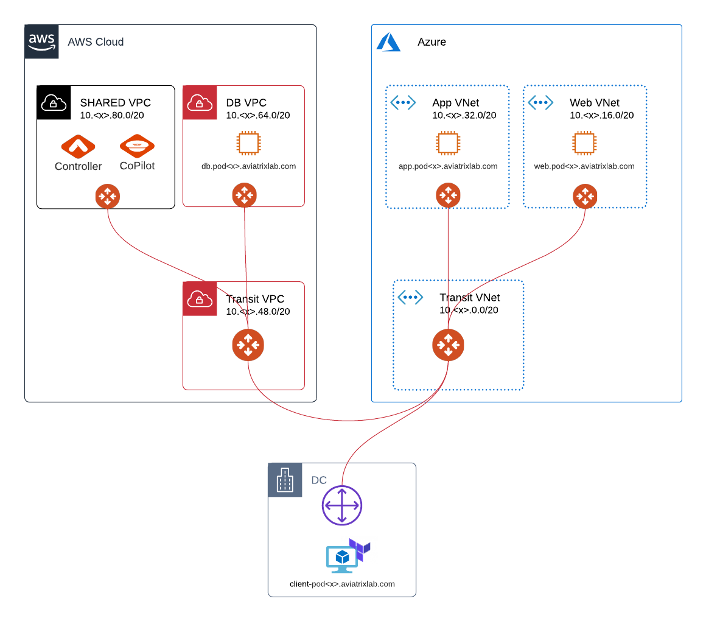

# Summary  

**Congratulations!!!**  In these short labs, you managed to:

* Build network connectivity within Azure
* Build network connectivity within AWS
* Build network connectivity between AWS and Azure
* Visualize application traffic
* Remediate application traffic issues

  
_Fig. Lab Complete_  

And the best part is that we did not have to touch a single Route Table entry! The secret to this simplicity is to have a central and abstracted Control and Management Plane with a robust Transit Layer, which enables you to easily build everything else on top of that.

