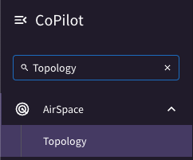
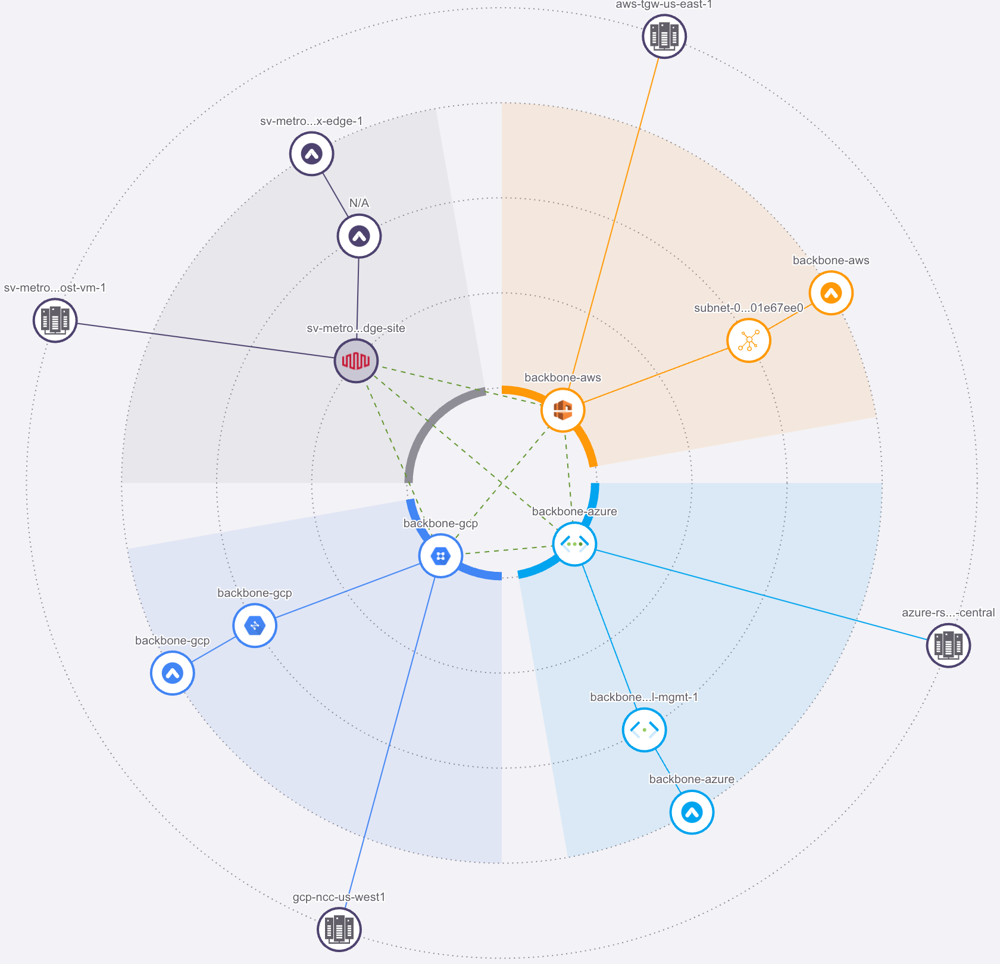
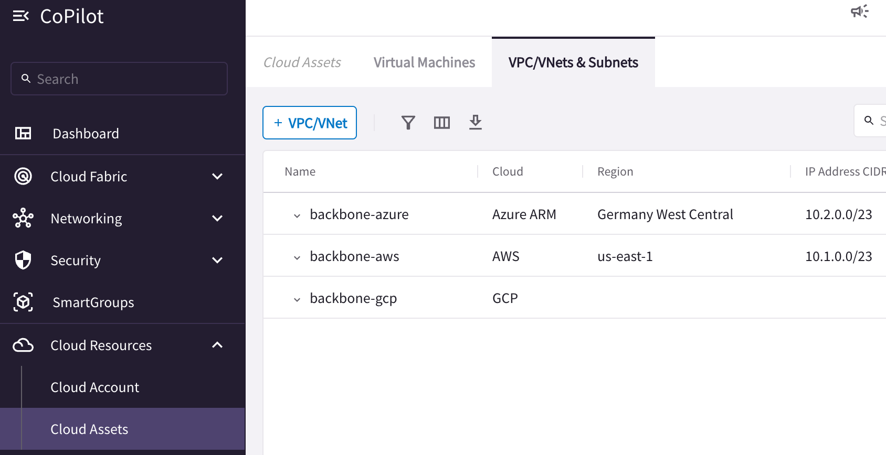
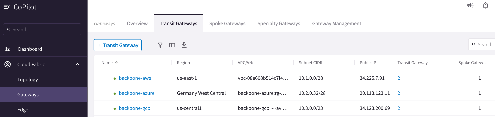
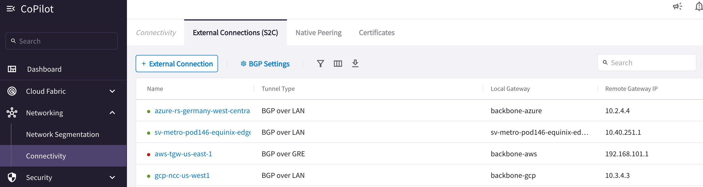
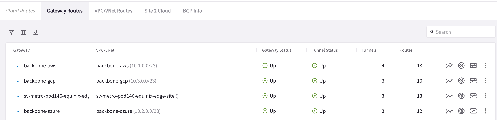
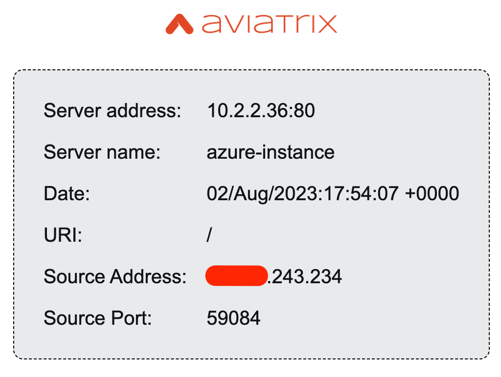
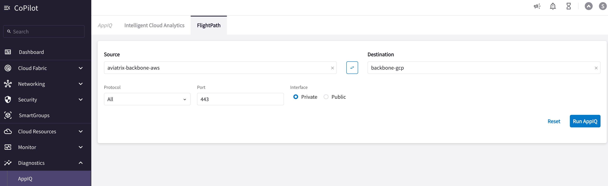
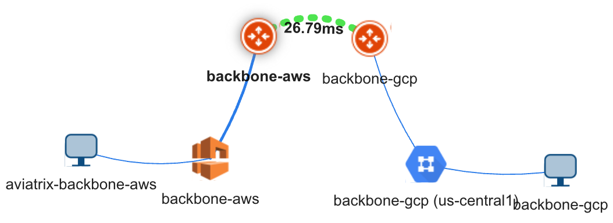

# Lab - Cloud Backbone and Hybrid Connectivity

Lab time: ~45 minutes

## 1 - Initial Topology

This is a current topology of a multicloud enterprise that has Data Center in US-East-1 and utilizes Equinix fabric as a Co-location facility in US-West-1 and EU region.

MPLS is heavily used for any East-West traffic between these regions across multicloud environment.

_Figure 1: Initial Topology_

### 1.1 - Quick Knowledge Quiz

Q. which native cloud services providers resources are used to onboard on-premise resources?

AWS -

Azure -

GCP -

## 2 - Dynamic Topology

Please login to Aviatrix Copilot and navigate to topology page by leveraging search bar as shown below.

 
_Figure 2: Using the Search Bar_

The following topology will appear on your Copilot

_Figure 3: Cloud Backbone & Hybrid Connectivity Topology_

### 2.1 - Quick Knowledge Quiz

Q2. Where is the Aviatrix Edge deployed?

Q3. To which Aviatrix cloud resources Aviatrix Edge is associated with?

## 3 - Networking & Security Infrastructure

### 3.1 - Transit VPC/VNET/VCN

Let's verify:

Cloud Resources --> Cloud Assets --> VPC/VNets Subnets
  

_Figure 4: Cloud Backbone Transit VPC/VNET/VCN_

 

### 3.2 - Transit Gateways

Let's verify Aviatrix Transit Gateways and their peerings.

Cloud Fabric --> Gateways --> Transit Gateways

_Figure 5: Transit Gateways_
  

Verify Transit peerings (screenshot not provided)
  

### 3.3 Connectivity between Aviatrix Cloud Backbone & Native CSP Constructs

Verify connectivity between Aviatrix Cloud Backbone and native CSP constructs.

Networking --> Connectivity --> External Connections (S2C)

You will notice different tunnel types due to CSP limitations.

_Figure 6: Connectivity with Native CSP Constructs_

### 3.4 - Quick Knowledge Quiz

Q4. How AWS, Azure and GCP transits are peered with each other?

Q5. Was Aviatrix Cloud Backbone established using Standard or High Performance Encryption?
  

## 4 - Traffic Routing

Navigate to the Cloud Routes menu within Copilot by leveraging the search bar as shown below.

 
_Figure 7: Search Bar - Cloud Routes_

The following screen will appear:

_Figure 8: Cloud Routes_

Verify Backbone components are receiving the routes across Multicloud environment including Equinix.

### 4.1 - Quick Knowledge Quiz

Q6. What routes GCP Transit GW is receiving from the Equinix Fabric?

 

## 5 - Data Plane Verification

Since this is a brownfield environment where this customer just stared using  Aviatrix Cloud Backbone for East-West communication and don't have Aviatrix Spoke Gateways in any application VPC/VNET/VCN, you won't be able to find the application ec2/VM on the dynamic topology map. To find the application ec2/VM public IP go to:

Cloud Assets --> Virtual Machines  

_Figure 9: Virtual Machines_

 

SSH from your laptop to AWS ec2 instance using terminal:

ssh student@aws.pod#.aviatrixlab.com

NOTE: pod# and password will be provided at the time of lab.

Ping GCP VM's private IP from the AWS instance to test the backbone:

_Figure 10: Ping Verification_

Access all the application instances/VMs using your laptop's browser using the following links:

http://aws.pod#.aviatrixlab.com/

http://azure.pod#.aviatrixlab.com/

http://gcp.pod#.aviatrixlab.com/

_Figure 11: Browser Verification_

## 6 - Troubleshooting

### 6.1 - Available Paths

Verify how many paths are available for an application to communicate between AWS and GCP, which one is the best path and why?

#### 6.1.1 Visually from the dynamic topology map  

Path1 -  
Path2 -  
Path3 -

#### 6.1.2 Diagnostics --> AppIQ --> FlightPath

_Figure 12: AppIQ_

    

_Figure 13: FlightPath_

#### 6.1.3 Latency Monitor

Monitor --> Traffic & Latencies -->Gateways

_Figure 14: Latency Monitor_

## 7 - Conclusion

In this lab, we have successfully verified and troubleshooted Aviatrix Cloud Backbone and hybrid connectivity including Equinix colocation.
