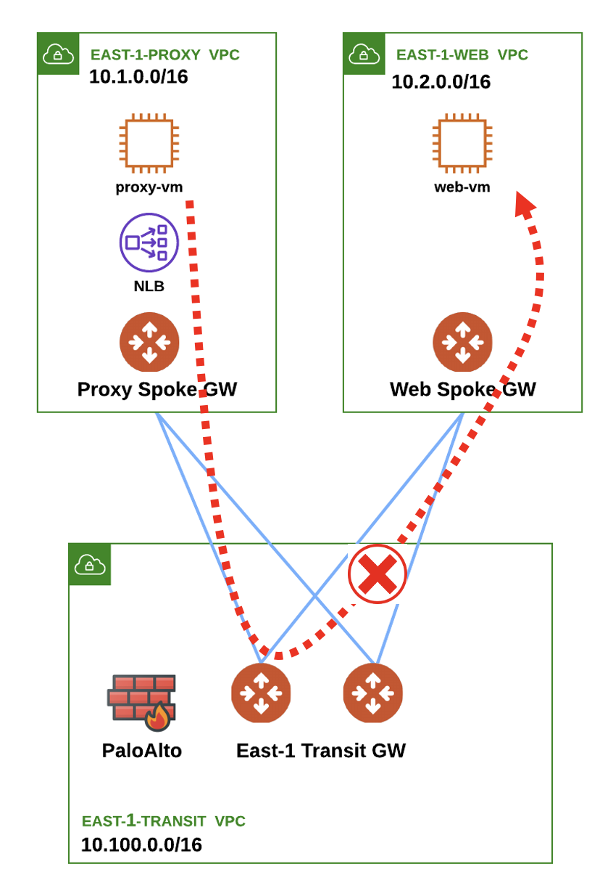

# Challenge 2 - Proxy VM to Web VM

## Scenario

You have received some indications that the problem is now between the Proxy VM and the Web VM.

_Figure 6: Proxy to Web Failure_

Use Copilot to figure out the IP addresses of both virtual machines.

* Can you try to ping the Web VM from the Proxy Spoke GW?

**HINT**: Go to **CoPilot > Diagnostics > Diagnostics Tools**  and select the Proxy Spoke GW and this time launch a *traceroute* towards the Web VM.

By the end of this challenge you need to ensure that traffic is flowing from the Proxy VM to the Web VM.