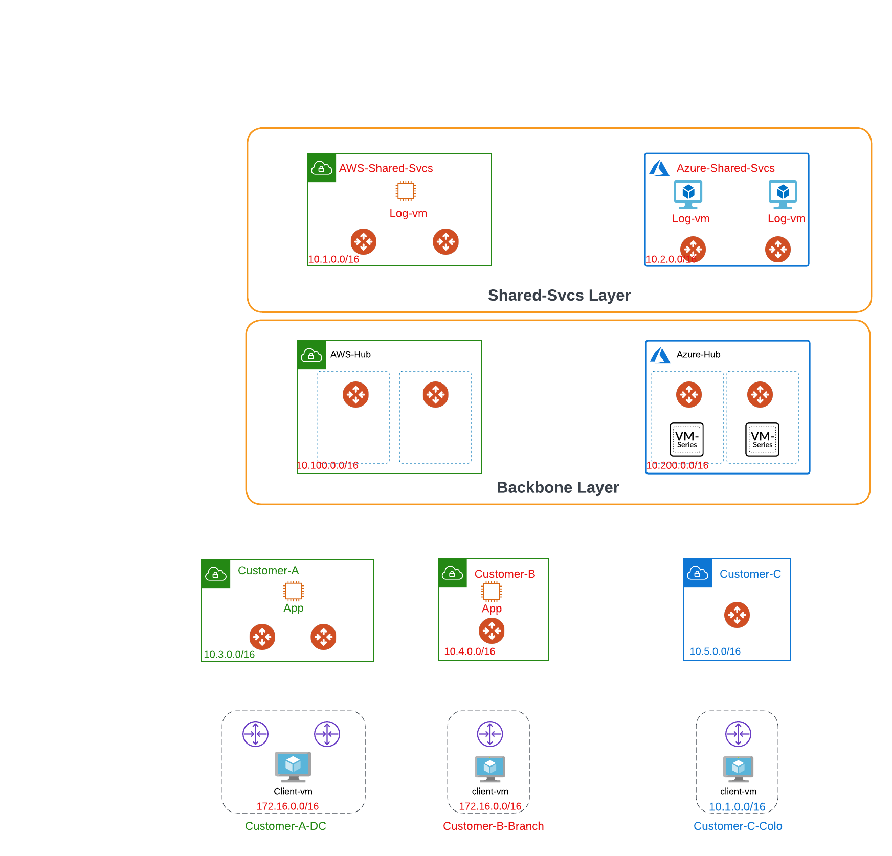
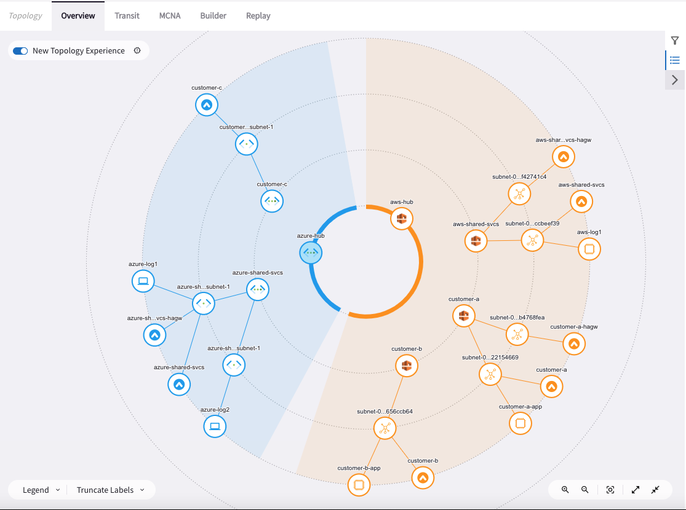
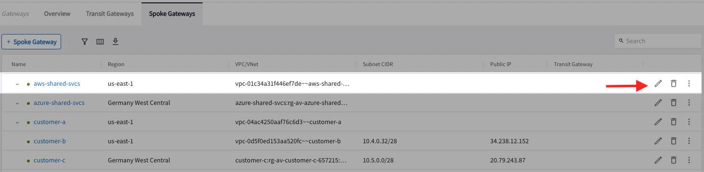
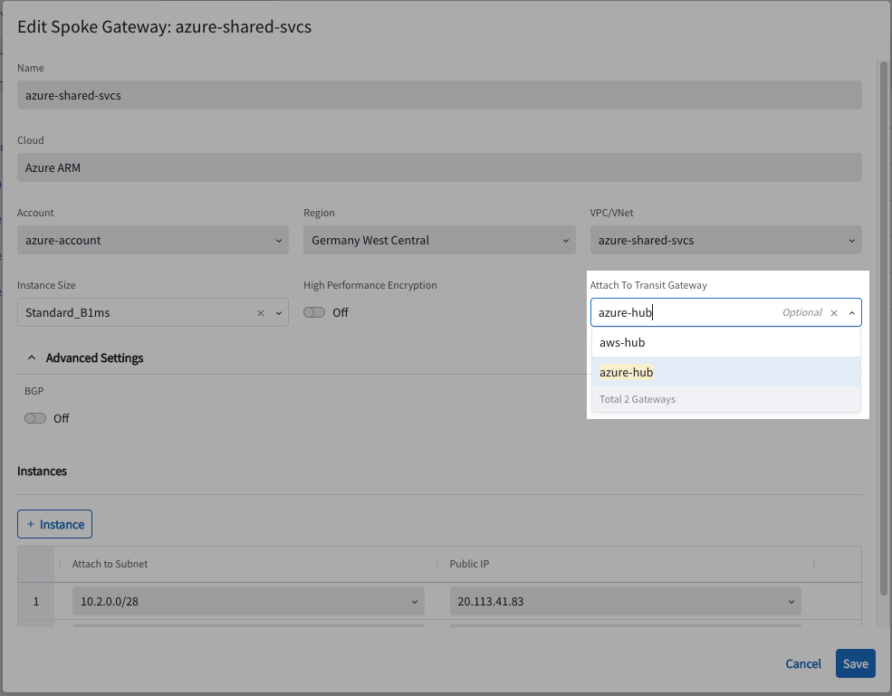
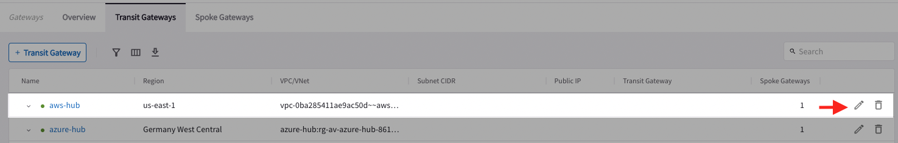
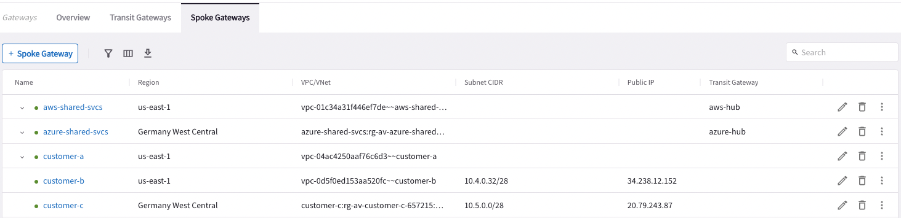
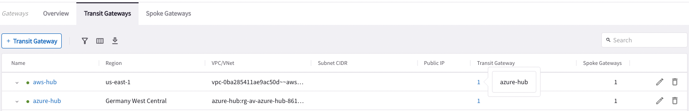
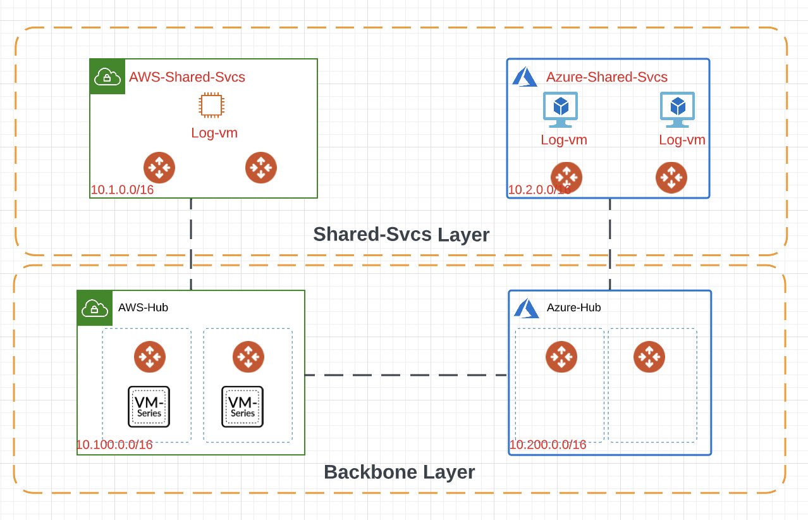
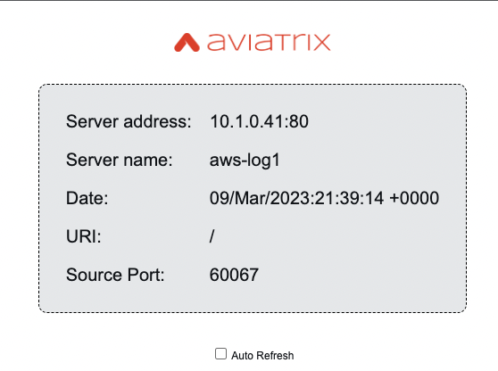

# Lab 1 Build the MSP Backbone

## 1.0 - What's in the lab?

Lab time: ~45 minutes

This is an advanced scenario for Managed Service Providers (msps) that goes through onboarding Tenants, connecting to their respective locations, overlapping addresses and much more.

The initial lab topology can be found below and consists of:

- Shared Services spread across AWS & Azure with their respective Spoke Gateways
- Backbone layer spread across AWS & Azure. The PAN FWs have already been pre-built in AWS. In a subsequent lab, you will be building the same within Azure.
- 3 Separate Tenants (customers-a, b and c). Customers in tandem with the MSPs can host their applications and services within their dedicated & isolated space. Though we represent each customer with a single VPC, in reality the same design can scale to cater multiple VPCs, Regions, and Accounts. 
- Customer Locations: These represent locations outside the Public Cloud(s) that need connectivity to the applications and services within the Public Cloud(s)
- There are workloads spread across the topology running an NGINX server & proxy which will be used to test end to end connectivity.

_Figure 1: Lab Overview_

## 1.1 - Initial Topology

Let's visit our topology page within Copilot by leveraging the Search bar as shown below.

_Figure 2: Using the Search Bar_

_Figure 3: Initial Topology_

## 1.2 - Build the MSP Backbone
Having looked at the initial overall topology we will focusing on the Backbone area for this lab. The initial status of the backbone area is as shown here.

_Figure 4: Backbone Area Initial Status_

### 1.2.1 - Connect AWS Shared Svcs to AWS Hub

Navigate to the Gateways menu within Copilot by leveraging the search bar as shown below. 

_Figure 5: Search Bar to Reach Gateways_

_Figure 6: Select aws-shared-svcs Gateways_

_Figure 7: Attach aws-shared-svcs to aws-hub transit gateway_

### 1.2.2 - Connect Azure Shared Svcs to Azure Hub

_Figure 8: Select aws-shared-svcs Gateways_

_Figure 9: Attach azure-shared-svcs to azure-hub transit gateway_

## 1.2.3 - Configure Transit Peering between AWS & Azure

_Figure 10: Select AWS Hub Transit_

_Figure 11: Configure Peering with Azure Hub Transit_

##  1.3 - Verification of Attachments & Peerings

_Figure 12: Spoke to Transit Attachment Verification_

_Figure 13: AWS & Azure Hub Peering Verification_

_Figure 14: Topology Verification_

_Figure 15: Current State of the Topology_

## 1.4 Data Plane Verification

_Figure 16: Find Instance IP Address_

_Figure 17: Ping Verification_

_Figure 18: Access aws-log1 Application_

_Figure 19: Verification Leveraging NGINX Proxy_

##  1.5 - Conclusion
In this lab, we have built our MSP backbone layer and ensured end to end connectivity across the MSP. 
