# Lab 4 Site2Cloud

## 4.0 - What's in the lab?

The MSP has done major strides in terms of setting up the backbone, segmenting its Customer Infrastructure, as well as deploying NG FWs.

Other teams within the MSP have been busy working with the 3 Customers to setup minimal infrastructure and applications. We have just received an official request from Customers A and B to connect their on-premise locations to their respective landing zones.

## 4.1 - Current Topology

This is the current state of the topology.

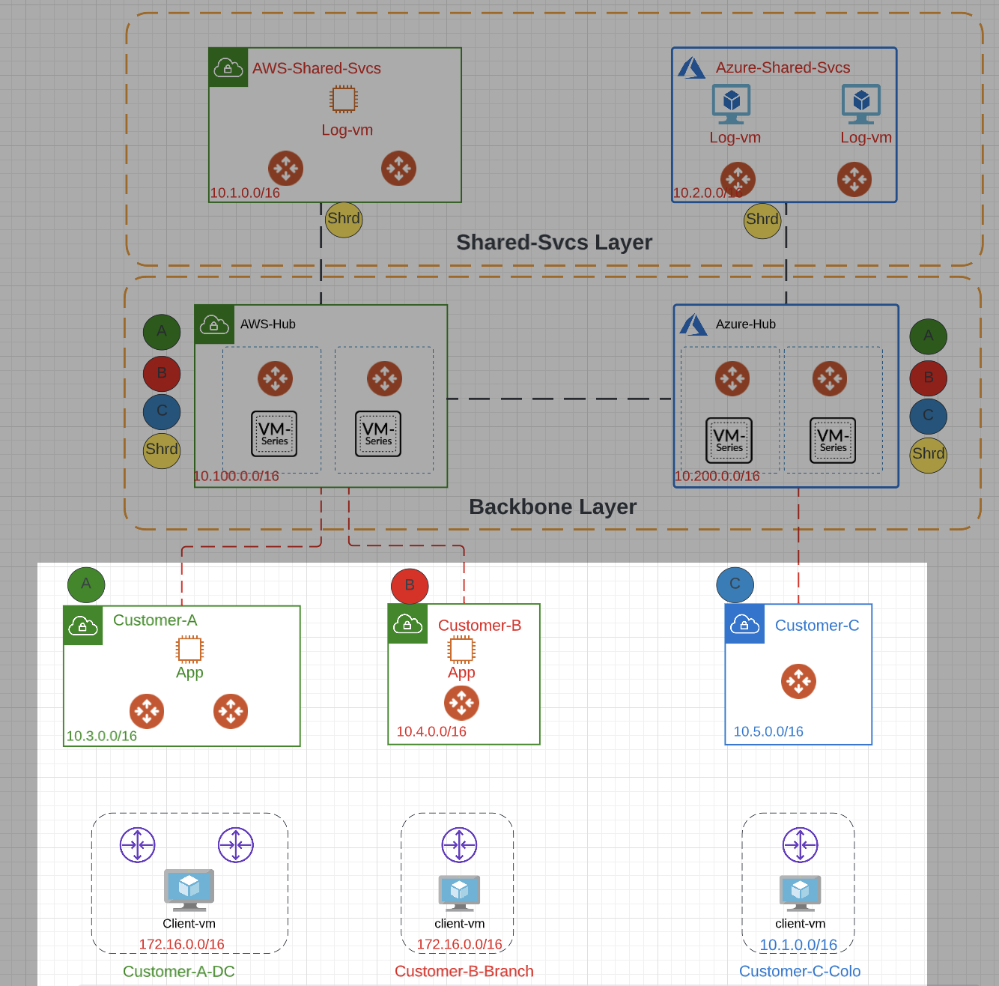_Figure 1: Current State of the Topology_

## 4.2 - Connect Customer-A-DC to Customer-A Landing Zone

### 4.2.1  - Configure the S2C Tunnel to CSR1

In this section, we will be connecting Customer-A DC Location to the Customer-A landing zone within our MSP.

We will be configuring full mesh connectivity between the 2 Aviatrix Spoke Gateways within our Customer-A Landing Zone and the 2 on-prem CSRs.

This will be configured in 2 main steps:

1. Tunnels (1 & 2) from both Aviatrix Spoke Gateways towards CSR 1
2. Tunnels (3 & 4) from both Aviatrix Spoke Gateways towards CSR 2

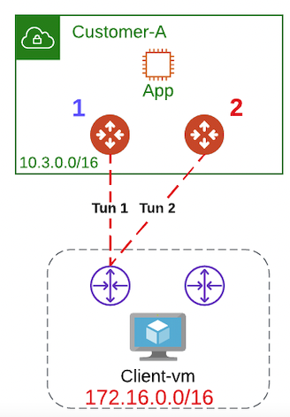
_Figure 2: S2C Tunnel towards CSR 1 Explained_

Please follow the below steps to configure the S2C tunnel towards CSR 1.

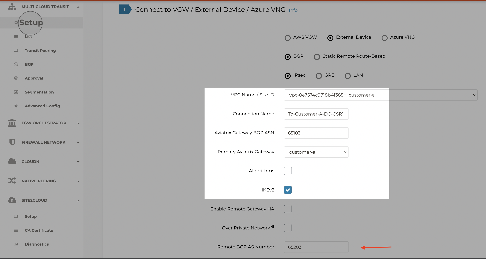
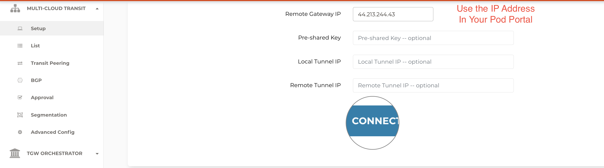_Figure 3: S2C to Customer A CSR 1_

Now we have configured the S2C tunnel from Aviatrix side. Aviatrix takes another step in simplifying S2C tunnel creation by providing the configuration of common on-prem network devices.

You can follow the below procedure to get the template for the CSR configuration.

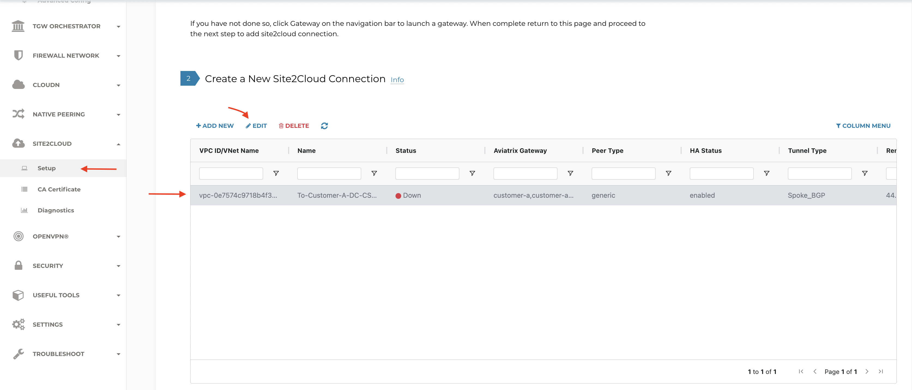

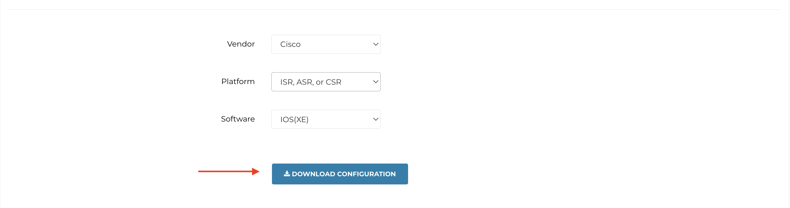_Figure 4: Download Configuration of CSR Router_

Make the following highlighted changes to the downloaded CSR configuration template.

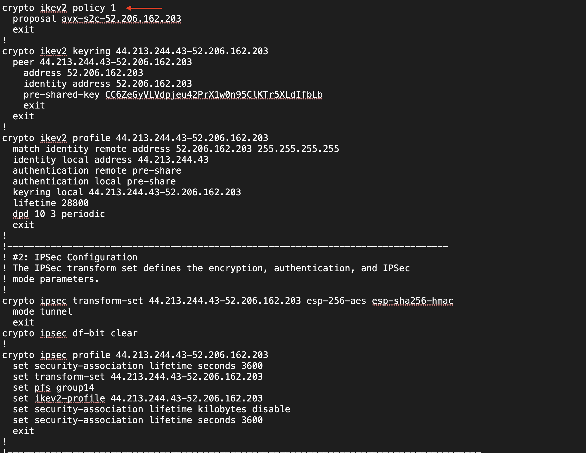
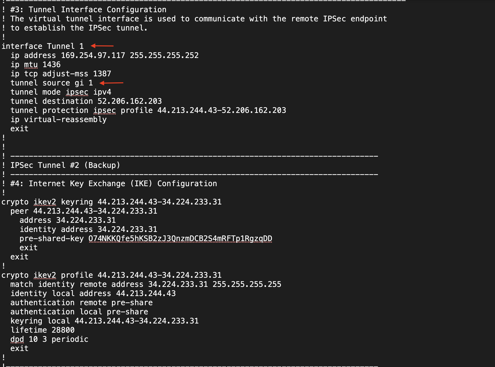
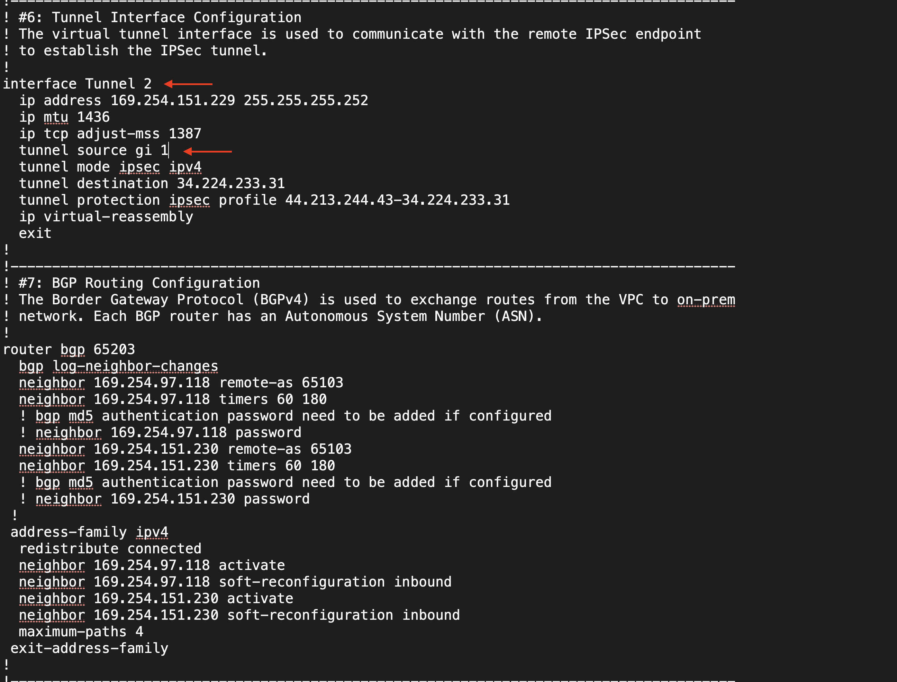
_Figure 5: CSR1 Edit Configuration_
#### 4.2.1.1  - Additional Configuration

Add the below configuration on CSR1
```
conf t
interface GigabitEthernet2
 ip address dhcp
 no shutdown
 negotiation auto
 no mop enabled
 no mop sysid
end
```

#### 4.2.1.2  - Validate IPSec/BGP From CSR1 Perspective

In this section, we validate the state of the BGP session between CSR1 and the 2 Spoke Gateways.

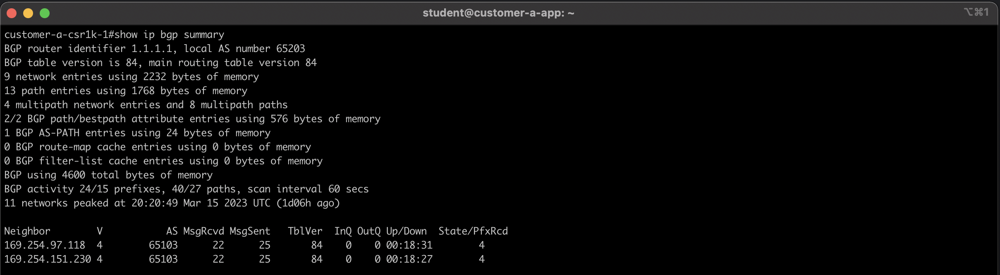
_Figure 6: show ip bgp summary_

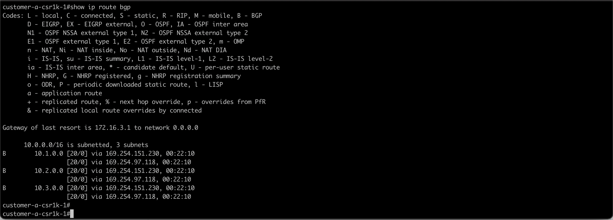
_Figure 7: show ip route bgp_

For the show ip bgp neighbor advertised routes make sure you reference your neighbor which you found in the show ip bgp summary output.

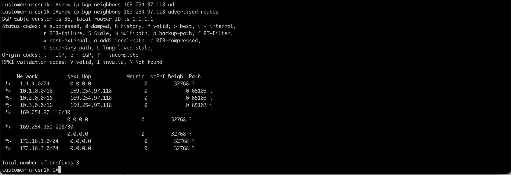
_Figure 8: show ip bgp neighbor advertised routes_


#### 4.2.1.3  - Validate IPSec/BGP from Copilot

In this section, we validate the state of the IPSec/BGP session between CSR1 and the 2 Spoke Gateways leveraging Copilot.

Use the search bar within Copilot to navigate to Cloud Routes and then go to the Site2Cloud tab.

Here we can see that the state of 2 Tunnels from customer-a and customer-a-hagw are both up to CSR1.


_Figure 9: Copilot S2C Status_

The below diagram shows the state of the BGP session.


_Figure 10: Copilot BGP Established_

You can also see the Learned Routes via BGP here.


_Figure 11: Copilot BGP Learned Routes_

### 4.2.2  - Configure the S2C Tunnel to CSR2

In this section, we repeat the same procedure we have done in 4.2.1 to configure the Site2Cloud tunnels from Customer-A landing zones to CSR2 in the Data Center. This is depicted in Figure


_Figure 12: S2C Tunnel towards CSR 1 Explained_

Please follow the below steps to configure the S2C tunnel towards CSR 2.

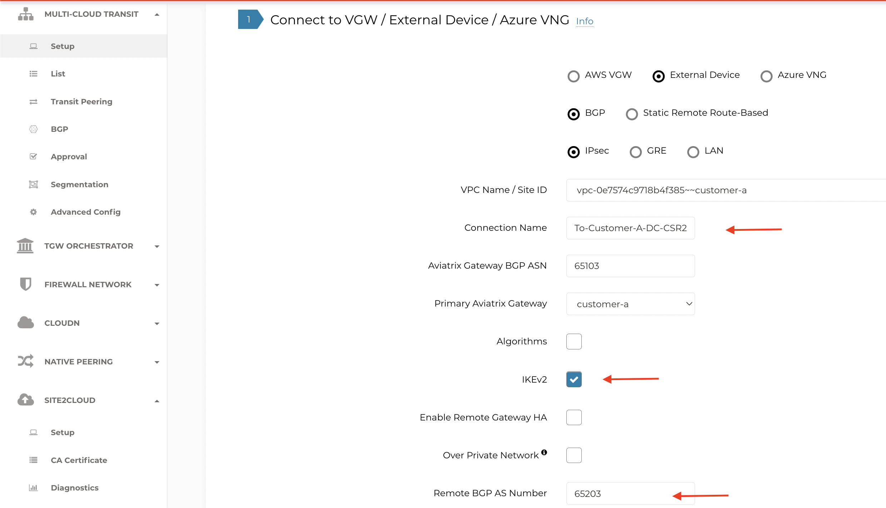 

_Figure 13: S2C to Customer A CSR 1_
Now we have configured the S2C tunnel from Aviatrix side. Aviatrix takes another step in simplifying S2C tunnel creation by providing the configuration of common on-prem network devices.

You can follow the below procedure to get the template for the CSR configuration.


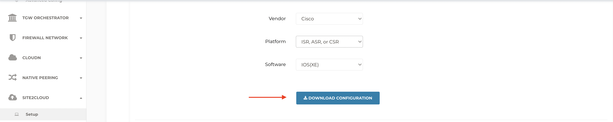
_Figure 14: Download Configuration of CSR Router_

Make the following highlighted changes to the downloaded CSR configuration template.


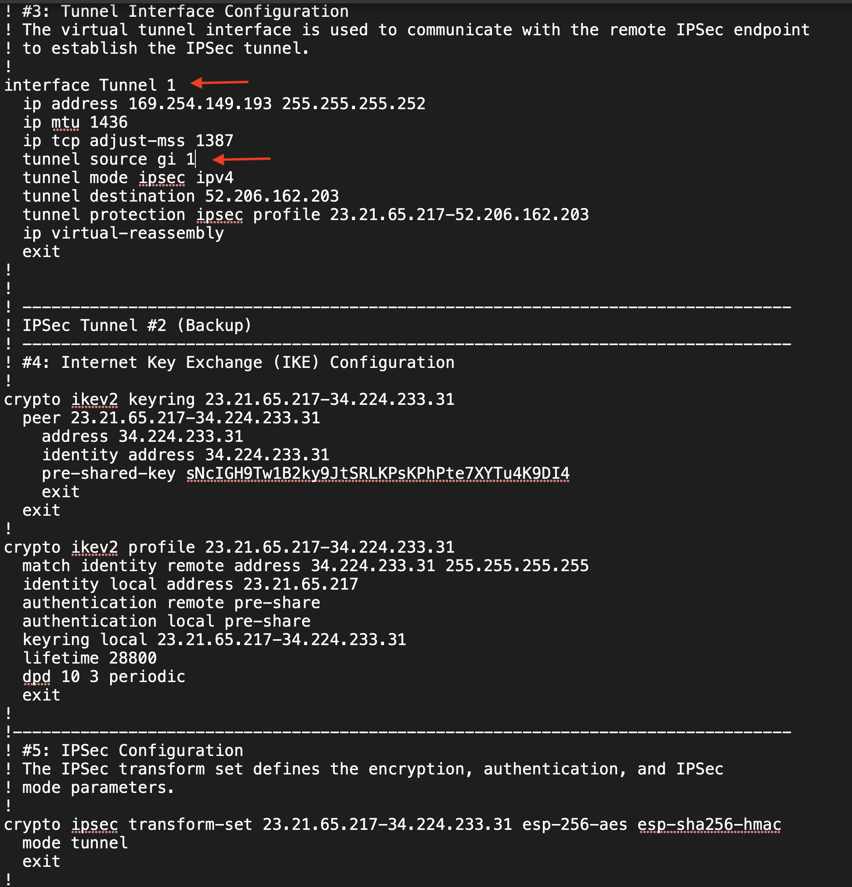

_Figure 15: CSR2 Edit Configuration_

In terms of the verification, follow the same steps available in sections 4.2.1.1 and 4.2.1.2 to ensure that IPSec/BGP are up with CSR2.

#### 4.2.2.1  - Additional Configuration

Add the below configuration on Customer-A CSR2
```
conf t
interface GigabitEthernet2
 ip address dhcp
 no shutdown
 negotiation auto
 no mop enabled
 no mop sysid
end
```

## 4.2.3 - Connectivity Test

This is a brief section where we ensure that data plane connectivity tests succeed.

Here we ping the application residing within Customer's A landing zone from customer A client in the DC.We also leverage the NGINX proxy for the same purpose.


_Figure 16: Ping Customer-a-client to Customer-a-App_


_Figure 17: Proxy Customer-a-client to Customer-a-App_

Here we ping the application (aws_log1) residing within the MSP's shared services from customer A client in the DC.We also leverage the NGINX proxy for the same purpose.

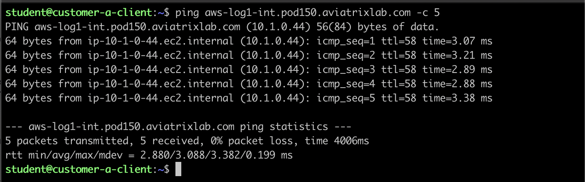
_Figure 18: Ping Customer-a-client to aws-log1_


_Figure 19: Proxy Customer-a-client to aws-log1_

## 4.3 - Connect Customer-B-Branch to Customer-B Landing Zone

The MSP is very happy to have fully onboarded their first customer (customer_a) and connected it to its external location. Now we have to follow the same procedure for Customer-B.

### 4.3.1  - Configure the S2C Tunnel to Customer B CSR

Please follow the below steps to configure the S2C tunnel towards Customer B's CSR.

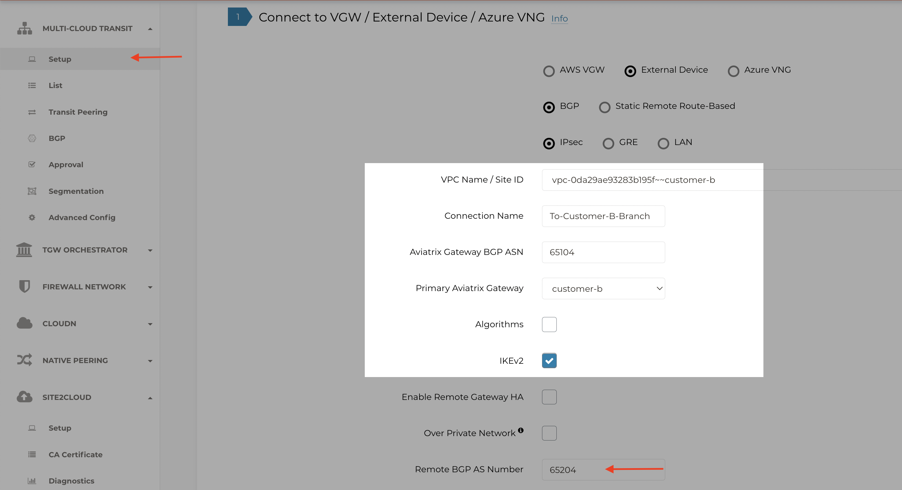
_Figure 20: S2C to Customer B CSR_


You can follow the below procedure to get the template for the CSR B configuration.


_Figure 21: Download Configuration of CSR Router_

Make the following highlighted changes to the downloaded CSR configuration template.


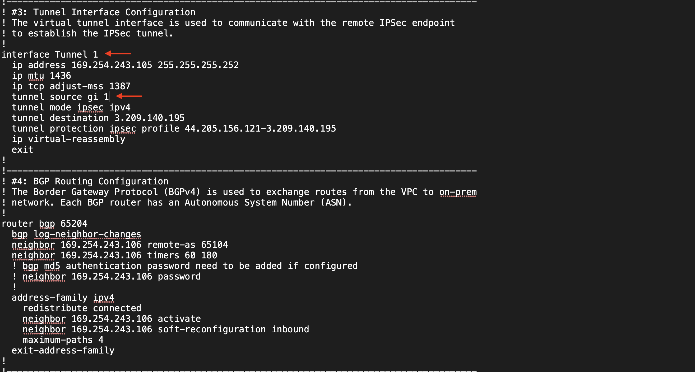
_Figure 21: CSR Edit Configuration_


In terms of the verification, you can follow the same steps available in sections 4.2.1.1 and 4.2.1.2.

#### 4.3.2.1  - Additional Configuration

Add the below configuration on Customer-B CSR
```
conf t
interface GigabitEthernet2
 ip address dhcp
 no shutdown
 negotiation auto
 no mop enabled
 no mop sysid
end
```
## 4.3.2 - Connectivity Test

Here we ping the application residing within Customer B landing zone from customer B client in the branch.We also leverage the NGINX proxy for the same purpose. This test should fail at this point in time.

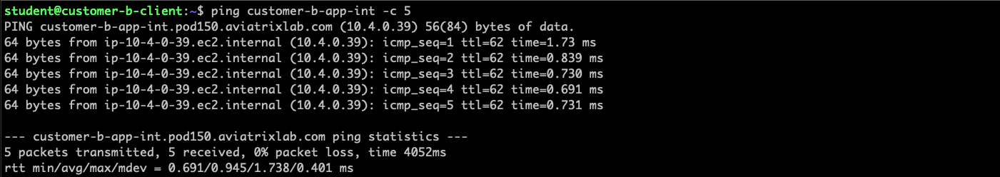
_Figure 22: Ping Customer-b-client to Customer-b-App_


_Figure 23: Proxy Customer-a-client to Customer-a-App_


Here we leverage the NGINX proxy to test the connectivity from customer-b-client to AWS-Log1. This test may or may not succeed in your lab. The instructor will provide more details on the problem and we will be solving it in the subsequent lab.


_Figure 24: Proxy Customer-a-client to aws-log1_

## 4.4 - Conclusion

In this lab we learned all the intricacies of how to configure a S2C connection to any external location in terms of the configuratio options from Aviatrix's side, downloading and editing the on-prem configuration files and validating the connectivity at the IPSec/BGP levels.
