# Lab 5 Advanced NAT Scenarios

## 5.0 - What's in the lab?

If you recall in Lab#4 we had an issue where there was no proper connectivity from either the client in Customer-A or B to the shared service application (aws_log1). We will commence lab 5 by solving this issue.

In addition, we will be connecting our last and final customer (customer_c) to the cloud. Finally, we will look at how to solve an advanced scenario with overlapping addresses.

## 5.1 - Current Topology

The below diagram explains the problem. If you look at the CIDR ranges of Customer-A-DC and Customer-B-Branch you will notice an overlap as both of them use 172.16.0.0/16. This is the reason why one of them will be successful in connecting to the shared service (aws_log1) whereas the other will fail.

In order for us to solve the problem, we will configure a customized NAT on Customer A's spoke gateways as well as customer B.

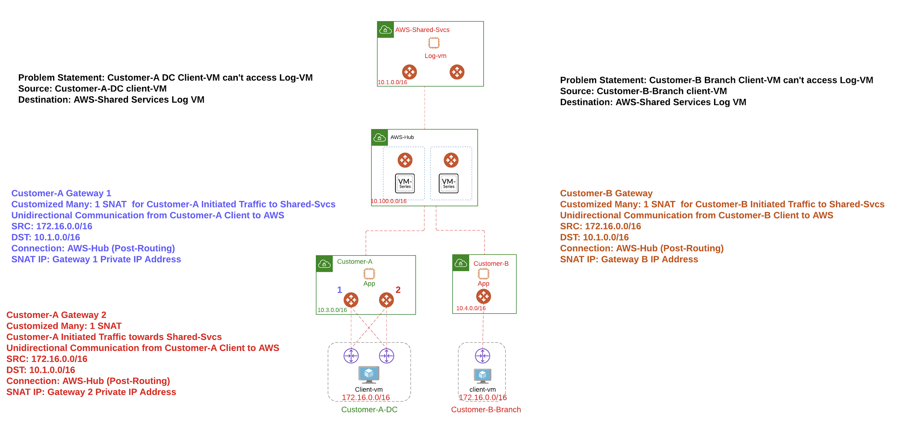_Figure 1: Explaining the Problem & Solution_

## 5.2 - SNAT on Customer A

Figures (2 & 3) show how to get the private address of the Spoke GW of customer-a. The reason we need the IP Address is we will be doing SNAT to this IP Address to resolve the overlapping CIDR problem with Customer-B. Please makes sure to use the IP address from your Pod and not the address on the screenshot.

_Figure 2: Add the Private IP Column_

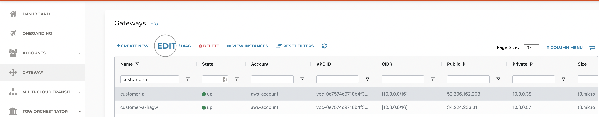_Figure 3: Edit the Gateway Configuration_

Figures (4 _ 7) walk you through configuring the Customized SNAT Rule.

_Figure 4: Configuring SNAT Rule Part 1_

_Figure 5: Configuring SNAT Rule Part 2_

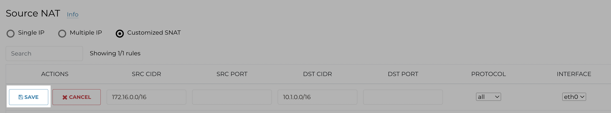_Figure 6: Save the SNAT Rules_

_Figure 7: Update the SNAT Rules_

Follow the same procedure for Customer A hagw.


Figure 8: Edit the HA Gateway Configuration_


_Figure 9: Configuring SNAT Rule Part 1_

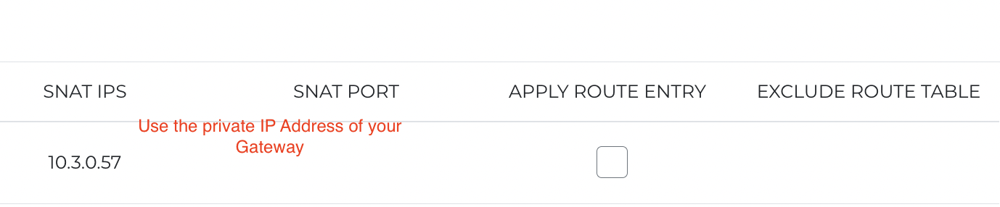_Figure 10: Configuring SNAT Rule Part 2_

Please don't forget to save and update.

Now let us do a Proxy test from customer-a-client towards AWS-Log1 should work. Notice the field Source Address, this should be one of the Spoke Gateway IP addresses.

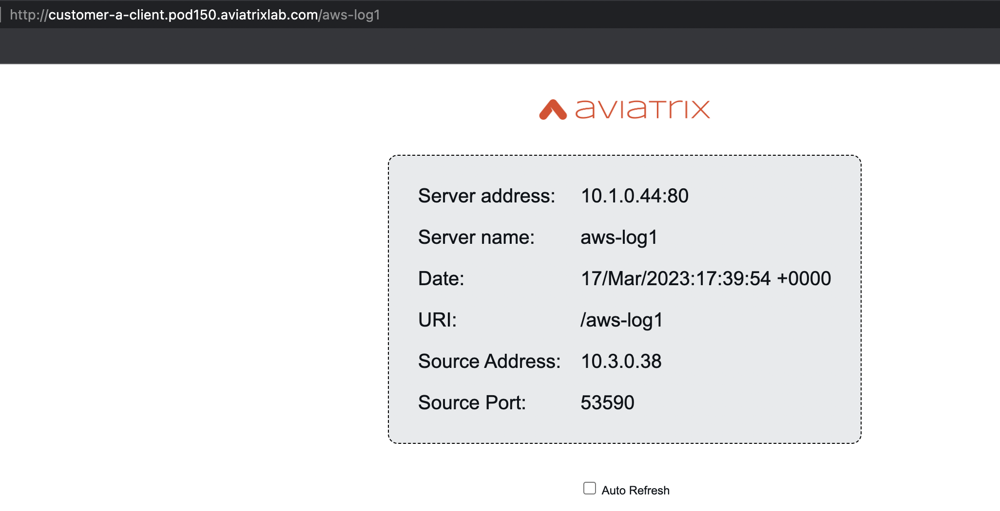_Figure 11: Proxy Customer A Client to AWS-Log1_

## 5.3 - SNAT on Customer B

This will be very similar to how we solved the problem for Customer A. We will select the gateway (customer_b) edit its configuration by configuring the Customized SNAT rule. This is done in Figures 12-14

_Figure 12: Select Customer B Gateway_

_Figure 13: Customer B Gateway SNAT Part 1_

_Figure 14: Customer B Gateway SNAT Part 2_

Don't forget to save and update!

Now let us do a Proxy test from customer-b-client towards AWS-Log1 should work. Notice the field Source Address, this should be the private address of Spoke B (doesn't have to be 10.4.0.41, please check the address within your lab pod)

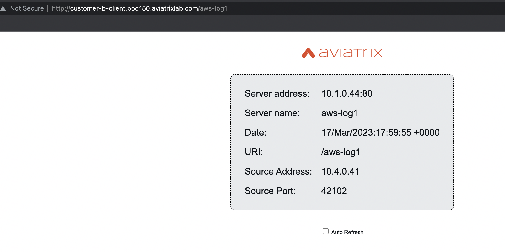_Figure 15: Proxy Customer B Client to AWS-Log1_

## 5.4 - Advanced NAT

In sections 5.2/5.3 we have solved the problem of being able to access (aws_log1) from all clients in Customer A and B locations (customer_a_dc and customer b branch). What about the reverse direction i.e. initiating traffic from the AWS-Log1 VM towards Customer-A-Client and Customer-B-Client. You might want to try that before you proceed further.

Test leveraging the proxy from AWS-Log1 to customer-a-client and customer-b-client. One of these two tests will not work.

```bash
http://aws-log1.pod150.aviatrixlab.com/customer-a-client

http://aws-log1.pod150.aviatrixlab.com/customer-b-client
```

The problem in a nutshell is also a result of the overlapping addresses of Customers A and B. We will only solve the problem for Customer-A in order to avoid repetition.

The problem and the solution are explained in the below diagram. The instructor will also be explaining the solution before you proceed.

_Figure 16: Explaining Advanced NAT Scenario_

### 5.4.1 - Configure Advanced NAT on customer-a Gateway
_Figure 17: Edit customer-a GW configuration_

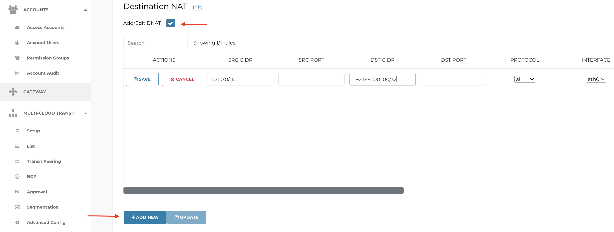
_Figure 18: Configure DNAT Rule Part 1_
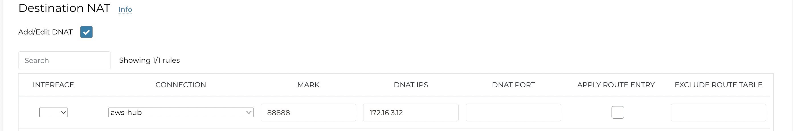
_Figure 19: Configure DNAT Rule Part 2_
_Figure 20: Save DNAT Rule_


_Figure 21: Update DNAT Configuration_
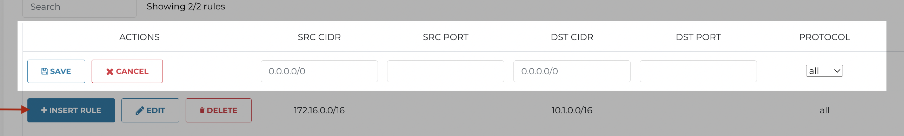
_Figure 22: Add new SNAT Rule P1_
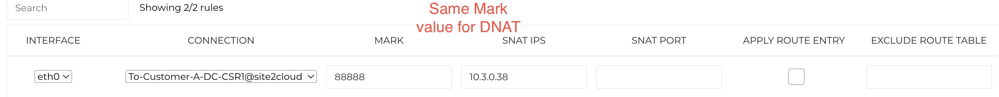
_Figure 23: Add new SNAT Rule P2_
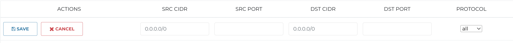
_Figure 24: Add new SNAT Rule towards CSR2 Part 1_
_Figure 25: Add new SNAT Rule towards CSR2 Part 2_

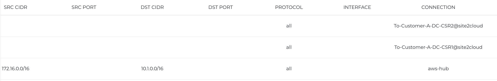
_Figure 26: All 3 SNAT Rules Part 1_

_Figure 27: All 3 SNAT Rules Part 2_

### 5.4.2 - Configure Advanced NAT on customer-a ha Gateway

We will follow the same procedure we have done on the customer-a gateway.

We start by selecting the customer-a-hagw and configuring the DNAT Rule.

_Figure 28: DNAT Rule customer-a-hagw Part 1_

_Figure 29: DNAT Rule customer-a-hagw Part 2_

_Figure 30: SNAT Rule customer-a-hagw Part 1_

_Figure 31: SNAT Rule customer-a-hagw Part 2_

_Figure 32: SNAT Rule customer-a-hagw towards CSR2 Part 1_

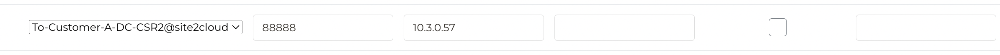_Figure 33: SNAT Rule customer-a-hagw towards CSR2 Part 2_

### 5.4.3 - Advertise Virtual IP Address

We have done everything right so far but how would the fabric know of the Virtual IP Address (192.168.100.100/32)? We need Customer-A gateways to actually advertise it into the Fabric as shown below.

_Figure 34: Customize Spoke Advertised VPC CIDR Part 1_

_Figure 35: Customize Spoke Advertised VPC CIDR Part 2_

### 5.4.4 - Verification

In this section, we will attempt to ping the virtual IP Addres (192.168.100.100) from AWS-Log1.

Start by SSHing to both instances & customer-a-client run the tcpdump command present in Figure 33. Once tcpdump is running on customer-a-client, initiate the ping towards the Virtual IP address that represents the client. You should see the packet being received by customer-a-client (dnat) while the source address is changed to one of the gateway addresses you configured (snat).

_Figure 36: Initiate the Ping from AWS-Log1 towards Virtual IP_

_Figure 37: Run tcpdump on customer-a-client_

## 5.5 - Mapped NAT Scenario

In this section, Customer C has asked us to connect its Colocation facility to its Landing Zone. It also needs to benefit from the applications within the shared services segment. One thing to note is that Customer C's told us that its on-premises router doesn't support BGP.

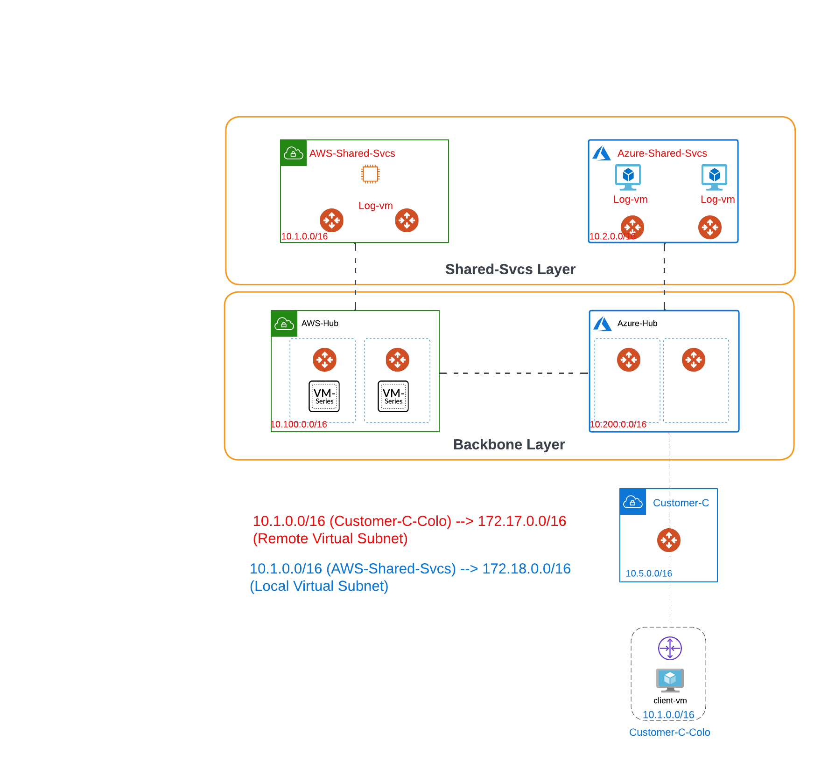_Figure 38: Mapped NAT Scenario with Customer C Explained_

### 5.5.1 - Configure S2C with Mapped NAT Towards Customer C

We will configure the Site2Cloud with Mapped NAT in Figures 34 & 35.

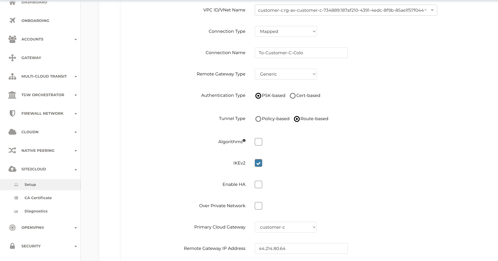_Figure 39: Configure Mapped NAT Aviatrix Side Part 1_

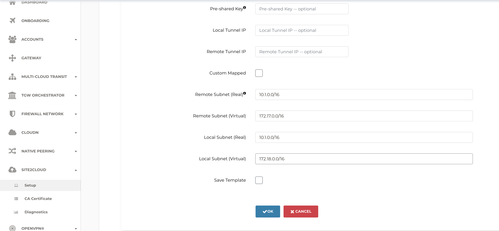_Figure 40: Configure Mapped NAT Aviatrix Side Part 2_

Now that we have configured the Site2Cloud connection from Aviatrix' side, we can get the templatized configuration for Customer C CSR.This is shown in Figures 34-36.

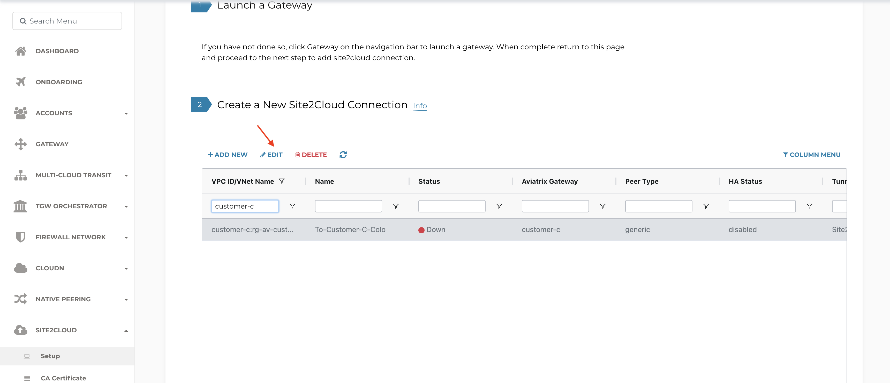_Figure 41: Get the CSR Configuration Template P1_


_Figure 42: Get the CSR Configuration Template P2_

Without Enable Traffic to Transit Gateway Mapped NAT will only work towards destinations within the same Spoke VPC. This doesn't apply to our case as the target VM we want to reach is in the Shared Services thus we need to enable traffic to transit gateway setting. This is shown in Figure 36.

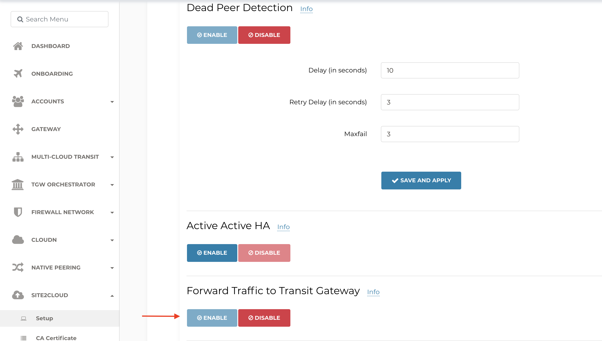_Figure 43: Enable Forward Traffic to Transit Gateway_

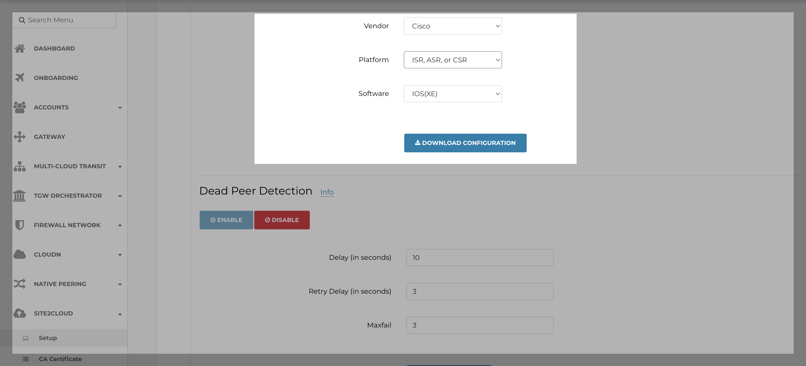_Figure 44: Get the CSR Configuration Template P3_

You need to make the changes highlighted in Figures 45 & 46.

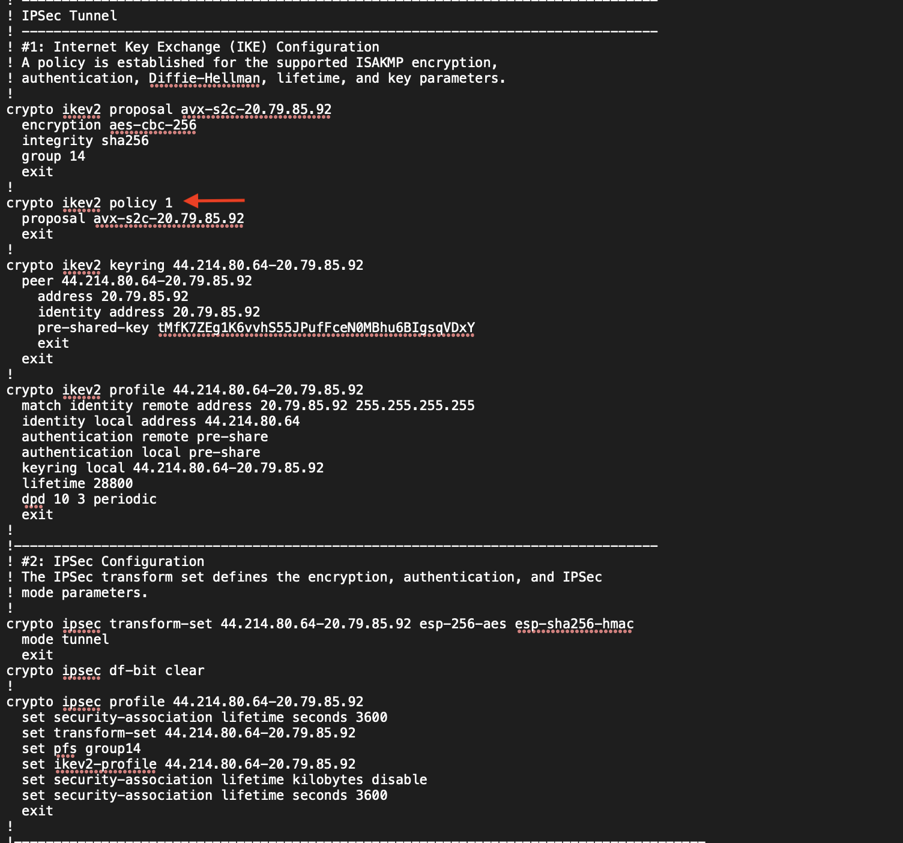_Figure 45: Edit Customer C CSR Config Part 1_

_Figure 46: Edit Customer C CSR Config Part 2_


### 5.5.2 - Verify Mapped S2C Configuration

We start by verifying that the tunnel is up on the CSR.

_Figure 47: CSR Tunnel Status is UP_

We also head to Cloud Routes within Copilot to look at the status of the S2C connection. Please note that we are not running BGP on top of this connection.

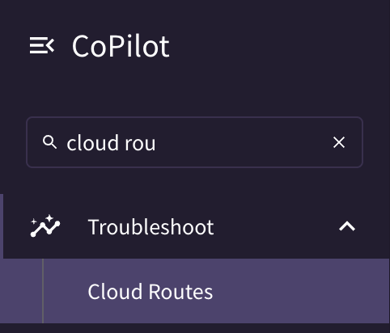_Figure 48: Head to Cloud Routes within Copilot_

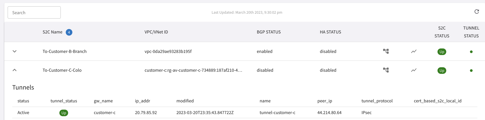_Figure 49: S2C Tunnel to Customer-C-Colo is UP_

Finally, we initiate traffic from customer-c-client towards AWS-Log1 VM.

.png)
_Figure 50: Successful Ping from Customer-C-Client towards AWS-Log1 VM_


_Figure 51: tcpdump output on AWS-Log1 VM_
