# Lab 6 Advanced Routing & Resiliency

## 6.0 - What's in the lab?

In this lab we explore a few features pertaining to Advanced Routing and Resiliency. We will look at BGP load balancing, resiliency testing, BGP Route Approval features & failover for shared services.

## 6.1 - Configure CSR Routers

Connect to customer-a-csr1k-1 as shown below:

```bash
ssh admin@customer-a-csr-1.pod150.aviatrixlab.com 
```

Paste the below configuration commands.

```bash
conf t
interface Loopback0
 ip address 1.1.1.1 255.255.255.0
end
```

Connect to customer-a-csr1k-2 as shown below:

```bash
ssh admin@customer-a-csr-1.pod150.aviatrixlab.com 
```

Paste the below configuration commands.

```bash
conf t
interface Loopback0
 ip address 1.1.1.2 255.255.255.0
end
```

Now we have advertised the same route from both of our CSRs belong to Customer-A. We will look at the route to 1.1.1.0/24 from the perspective of Customer-A Spoke Gateways.


_Figure 1: Lab 6 Scenario_

## 6.2 - Without Active Standby

 Without enabling active/standby, Aviatrix Gateways will have both tunnels active where some destinations will be reached over a tunnel whereas others will be reached on another tunnel.

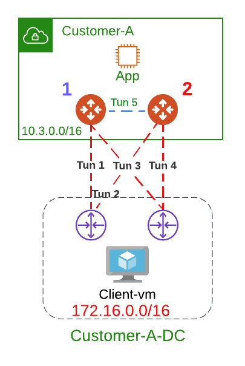
_Figure 2: Without Active Standby_

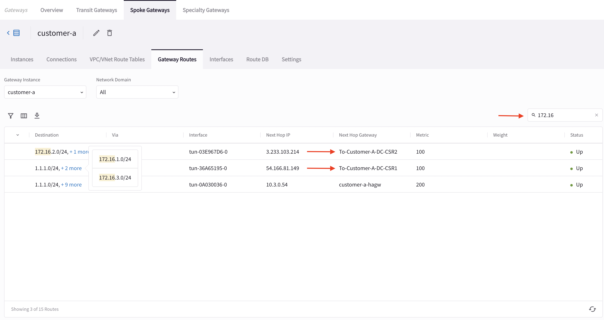
_Figure 3: Without Active Standby Customer A_
 

_Figure 4: Without Active Standby Customer A HA GW_
 
Each Aviatrix Gateway will select a single tunnel to get to a particular destination. For instance we have the route 1.1.1.0/24 advertised from both CSRs, Aviatrix Gateways 1 & 2 will each select a tunnel (tunnels 1 and 2 respectively) to get to 1.1.1.0/24. These tunnels are labeled in Red. In your lab setup the result might differ choosing tunnels 3 and 4 however the common theme is that 1 tunnel is chosen per gateway to get to a common destination (no load balancing).
Thus, over the same connection To-DC-CSR1 each Aviatrix gateway selects its local tunnel to get there.

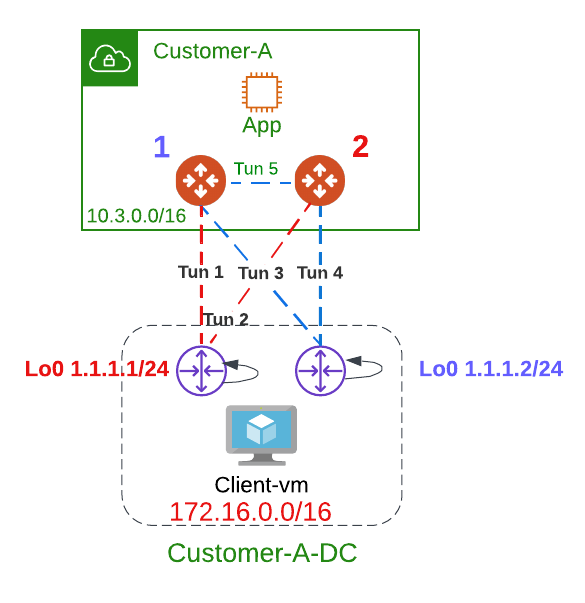_Figure 5: Without Active Standby Same Prefix_

_Figure 6: Customer-A GW Preferred Path_

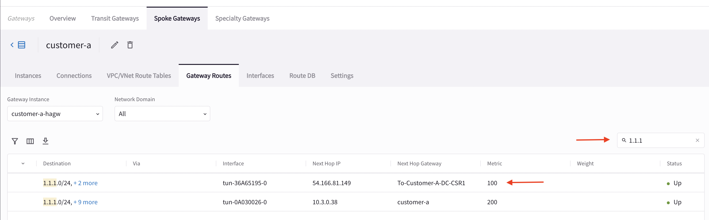_Figure 7: Customer-A HA GW Preferred Path_

## 6.3 - With Active Standby

This option is to provide the flexibility on Aviatrix Transit Gateways and Aviatrix BGP Spoke Gateways to connect to on-prem with only one active tunnel and the other one as backup.

So for the connection to CSR1, Gateway 1 is active and similarly Gateway 1 is active for the connection to CSR2. This mean that the exit from the Customer-A VPC has to always go through Gateway 1. If traffic is received by Gateway 2 from the instance (app) it will be forwarded over Tun 5 to get to Gateway 1 and then to the CSRs.

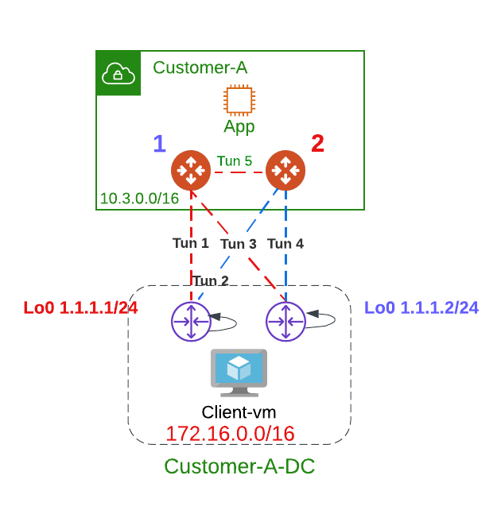_Figure 8: Active Standby Traffic Path_

_Figure 9: Enable Active Standby Mode_

_Figure 10: Check Active GW for Connection to CSR1_

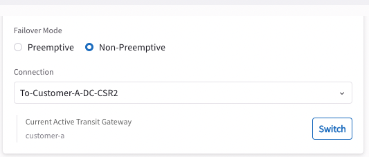_Figure 11: Check Active GW for Connection to CSR2_

_Figure 12: Customer A preferred Path with A/S_

_Figure 13: Customer A HAGW preferred Path with A/S_

## 6.4 - BGP Load Balancing

First let us remove Active/Standby configuration on the Customer-A Spoke before proceeding.

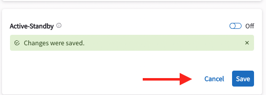_Figure 14: Disable Active/Standby_

In this section we explore the routing between Customer-A landing zone and DataCenter.

The below topology shows the setup where we will need to advertise the same route (1.1.1.0/24) from both CSRs within Customer-A-DC.

_Figure 15: Without Active Standby Same Prefix_

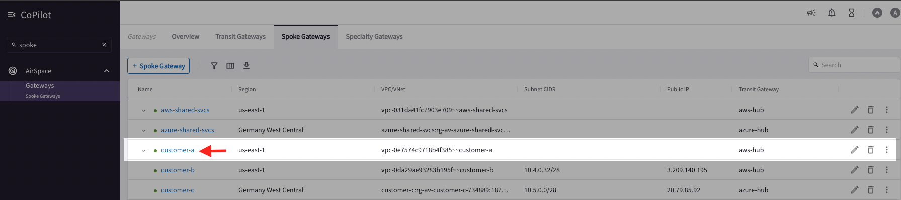_Figure 16: Select Customer A_

_Figure 17: Without A/S Customer-A GW Preferred Path_

_Figure 18: Without A/S Customer-A HA GW Preferred Path_

_Figure 19: Turn on BGP ECMP_

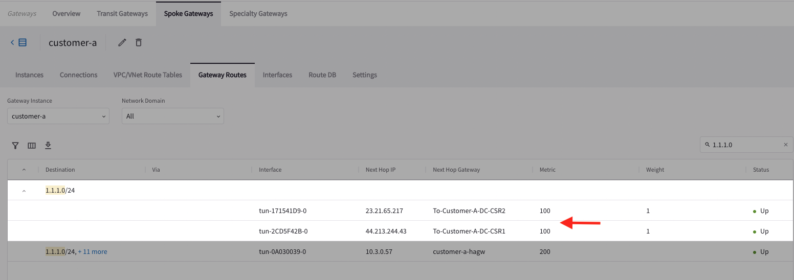_Figure 20: Routing to 1.1.1.0 Customer-A With ECMP_

_Figure 21: Routing to 1.1.1.0 Customer-A With ECMP_

## 6.5 - Resiliency and High Availability

In this section, we will be shutting down one of the gateways to ensure proper failover of the setup. 

Let's start by browsing to:
```
http://customer-a-client-pod150.aviatrixlab.com/aws-log1
```
_Figure 22: Proxy from Customer A client to AWS-log1_

The source address you will see might be different that the one in the screenshot however it needs to belong to one of the spoke gateways within Customer-A. Let's navigate to the Customer-A spoke gateway and check which instance actually maps to the source address.

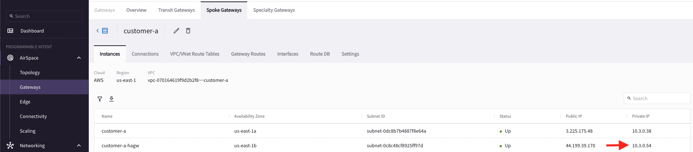_Figure 23: Find IP addresses of Proxy Spokes_

Now, we can conclude that the traffic is passing through customer-a-hagw. Note that it might be different in your case where that specific flow might pass through customer-a gateway however the logic still holds true.

Access the AWS Console as present in the lab portal. 
Paste the below configuration commands.
```
https://podX-aviatrix.signin.aws.amazon.com/console 
```
where X is the pod number. Signin with the credentials provided in the lab portal.

Navigate to EC2 and shutdown the gateway the traffic is passing through (in my lab setup customer_a_ha_gw).

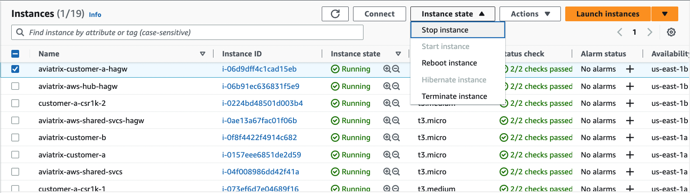_Figure 24: Proxy from Customer A client to AWS-log1_

_Figure 25: Proxy from Customer A client to AWS-log1_
