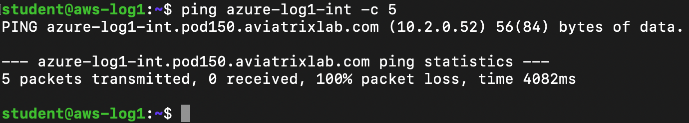
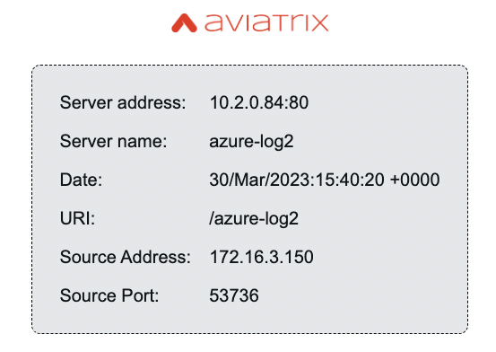
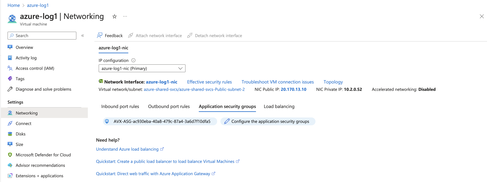
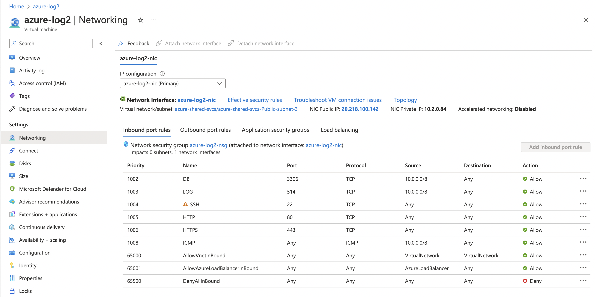
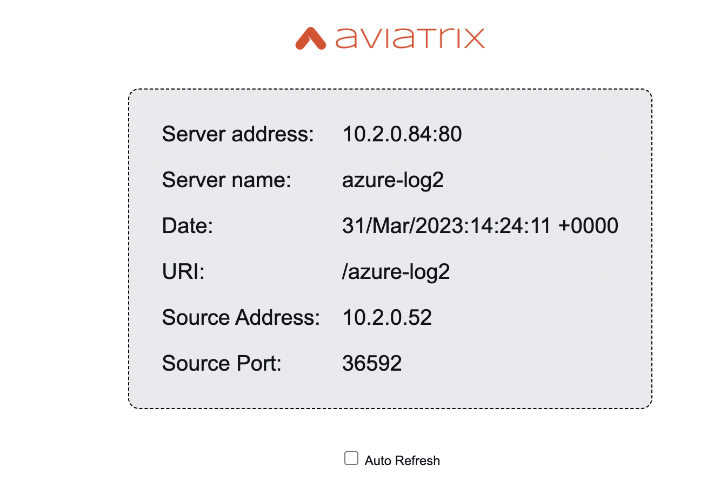
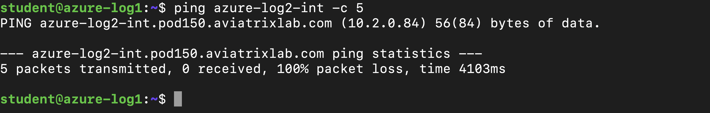

# Lab 7 Security Enhancements

## 7.0 - What's in the lab?

In this lab we will mainly explore a subset of the security features that the platform provides. We will start with Distributed Firewalling where the source and destination are in two different VPCs to Intra-VNET segmentation and finally end with a quick configuration of ThreatIQ.

_Figure 1: Current State of the Topology_

## 7.1 - Distributed Firewalling (Inter-VPC/VNET)

### 7.1.1  - Smart Group Creation


_Figure 2: Navigate to Smart Groups_

_Figure 3: Create Smart Group Aws-log1_

_Figure 4: Create Smart Group Azure-log1_

_Figure 5: Create Smart Group Azure-log2_

_Figure 6: AWS-Log1 SmartGroup Resource Matching_

_Figure 7: Azure-Log1 SmartGroup Resource Matching_

_Figure 8: Azure-Log2 SmartGroup Resource Matching_

### 7.1.2  - Pre-DFW Connectivity Test

Before any DFW rules, let us check the connectivity from aws-log1 to azure-log1 & azure-log2 leveraging ping and the proxy. 

_Figure 9: Ping from aws-log1 to azure-log1_

_Figure 10: Proxy from aws-log1 to azure-log1_

_Figure 11: Ping from aws-log1 to azure-log2_

_Figure 12: Proxy from aws-log1 to azure-log2_

### 7.1.3  - Distributed Firewall Rule

Let's start by enabling Distributed Firewalling.

_Figure 13: Navigate to Distributed Firewalling_

_Figure 14: Enable Distributed Firewalling_

Now that we have enabled Distributed Firewalling, the next step is to put a rule that locks down the communication from aws-log1 to azure-log1 to be only HTTP.

_Figure 15: Rule aws-log1 to azure-log1 tcp port 80 Part 1_


_Figure 16: Rule aws-log1 to azure-log1 tcp port 80 Part 2_

### 7.1.4  - Zooming in on the DFW Rule

In the previous section, we just put a rule allowing HTTP traffic only from aws-log1 to azure-log1. Note that because the source and destination are in different VPC/VNETs the rules are applied on the gateways. The intelligence of the solution allows you to write a rule and the system decides where to enforce the rule (Gateway or NSGs in Azure).

_Figure 17: DFW Rules Impact Explained_

Now that we have explained how Distributed Firewalling works across VPCs/VNETs let us attempt to ping azure-log1 from aws-log1.

```bash
ssh student@aws-log1.pod150.aviatrixlab.com 
```

_Figure 18: Ping azure-log1 from aws-log1_

Ping stops working as expected due to an implicit deny policy. 
Let us try to proxy from aws-log1 to azure-log1. This works as per the allowed policy. 

_Figure 18: Proxy azure-log1 from aws-log1_

Below you can see the logs in Policy Monitor for this connection.

_Figure 18: Proxy azure-log1 from aws-log1_

Now aws-log1 is only allowed to communicate with azure-log1 over HTTP, all other communication with aws-log1 or azure-log1 will be blocked by the virtue of implicit deny.

_Figure 19: Ping azure-log2 from aws-log1_

Customer-a-client is no longer able to access aws-log1 or azure-log1 but can still access azure-log2 as it is not part of the policy.

_Figure 20: Proxy customer-a-client to aws-log1 and azure-log1_

_Figure 21: Proxy customer-a-client to azure-log2_

## 7.2 - Distributed Firewalling (Intra-VNET)

This section shows Intra-VNET segmentation between two Virtual Machines in Azure namely azure-log1 and azure-log2.

We start by logging into the Azure Portal (details are in the lab portal).

We will see the Virtual Machine's Network Security Group (NSG) configuration of both instances prior to enabling Intra-VNET firewalling.

_Figure 22: Azure-log1 Networking pre-Intra VNET_

Please make sure you filter by subscription where your subscription is equal to your pod id. 

_Figure 23: Azure-log1 Networking pre-Intra VNET_

Figures 24-27 show how you can get the details of the NSGs for azure-log1 & azure-log2 prior to enabling Intra-VNET firewalling.

_Figure 24: Azure-log1 Networking pre-Intra VNET_

_Figure 25: Azure-log1 Networking pre-Intra VNET_

_Figure 26: Azure-log1 Networking pre-Intra VNET_

_Figure 27: Azure-log2 Networking pre-Intra VNET_

Here, we will attempt a connectivity test from azure-log1 to azure-log2 leveraging the proxy.

_Figure 28: azure-log1 to azure-log2 proxy pre-Intra VNET_

Now we will enable Intra-VNET on the azure shared services VNET containing azure-log1 and azure-log2.

_Figure 29: Enable Intra-VNET Part 1_

_Figure 30: Enable Intra-VNET Part 2_

_Figure 31: Enable Intra-VNET Part 3_

_Figure 31: Enable Intra-VNET Part 4_

Now let us look at the impact of enabling Intra-VNET on the NSGs/ASGs of azure-log1 and azure-log2.

The reason that Azure-log1 has a change in its NSG and is put into an ASG is that it is referenced by policy whereas Azure-log2 remains unaltered.

_Figure 32: Azure_log1 post intra-VNET ASG_

_Figure 33: Azure-log1 post intra-VNET NSG_

_Figure 34: Azure-log1 post intra-VNET NSG_

_Figure 35: Azure-log2 post intra-VNET ASG_

Now try accessing azure-log1, you will realize it is no longer reachable. This is due to the last rule in the NSG DenyAllInbound which will block our access as we are trying to access via our own Public addresses.

_Figure 36: Azure-log1 no longer reachable_

To solve this problem, let us create a SmartGroup referencing our public address.

_Figure 38: Home IP SmartGroup_

We will now create a rule that allows from traffic from our public address to azure-log1.

_Figure 39: Allow HTTP from Home IP to Azure-log1_

_Figure 39: Allow HTTP from Home IP to Azure-log1 Part 2_

Now, we can see the NSG for azure-log1 got updated with a rule allowing traffic from our public address. Please note that the public address you will have in your setup will be different than the screenshot.

_Figure 40: Azure-log1 NSG Updates_

Now you should be able to recover access to azure-log1 and you can attempt to proxy from azure-log1 to azure-log2. This should work as azure-log2 has no inbound policy preventing the access, however attempting to proxy from azure-log2 to azure-log1 will not succeed due to rule 4095 which blocks traffic from 10.2.0.0/16 to 10.2.0.0/16.

_Figure 42: Allow HTTP from Home IP_

_Figure 42: Allow HTTP from Home IP_

Now our objective is to close down the communication from azure-log1 to azure-log2. Let's check if ping is allowed. Let's SSH to azure-log1 and try to ping azure-log2.

```bash
ssh student@azure-log1.pod150.aviatrixlab.com
```

SSH is not working due to the fact that we only allowed HTTP from our public address.

_Figure 42: Allow SSH from Home IP Part 1_

_Figure 42: Allow SSH from Home IP Part 2_

_Figure 43: Allow HTTP from Home IP Part 2_

To close this down, we will be putting a rule from azure-log1 to azure-log2 that only allows HTTP traffic.

_Figure 43: Allow HTTP from Home IP Part 2_

_Figure 42: Allow HTTP from Home IP_

_Figure 42: Allow HTTP from Home IP_
