# Lab 1 - Network Domains

## 1. SCENARIO

Infrastructure <ins>was segmented</ins> recently into 2 network domains: **BU1** & **BU2**.

You are requested to ascertain the segregation between the two network domains.

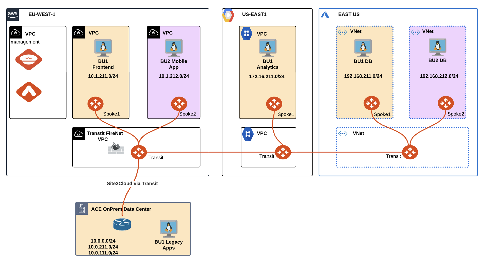
_Figure 2: Segmentation_


## 2. VALIDATION REQUEST

* Go to **CoPilot > Settings > Resources > Task Server**
  * Ensure that both **Fetch GW Routes** and **Fetch VPC Routes** intervals are set to <ins>“1 second”</ins> each and then click on **SAVE**.

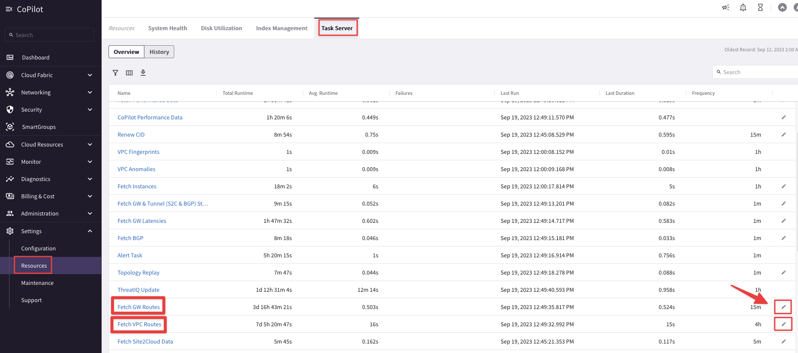
_Figure 3: Task Server_

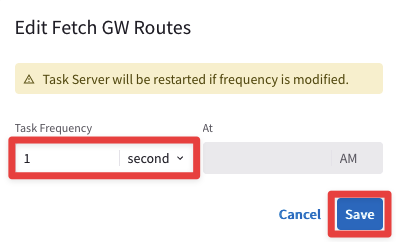
_Figure 4: Fetch GW Routes_

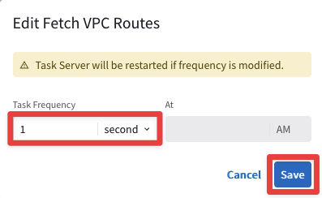
_Figure 5: Fetch VPC Routes_


Afterwards, click on **Commit**.

_Figure 6: Commit_

```{warning}
These are very aggressive settings. In a Production environment, you should NOT set these intervals that frequently!
```

- Verify connectivity between clients **within** the same BU:
    - SSH to the BU1 Frontend in AWS.
    - From BU1 Frontend ping BU1 Analytics in GCP.

There are **two** methods for SSH to any instances inside the multicloud infrastructure of this lab:

1. Using an **SSH client** from your laptop (<ins>recommended method!</ins>).


_Figure 7: Public IP_

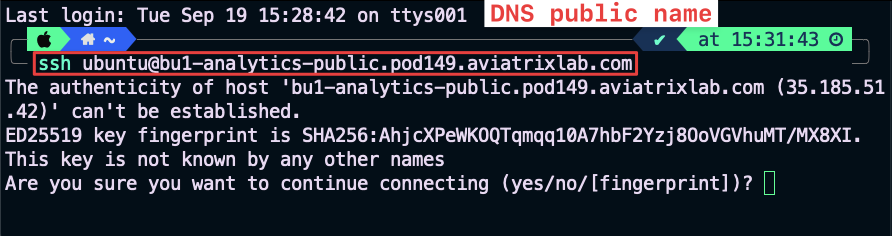
_Figure 8: DNS name_

1. Using the <span style='color:#00FFFF'>**Apache Jumpbox**</span> from the POD Portal, <ins>for example if you are within your corporate network and an inbound restriction is applied on port **22**</ins>.


_Figure 9: Jumpbox_


_Figure 10: Apache Guacamole Portal_

```{note}
Please bear in mind that if you decide to use the Jumpbox, *Copy and Paste* does not work directly from the host machine, therefore activate the **Guacamole Menu**, that is a sidebar which is hidden until explicitly shown. On a desktop or other device which has a hardware keyboard, you can show this menu by pressing **Ctrl+Alt+Shift** on Windows machine (**Control+Shift+Command** on Mac).
```


_Figure 11: Guacamole Menu_

```{tip}
The IP addresses can be easily retrieved either from the **Properties** section of each Virtual Machine on the Topology, or alternatively, you can retrieve the **DNS symbolic name** from your personal POD portal.
```

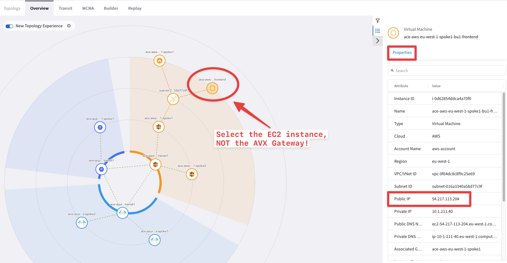
_Figure 12: Instance Properties_

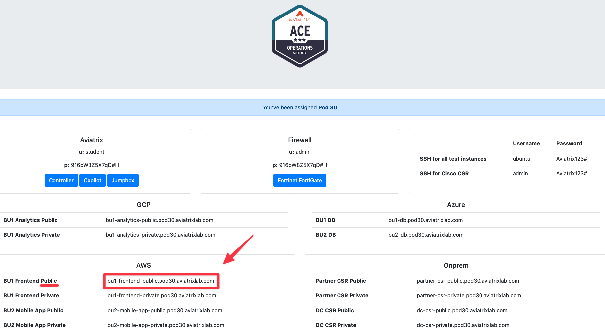
_Figure 13: Public DNS Name_

Ping and SSH will be successful **within** the same network domain!

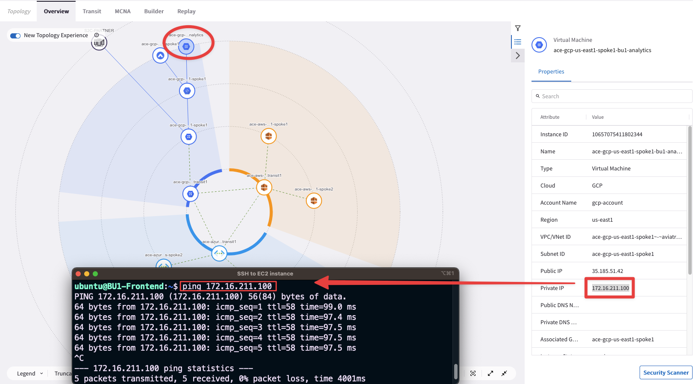
_Figure 14: BU1 connectivity_

* Verify the network segregation **between** the two BUs:
  * From BU1 Frontend try to ping BU2 Mobile App.

Ping and SSH commands should not work this time, due to the separation between the two segments (i.e. <ins>these are two different Routing Domains</ins>).

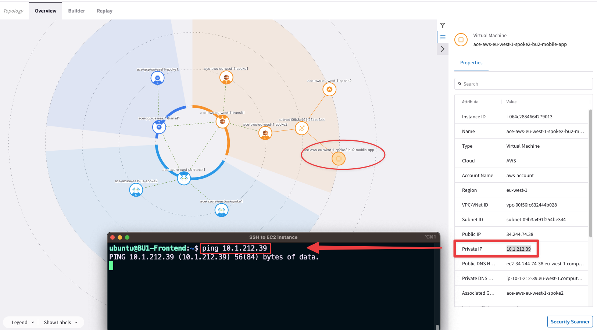
_Figure 15: BU1 to BU2 fails_

* Check Network Segmentation on the CoPilot by searching segmentation and look at the **Logical View**.

```{tip}
Go to **CoPilot > Networking > Network Segmentation > Overview**
```

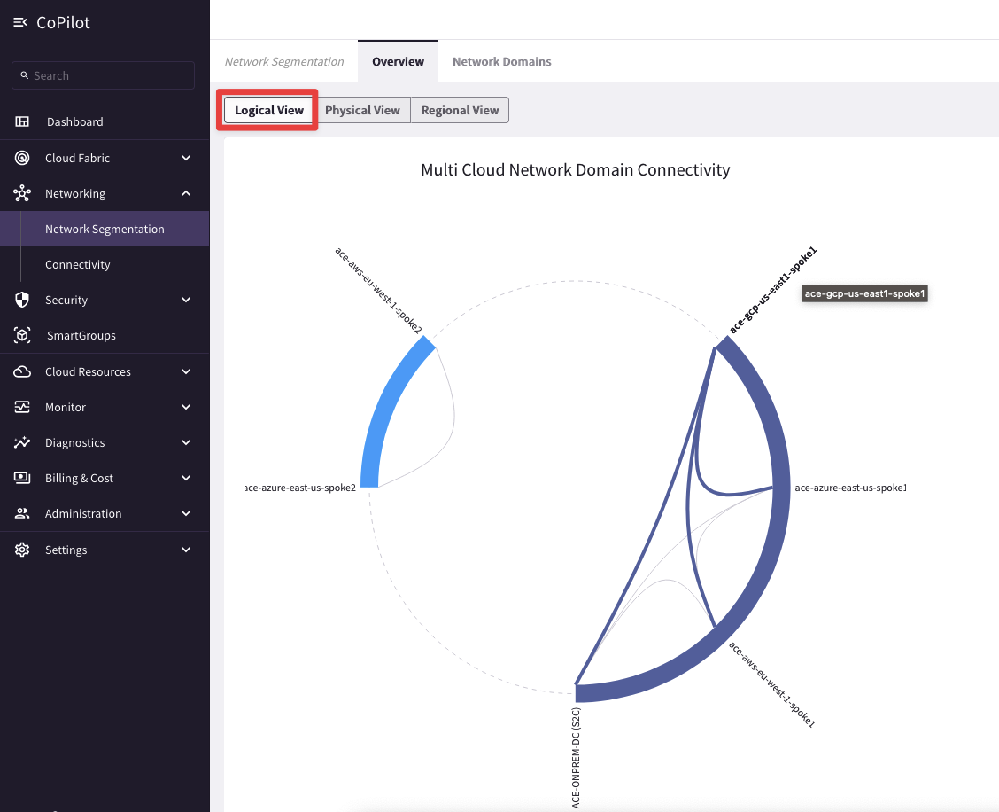
_Figure 16: Logical View_

* Check the different routing tables (VRFs) maintained by any of the Transit Gateways.

```{tip}
Go to **CoPilot > Cloud Fabric > Gateways > Transit Gateways >** select the **ace-aws-eu-west-1-transit** gateway **> Gateway Routes** and filter out based on the Network Domain (i.e. either BU1 or BU2).
```

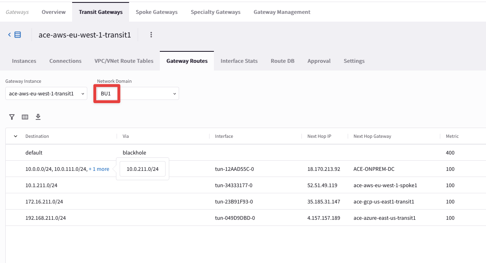
_Figure 17: Network Domain (aka VRF)_

* Use <span style='color:#FF0000'>**FlowIQ**</span> from the POD Portal, <ins> for inspecting the NetFlow Data.

```{tip}
Go to **CoPilot > Monitor > FlowIQ** and filter based, for instance, on the destination IP **172.16.211.100** (i.e. BU1 Analytics).
```

Then check the Flow Exporters widget, then from the drop-down menu and select the *Aviatrix Gateway* widget: you will see the list of the Aviatrix gateways involved along the path.

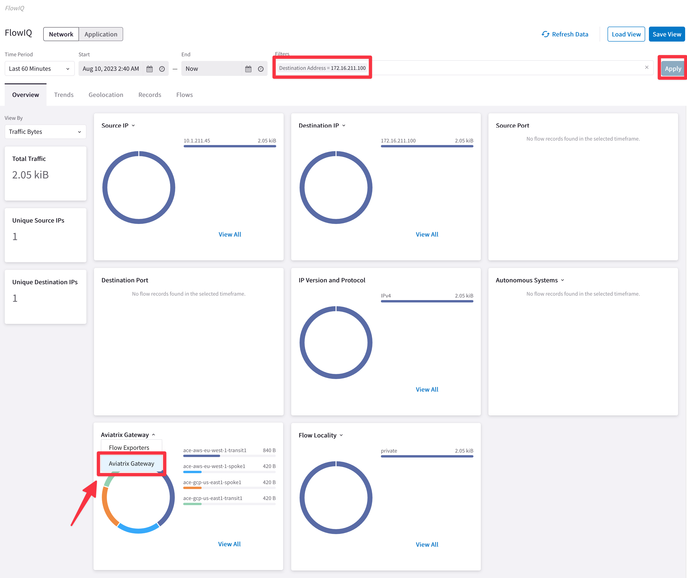
_Figure 18: FlowIQ_

```{note}
On the Aviatrix Gateway widget, the very first gateway from the list is the gateway with the highest traffic (in Bytes).
```

* Use **Cloud Routes** for pinpointing the originator of the route **172.16.211.0/24**.

```{tip}
Go to **CoPilot > Diagnostics > Cloud Routes** and filter based on the subnet and based on the Gateway name (add the string “**spoke1**”).
```

```{tip}
The Originator has the egress interface that is equal to **eth0** (i.e. the LAN interface), which in turn means, direct connected.
```


_Figure 19: Cloud Routes_

* Use **Cloud Routes** for pinpointing the originator of the route **10.0.0.0/24**.

```{tip}
Go to **CoPilot > Diagnostics > Cloud Routes** and filter based on the subnet. <ins>Remove the previous filter</ins>!
```

This time you need to proceed with a <ins>recursive lookup</ins>: from any Spoke GWs check the **NEXT HOP GATEWAY** column and try to find the originator of 10.0.0.0/24.


_Figure 20: Cloud Routes - recursive lookup_