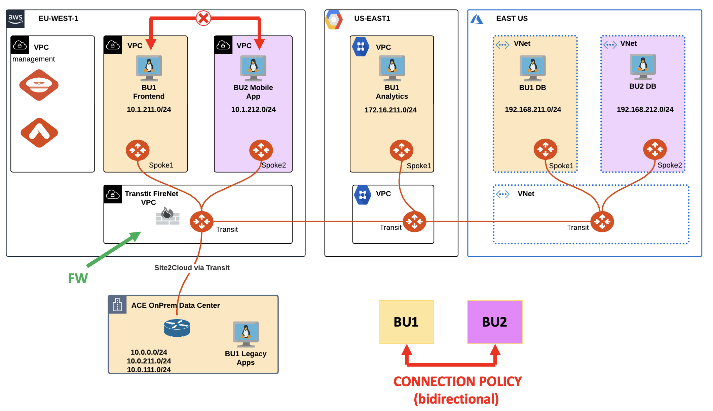
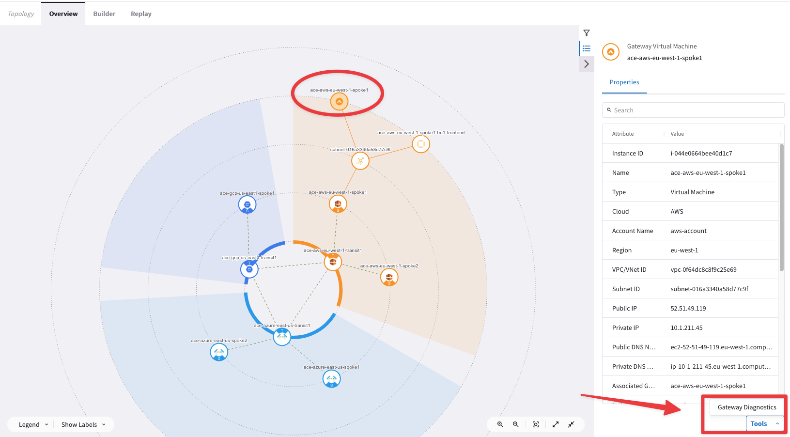
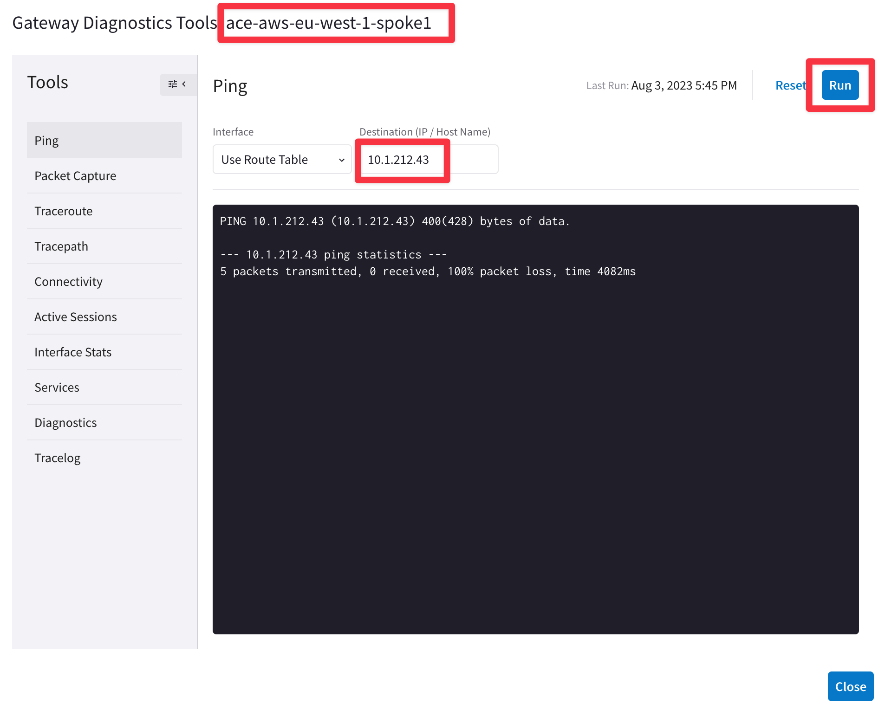
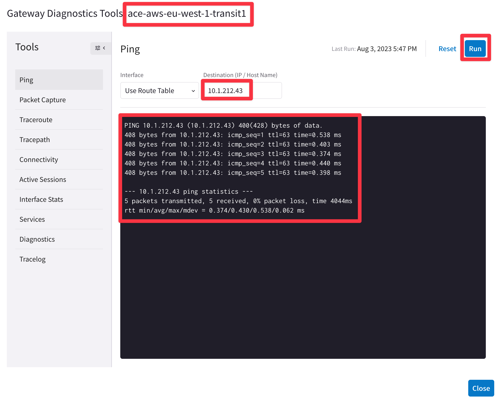
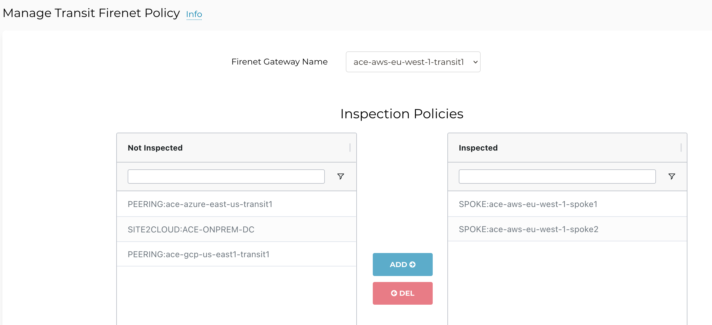
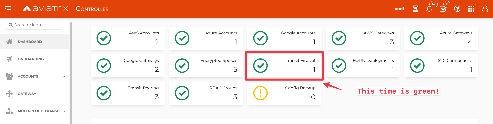

# Lab 4 - FireNet - Routes

## 1. SCENARIO

BU1 and BU2 were able to communicate as end of Lab3.

Unfortunately, the network team received another complaint from BU1 Frontend Team that BU2 Mobile App was no longer reachable.


_Figure 45: Network Domains with the Connection Policy_

## 2. TROUBLESHOOT REQUEST

- Verify that the connectivity between **BU1 Frontend** and **BU2 Mobile App** is actually broken.

  - SSH to BU1 Frontend and launch ping/ssh to BU2 Mobile App.


_Figure 46: Ping fails_

- Check whether the concerned Spokes have the relevant routes or not.

```{tip}
Go to **CoPilot > Cloud Fabric > Gateways > Spoke Gateways >** select the **ace-aws-eu-west-1-spoke1** gateway and filter out based on the remote route.
```


_Figure 47: Filter out_

From the outcome above, it is evident that Spoke1 in AWS has the destination route in his RTB.

 - Use Diagnostics tool by clicking on the Spoke1 Gateway in AWS and try to ping/traceroute the instance behind the other spoke.

```{tip}
Go to **CoPilot > Cloud Fabric > Topology** and select the *Spoke1 Gateway in AWS* and click on **Tools** and then on **Gateway Diagnostics**.
```


_Figure 48: Enterprise-Grade Tools_


_Figure 49: Ping fails_

- Try to ping both workloads from the Transit.


_Figure 50: Ping ok_

- Check if the concerned Spoke VPCs are inspected by FireNet.

```{tip}
Go to **Controller > FIREWALL NETWORK > Policy**
```


_Figure 51: Inspection Policy Verification_

- Have a look at the dashboard on the main page of the Controller.


_Figure 52: Dashboard_

- Verify the Vendor Integration on the FireNet section on the Controller!

```{tip}
Go to **Controller > FIREWALL NETWORK > Vendor Integration**, select the **FW**, click on **EDIT** and then click on **SHOW**.
```


_Figure 53: Vendor Integration_


_Figure 54: Missing route_

You will notice that the **10.0.0.0/8** is not present inside the routing table of the FW.

- Fix the problem, clicking on the **SYNC** button, in order to inject again the 10.0.0.0/8 into the RTB.


_Figure 55: SYNC_

- Relaunch the ping from **BU1 Frontend** towards **BU2 Mobile App**.


_Figure 56: Ping is ok_