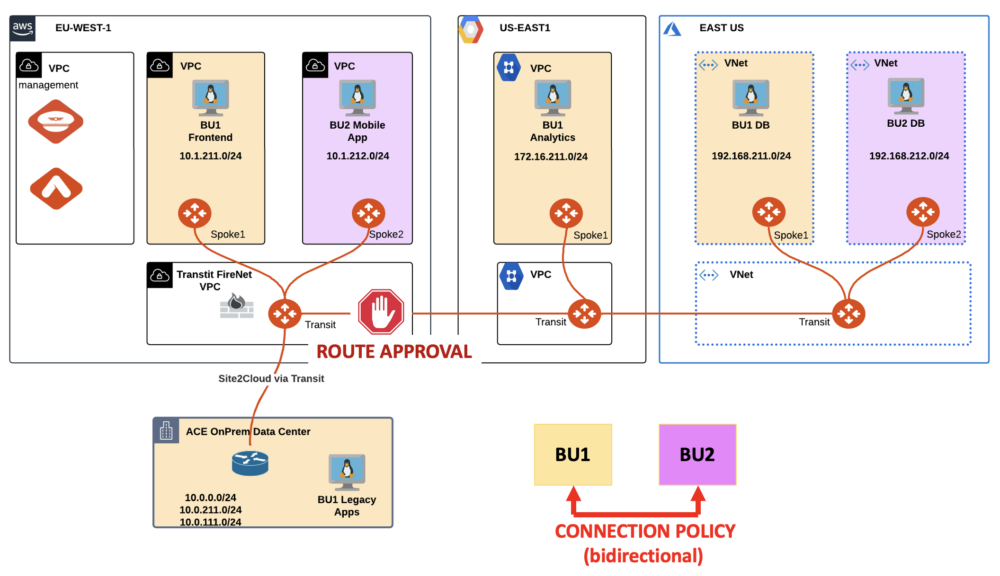
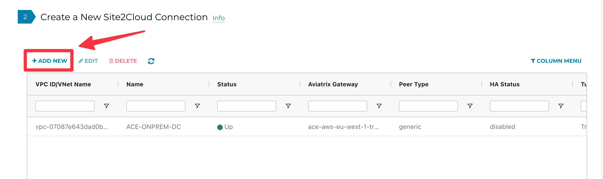
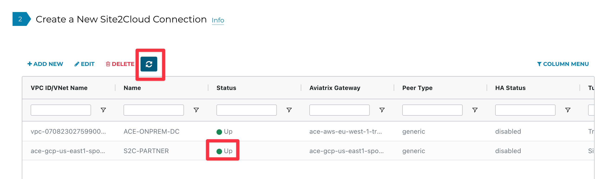
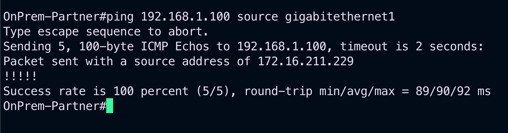

# Lab 6 - Site2Cloud

## 1. SCENARIO#1

ACE’s OnPrem Data Center has recently hired a new network engineer.

You have been engaged for activating the <span style='color:#00FFFF'>**Route Approval**</span> feature in order to protect the MCNA from unauthorized advertisements.


_Figure 70: Lab 5 Scenario#1 Topology_


## 2. CHANGE REQUEST

- Activate the **Route Approval** feature for monitoring unauthorized advertisements that could be received from the DC.

```{tip}
Go to **Controller > MULTI-CLOUD TRANSIT > Approval** and turn the knob **“Learned CIDRs Approval”** for the **ace-aws-eu-west-1-transit1 GW**.
```


_Figure 71: BGP Route Approval Activation_

Afterwards, inform the trainer that you have activated the feature with the tool <b><span style='color:#FFFF00'>**“Raise Hand”**</span> on Zoom, as depicted below.


_Figure 72: Raise Hand tool on Zoom_

<ins>Please wait for the trainer to inform you about the injection of the failure!</ins>

<ins>Wait for one minute and then click on the <b><span style='color:orange'>**refresh**</span> button to see what kind of route will be blocked inside the <span style='color:#FFFF00'>**Pending Learned CIDRs**</span> state, as depicted below.</ins>


_Figure 73: Refresh_

You have successfully prevented that somebody from the DC could jeopardize the whole network inside the multicloud infrastructure! Of course do not approve a default route!

## 3. SCENARIO#2

ACE’s OnPrem Partner needs to be connected to the MCNA in the GCP region, however, it has overlapping IP’s with BU1’s Analytics VPC.

You have been engaged for creating a <span style='color:#FF00FF'>**Site2Cloud**</span>
 connection between the GCP Spoke GW and the OnPrem Partner router and also for resolving the IP conflict through the **Mapped NAT** feature.


_Figure 74: Lab 6 Scenario#2 Topology_

## 4. CHANGE REQUEST

- Create a new **S2C** connection.

```{tip}
Go to **Controller > SITE2CLOUD > Setup**, then click on **+ADD NEW.**
```



_Figure 75: Add New S2C_

Configure the new S2C connection based on the schema below.

- **VPC**: <span style='color:#00FF00'>ace-gcp-us-east1-spoke1</span>

- **Connection Type**: <span style='color:#00FF00'>Mapped</span>

- **Connection name**: <span style='color:#00FF00'>S2C-PARTNER</span>

- **IKEv2**: <span style='color:#00FF00'>Enable</span>

- **Remote Gateway IP Address**: <span style='color:#00FF00'>follow the Note below</span>

```{note}
Use the “**dig partner-csr-public.pod#.aviatrixlab.com +short**” command <ins>from your personal laptop terminal</ins> to resolve the symbolic public name of the OnPrem Partner CSR router and retrieve the <ins>remote gateway public IP address</ins>, as depicted in the example below.
```


<ins>Replace the <span style='color:#FF00FF'>**#** </span>symbol with your POD number!</ins>

The example is referring to POD #32 (please issue the command based on your POD number!).


_Figure 76: Retrieving the Public IP_

- **Pre-shared Key**: <span style='color:#00FF00'>Aviatrix123#</span>

- **Local Tunnel IP**: <span style='color:#00FF00'>169.254.0.1/30</span>

- **Remote Tunnel IP**: <span style='color:#00FF00'>169.254.0.2/30</span>

- Configure the **Mapped NAT** with the following CIDRs:
  - **Remote Subnet (Real)** = <span style='color:#00FF00'>172.16.211.0/24</span>
  - **Remote Subnet (Virtua)** = <span style='color:#00FF00'>192.168.2.0/24</span>
  - **Local Subnet (Real)** = <span style='color:#00FF00'>172.16.211.0/24</span>
  - **Local Subnet (Virtual)** = <span style='color:#00FF00'>192.168.1.0/24</span>


_Figure 77: Retrieving the Public IP_

Wait some minutes for the completion of the S2C. Click on the <b><span style='color:orange'>**refresh**</span>
 button to see the status changing from red to green.


_Figure 78: S2C is up and running_

- SSH to the OnPrem partner router and issue the following command:

```bash
ping 192.168.1.100 source gigabitethernet1
```


_Figure 79: Ping is ok_
