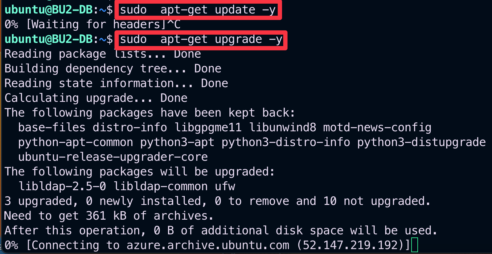

# Lab 7 - Egress FQDN

## 1. SCENARIO

BU2 DB needs to get updates by running:

```bash
sudo apt-get update -y 
```
and
```bash
sudo apt-get upgrade -y
```

No other Egress traffic should be allowed!

An Aviatrix Gateway has already been deployed and enabled for **Egress FQDN filtering**.

The BU2 DB owner has raised a complaint that the apt-get commands are not working, furthermore the other egress traffic is permitted...


_Figure 83: Lab 7 Scenario Topology_

## 2. TROUBLESHOOT REQUEST

- SSH to the BU2 DB (this VM does not have a Public IP, whereby you need to SSH to BU1 Frontend first, and then from that VM, issue the SSH command towards the Private IP of BU2 DB) and verify whether the apt-get commands are working or not.

```{tip}
In addition to the apt-get commands, carry out the following commands:
```

```bash
curl https://www.google.com
curl https://www.wikipedia.com
curl https://www.espn.com
```


_Figure 814: Sudo commands_

- Check the FQDN Stats

```{tip}
Go to **Controller > Security > FQDN Stats > Gateway FQDN Stats** and set the Time range to **“Today”**.
```


_Figure 85: Stats_

- Verify the configuration of the Egress FQDN Filtering Policy.

```{tip}
Go to **Controller > SECURITY > Egress Control > Egress FQDN Filter** and then check the policy called **“ACE-UBUNTU-PATCHES”**.
```

Is there something suspicious in the configuration of the policy? Try to fix the evident misconfiguration!


_Figure 86: Filter_

- Relaunch the apt-get commands after applied the resolution.


_Figure 87: apt-get is successful_
