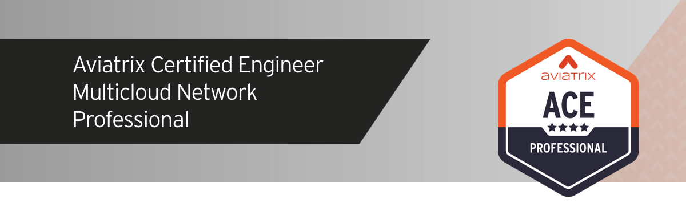
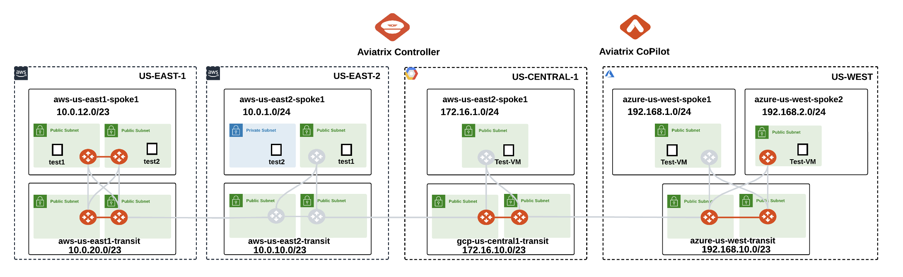
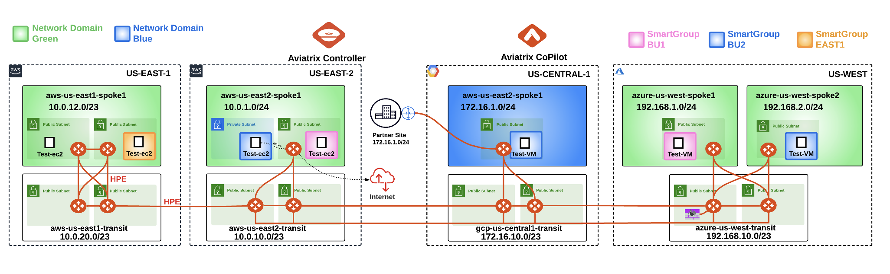

# Welcome to ACE Professional Lab

## 1. Preface

These labs are intended for Aviatrix Customers, Partners, and Employees to aid in the Aviatrix solution learning process. The scope of this document is specifically to cover Aviatrix use-cases configuration steps to design and validate end-to-end Aviatrix functionality.

Unless otherwise mentioned, the lab PODs will be available until Friday afternoon US Pacific time the week of the training. In other words, <ins>the pods will be torn down on Friday afternoon</ins>.

## 2. Prerequisites

- You must have an `SSH client` installed on your PC and be comfortable using it.
- If you cannot SSH from your corporate laptop/desktop, <ins>please use a personal laptop/desktop in the class instead</ins>.
- You may be asked to share your desktop on the Zoom call, so please be prepared.

## 3. Getting Started with the labs

To access Aviatrix Multicloud Networking and Security Bootcamp labs, use one of these supported browsers:

- Chrome 71 (or later)
- Firefox 63 (or later)
- Edge 105 (or later)
- Safari 16.3 (or later)

## 4. Access Information

This information is provided separately before the start of the labs inside a dedicated portal.

- Aviatrix Controller
- Aviatrix CoPilot
- Test Instances in each cloud
- Bootstrap package information for Palo Alto Firewall (VM-Series) [Lab 7]
- Cisco Cloud Services Router 1000v Series (CSR) [Lab 8]
- Malicious IP [Lab 9]

## 5. Lab Topology

At the start of Day 1 of the class, each student will be given a POD with the following topology.


_Figure 1: Initial Topology_

By the end of **Day 3**, each student will be able to deploy and verify the following Multicloud Topology, including the following use cases:

- VPC and VNet Creation
- Single Cloud Transit
- Multicloud Transit
- Single/Multicloud Network Segmentation
- Role-Based Access Control (RBAC)
- High Performance Encryption (aka Insane Mode)
- ActiveMesh High Availability
- Egress FQDN Filtering
- FireNet
- Site2Cloud with Overlapping IPs
- ThreatIQ and ThreatGuard
- Distributed Cloud Firewall
- Multi-Tier Transit


_Figure 2: Full-Blown MCNA_

```{note}
Throughout the labs, you will notice some additional pre-configured constructs, which will be utilised in the later labs. Please pay special attention to selecting the right region, gateway or VPC/VNet.

In particular, resources in AWS us-east-1 will not be used until Lab 5. Likewise, resources in Azure US West Spoke 2 will not be used until Lab 7.
```