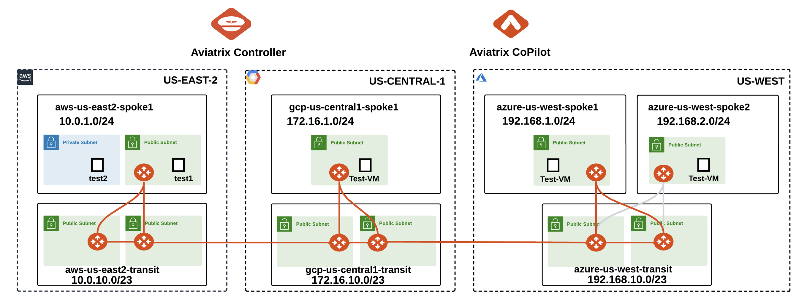
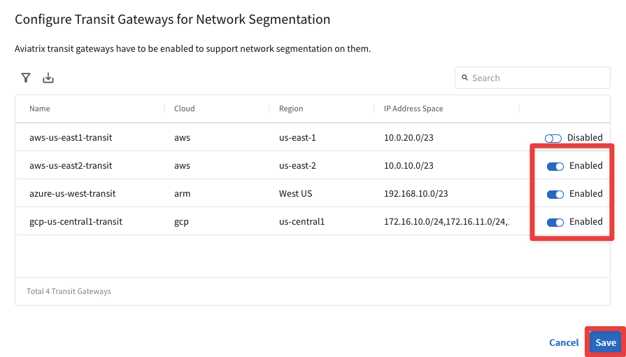
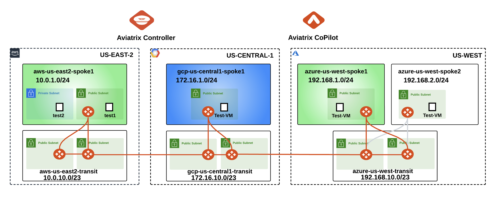
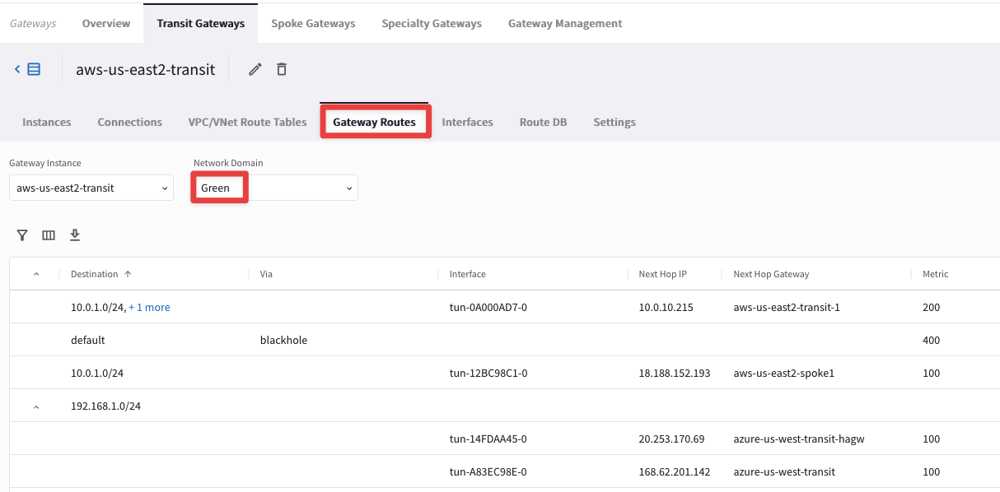
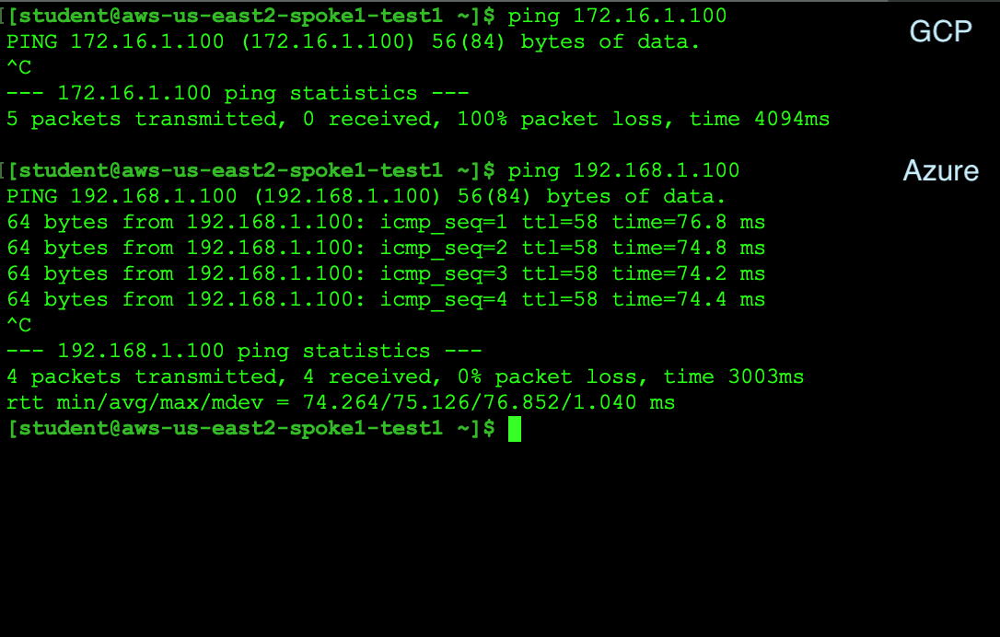
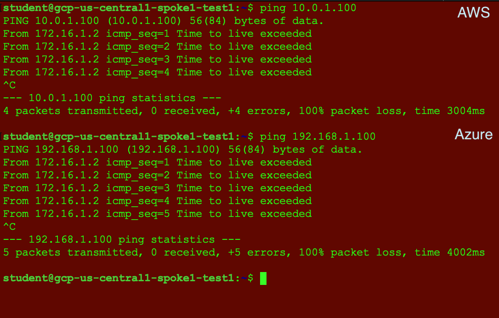

# Lab 3 - NETWORK SEGMENTATION

## 1. Objective

Implement network segmentation between workloads across multicloud and on-premises environments using network domains.

```{note}
Network Segmentation will be extended to on-premises in the Site2Cloud lab.
```

## 2. Network Segmentation Overview

Enterprises can define their network domains (aka *segments*) and group VNets/VPCs/VCNs with similar security policies without requiring firewall solutions.

Aviatrix transit and spokes architecture help (aka *Hub & Spoke* architecture) enterprises create customised segments and onboard branches, partners and customers in their respective segments so no partner can communicate with each other unless desired.

## 3. Topology

In this lab, we will use Aviatrix CoPilot to enable `Network Segmentation` in Azure, AWS and GCP, in order to segregate VPC/VNet with similarities. At this point, there is a flat routing domain and the communication among the three CSPs occurs through the Transit Core Backbone layer.

Green VPC resources in AWS and Azure can communicate with each other, while access is restricted to Blue VPC resources in GCP. Later, we will ease this restriction with a `Connection Policy`: Blue and Green segments will be able to communicate with others as well.


_Figure 69: Topology for Lab 3_

## 4. Configuration

### 4.1. Aviatrix Transit Gateways

Go to **CoPilot > Networking > Network Segmentation > Network Domains > Transit Gateways**:


_Figure 70: Enable the feature_

Enable all three Aviatrix Transit Gateways in Azure, GCP and AWS (<ins>**us-east-2** only for now</ins>) for network segmentation as shown below:


_Figure 71: Enable Segmentation on the relevant Transit GWs_

## 4.2 Network Domains

Go to **CoPilot > Networking > Network Segmentation > Network Domains > + Network Domain**


_Figure 72: Network Domain creation_

Create **two** network domains (Green and Blue) and associate them to their respective Spokes as follows:

-  <span style='color:lightgreen'>Green</span>- azure-us-west-spoke1 (do not select azure-us-west-**spoke2**)
- <span style='color:lightgreen'>Green</span> - aws-us-east2-spoke1 (do not select aws-us-**east1**-spoke1)
- <span style='color:lightblue'>Blue</span> - gcp-us-central1-spoke1

Click on **Save** after creating each Network Domain.


_Figure 73: Green network domain_


_Figure 74: Blue network domain_

## 5. Verification of Segment Attachments

This is what the lab topology looks like after enabling network segmentation:


_Figure 75: Topology with Network Domains_

### 5.1. CoPilot Verification

Go to **CoPilot > Networking > Network Segmentation > Network Domains**

Verify the segments and the associations as shown below:


_Figure 76: Associations verification_

Go to **CoPilot > Cloud Fabric > Gateways > Transit Gateways** and select the Transit Gateway **_aws-us-east2-transit_**:


_Figure 77: Select Transit in US-East-2_

Then select the `"Gateway Routes"` tab and inspect the routing table of the network domain **Green**, likewise the routing table of the network domain **Blue**:


_Figure 78: Explore Green_


_Figure 79: Explore Blue_

Go to **CoPilot > Networking > Network Segmentation > Overview > Logical View**

The nodes depicted in the Logical View represent spokes and site2cloud instances. Hover over a node to highlight reachability. Nodes are grouped by colored arcs representing network domains. At this time, only the spoke gateways in Azure and AWS (i.e. Green Network Domain) are connected:


_Figure 80: Logical View_

Open **three** terminal windows and SSH to the test instances/VMs in each cloud and ping the **private** IPs of each other to test the Multicloud connectivity (Refer to pod info).

Azure and AWS resources will ping each other, but neither will be able to access GCP VM, since GCP spoke is in a different segment (Blue).

**AWS**:

SSH into **_aws-us-east2-spoke1-test1_** (ssh student@public_ip)


_Figure 81: Ping test from AWS_

**Azure**:

SSH into **_azure-us-west-spoke1-test1_** (ssh student@public_ip)


_Figure 81: Ping test from Azure_

**GCP**:

SSH into **_gcp-us-central1-spoke1-test1_** (ssh student@public_ip)


_Figure 82: Ping test from GCP_

## 6. Connection Policy

Go to **CoPilot > Networking > Network Segmentation > Network Domains**

Click the pencil icon to edit. You can either select the Green domain or the Blue domain.

```{important}
The connection policy is always bidirectional!
```


_Figure 83: Edit Blue_

Select the appropriate option from the **`"Connect to Network Domain"`** pull-down menu (Green shown here). Then click **Save**:


_Figure 84: Apply the connection policy_

### 6.1. Verification of Connection Policy

Go to **CoPilot > Networking > Network Segmentation > Overview > Logical View**

Now you will see that the spoke gateways in all three clouds are connected. This is because the Blue and Green Network Domains are directly connected:


_Figure 85: Logical View with the connection policy_

Retest the connectivity; now you will have end-to-end connectivity across the multicloud environment.

**AWS**:

SSH into **_aws-us-east2-spoke1-test1_** (ssh student@public_ip)


_Figure 86:  New Test from AWS_

**Azure**:

SSH into **_azure-us-west-spoke1-test1_** (ssh student@public_ip)


_Figure 87:  New Test from Azure_

**GCP**: 

SSH into **_gcp-us-central1-spoke1-test1_** (ssh student@public_ip)


_Figure 88:  New Test from GCP_

After this lab, this is how the overall topology would look like:


_Figure 88:  Final topology for Lab 3_