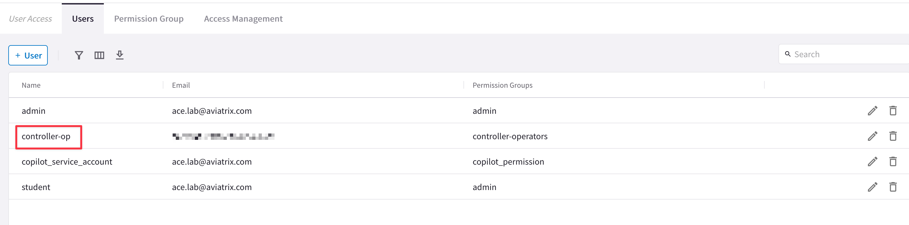
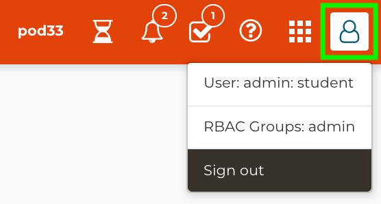
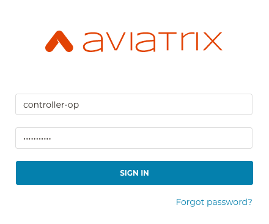
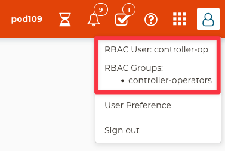
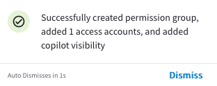
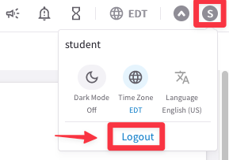

# Lab 4 - RBAC

## 1. Objective

Implement **Role-Based Access Control** using Local Authentication both on the **Controller** and on the **CoPilot**.

You will perform tasks to address the following scenario:

- For the **Controller**: create an Operator that has RW access to **Dashboard**, **Useful Tools** and **Troubleshoot** sections for all cloud accounts.
- For the **CoPilot**: create an Operator that has RW access to **Dashboard**, **Topology**, **Monitor** and **Troubleshoot** sections for all cloud accounts.

```{note}
Notice that the account you are provided in the labs is a local user called **student** that is a member of the Permission Group <ins>"admin"</ins>.
```

## 2. Configuration: RBAC for the Controller

### 2.1. Create a Permission Group

Navigate to **CoPilot > Administration > User Access > Permission Group**

Click on `“+Permission Group”`.


_Figure 89: Permission Group creation on the CoPilot_

Name the group **controller-operators**, select all the **Access Accounts** available from the drop-down window and choose the **Controller Permissions**.

Then from the **API/Terraform Permissions** field, select **Dashboard**, **Useful Tools** and **Troubleshoot** privileges, as depicted below.

Click on **Save**.


_Figure 90: Permisionn Group configuration_

In the list of permission groups you should see the new created **controller-operators**.


_Figure 91: "controller-operators" Permission group_

### 2.2. Create a new User

Navigate to **CoPilot > Administration > User Access > Users**

Click on `“+User”`.


_Figure 92: +User_

Ensure to enter the following values:

- **Username:** <span style='color:#33ECFF'>controller-op</span>
- **Email:** <span style='color:#33ECFF'>[Enter your own]</span>
- **Password:** <span style='color:#33ECFF'>[Pick a strong password and remember it]</span>
- **Confirm Password:** <span style='color:#33ECFF'>[Repeat the previous password]</span>
- **Permission Groups:** <span style='color:#33ECFF'>controller-operators</span>

Then click on **Save**.


_Figure 93: Add User_

In the list of users, you should see the new created **_controller-op_**.


_Figure 94: controller-op_

At this point, you should have received an email and a message in the **Notifications** tray, similar to the message below:


_Figure 95: Notification message_

## 3. Verification: RBAC on the Controller
 
### 3.1. Log out and log back in as new RBACK User (controller-op)

Go to **Controller** and then hover over the user icon in the top-right corner and click on **Sign out**.


_Figure 96: Sign out_

Sign back in as a **controller-op** with the same password you picked earlier.


_Figure 97: Sign back with controller-op_

You should see in the top-right corner that you are logged in as the **controller-op** RBAC User, a member of the **controller-operators** RBAC Group.


_Figure 98: RBAC sign-in_

### 3.1.1. Positive Test

Navigate to **Controller > USEFUL TOOLS > Create a VPC** and click `"+ Add New"`

Create a new VPC as follows (make sure that **_Aviatrix Transit VPC_** is not selected).

- **Cloud Type:** <span style='color:#33ECFF'>AWS</span>
- **Account Name:** <span style='color:#33ECFF'>[your AWS account name will be auto-populated]</span>
- **VPC Name:** <span style='color:#33ECFF'>rbac-lab-test</span>
- **VPC Region:** <span style='color:#33ECFF'>us-east-1</span>
- **VPC CIDR:** <span style='color:#33ECFF'>10.0.150.0/24</span>
- **Advanced:** <span style='color:#33ECFF'>unchecked</span>
- **Aviatrix Transit VPC:** <span style='color:#33ECFF'>**unchecked**</span>
- **Aviatrix FireNet VPC:** <span style='color:#33ECFF'>unchecked</span>


_Figure 99: Creating a VPC from the Controller_

You will receive confirmation that your VPC was created successfully!


_Figure 100: Successfully created_

### 3.1.2. Negative Test

Navigate to **Controller > MULTI-CLOUD TRANSIT > Segmentation** and scroll down to **Step 3, Add / Modify Connection Policy**

Attempt to undo your work in the Network Segmentation Lab, by disconnecting the <span style='color:lightgreen'>Green</span> security domain from the <span style='color:lightblue'>Blue</span> one.

Select the Green domain first and then click on the **DEL** button.


_Figure 101: Modify Segmentation_

You should immediately receive an error in the Notifications tray such as this:


_Figure 102: Error_

```{attention}
Before moving to the subsequent section, be sure to sign out as a **controller-op** and sign back in as a **student**.
```

## 4. Configuration: RBAC for the CoPilot
 
### 4.1. Create a new Permission Group

Navigate to **CoPilot > Administration > User Acces > Permission Group**

Click on `“+ Permission Group”`.


_Figure 103: New Permission Group_

Ensure to insert the following values inside the pop-up window `“Create Permission Group”`:

- **Name**: <span style='color:lightgreen'>copilot-operators</span>
- **Users**: <span style='color:lightgreen'>[empty]</span>
- **Access Accounts**: <span style='color:lightgreen'>choose all the accounts</span>

Click on **“Clear All Views”**, and then select the following sections (and subsections):

- **Cloud Fabric** (and only the subsection **Topology**)
- **Monitor**
- **Diagnostics**


_Figure 104: New Permission Group_


_Figure 105: New Permission Group_

You should notice a **Notification** message popping up.


_Figure 106: Successfully created_

### 4.2. Create a new User

Navigate to **CoPilot > Administration > User Acces > Users** 

Click on `“+ User”`.


_Figure 107: +User_

Ensure to enter the following values:

- **Username**: <span style='color:lightgreen'>copilot-op</span>
- **Email**: <span style='color:lightgreen'>[Enter your own]</span>
- **Password**: <span style='color:lightgreen'>[Pick a strong password and remember it]</span>
- **Confirm Password**: <span style='color:lightgreen'>[Repeat the password previously inserted]</span>
- **Permission Groups**: <span style='color:lightgreen'>copilot-operators</span>

Then click on **Save**.

This is the list of all users that you should be able to see at this point.


_Figure 108: List of users_

## 5. Verification: RBAC on the CoPilot
 
### 5.1. Log out and log back in as new RBAC User (copilot-op)

Hover over the user icon in the top-right corner and click **Logout**.


_Figure 109: Log out_

Sign back in as a **copilot-op** with the same password you picked earlier.


_Figure 110: Log in CoPilot_

```{attention}
You will immediately notice that the RBAC feature on the CoPilot is capable to limit to each persona the visibility of the platform, showing only those sections that have been permitted.

The user copilot-op can only interact with the Cloud Fabric section (but only with the sub-section Topology, whereby, this user is not authorized to deploy gateways), the Monitor section and the Troubleshoot section.

The other sections are not more visible.
```


_Figure 110: Restricted Dashboard view_

```{note}
Be sure to sign out as a **copilot-op** and sign back in as a **student**, in order to complete this lab!
```
