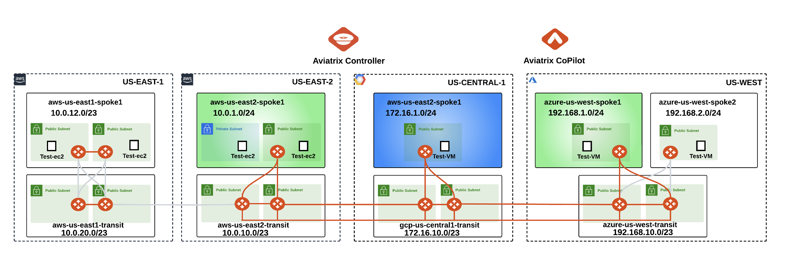
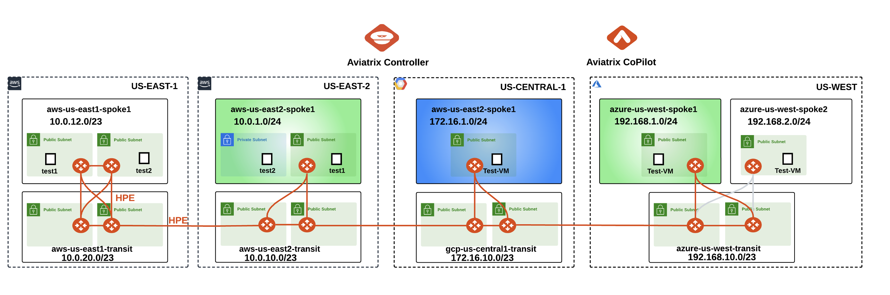
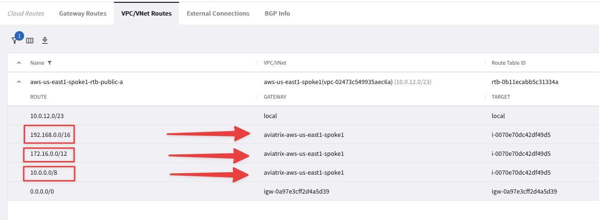
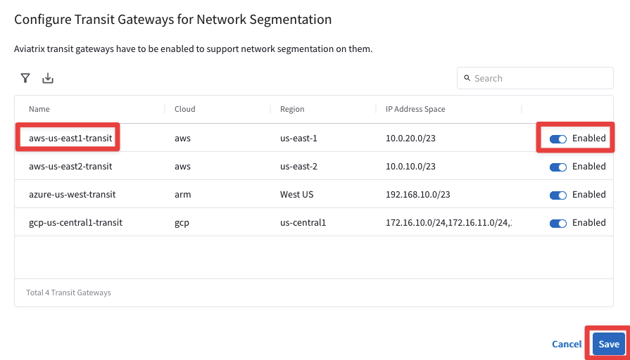
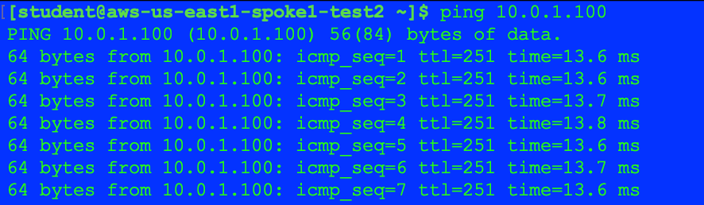
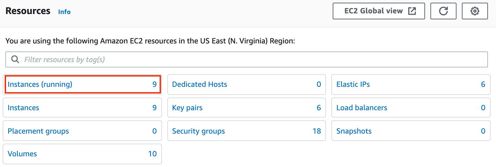
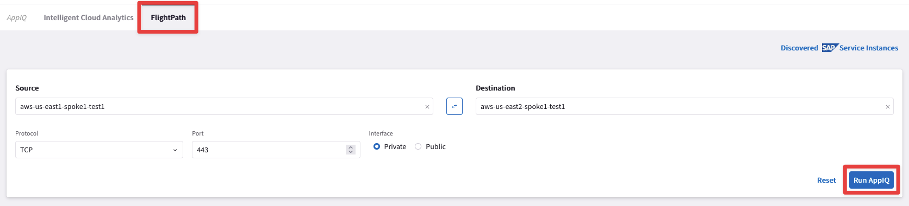

# Lab 5 - HPE WITH ACTIVE MESH

## 1. Objective

In this lab, we will demonstrate Active/Active communication between the resources utilizing high performance encryption (*aka `Insane Mode`* - **large number of A/A tunnels**) between Aviatrix Gateways (Spoke-to-Transit & Transit-to-Transit).

## 2. High Performance Encryption and ActiveMesh

Encryption in Cloud could be a compliance, security or business requirement. Hybrid cloud connectivity and in the cloud communication is untrusted. Aviatrix **`HPE`** provides high performance end-end encryption from on-prem (private/public connections) to the cloud walled-gardens, between the regions and clouds. It can also help overcome native constructs routing scalability challenges.

Aviatrix **`ActiveMesh`** technology provides network resiliency, better convergence and high performance. Both Aviatrix gateways in transit and spoke VPC/VNet/VCNs forward traffic simultaneously. It helps enterprises in traffic engineering and provides deterministic next hop based on path-selection algorithm.

## 3. Topology

In this lab we will configure the pending attachment between the Spoke Gateways in aws-us-east1-spoke1 and the Transit Gateways in aws-us-east1-transit, and the peering between the Transit Gateways aws-us-east1-transit and the Transit Gateways in aws-us-east2-transit. The Gateways in AWS region us-east-1 are pre-configured with HPE (High Performance Encryption, also known as Insane Mode) and AWS us-east2 region was configured in Lab 3.


_Figure 111: Lab 5 Topology_

```{note}
Please keep in mind that the Spoke Gateway in **azure-us-west-spoke2** VPC will still remain unattached in this lab!
```

## 4. High Performance Encryption Configuration
 
### 4.1. CoPilot View before starting

Go to **CoPilot > Cloud Fabric > Topology > Overview**

```{important}
Verify that AWS US-EAST-1 region has a Transit gateway and a Spoke gateway that are not connected yet.
```


_Figure 112: CoPilot view_

### 4.2. Transti-Spoke Attachment

Go to **CoPilot > Cloud Fabric > Gateways > Spoke Gateways** and edit the Spoke Gateway **aws-us-east1-spoke1** clicking on the pencil icon:


_Figure 113: Edit Spoke US-East-1_

Select the Transit Gateway **aws-us-east1-transit** from the drop-down window `"Attach To Transit Gateway"`, and then click on **Save**.


_Figure 114: Attachment_

## 4.3. CoPilot View after Transit-Spoke Attachment

Go to **CoPilot > Cloud Fabric > Topology > Overview**

Verify aws-us-east-1 Transit gateway and aws-us-east-1 Spoke gateway are now connected. 

```{tip}
Wait a handful of minutes and then refresh the web page, in order to see the changes applied on the topology!
```


_Figure 115: Attachment on the CoPilot_

## 4.4. Transit Peerings Configuration

Here you will configure Transit Peering between aws-us-east1 and aws-us-east2.

Go back to **CoPilot > Cloud Fabric > Gateways > Transit Gateways**

- **aws-us-east1-transit** to **aws-us-east2-transit**

Edit the Transit Gateway **aws-us-east1-transit**, clicking on the pencil icon:


_Figure 115: Edit Transit in US-EAST-1_

Select the Transit Gateway **_aws-us-east2-transit_** from the drop-down window `"Peer To Transit Gateways"`, and then click on **Save**.


_Figure 115: Peering_

### 4.4.1. Transit Peerings Verification

Go to **CoPilot > Cloud Fabric > Gateways > Transit Gateways**, select the Transit Gatewasy **_aws-us-east1-transit_**, select the `"Gateway Routes"` tab and check the route **10.0.1.0/24** for instance.

```{note}
It may take a minute or two to reflect here.
```

You will find out that the route 10.0.1.0/24 is reachable through **nine** connections with the **_aws-us-east2-transit_**:


_Figure 115: HPE in action on the First Transit GW_

Likewise, the same route is also reachable via other **nine** connections but through the Second Transit Gateway **_aws-us-east2-transit-1_**:


_Figure 115: HPE in action on the Second Transit GW_

```{important}
The number of additional connections depend on the **_size_** of the Aviatrix Gateway.
```

At this point, this is how the overall topology would look like:


_Figure 116: Logical Topology View_

This is the topology view from CoPilot at this stage:


_Figure 117: CoPilot Topology View_

```{caution}
The actual configuration of **_High Performance Encryption_**  on both the **_aws-us-east1-transit_** and the **_aws-us-east1-spoke1_** was done when the gateways were created before this lab.
```

## 5. High Performance Encryption Verification

### 5.1. CoPilot Verification of the VPC Peerings(Transit-Transit and Spoke-Transit)

HPE automatically creates an underlying VPC Peering attachment within AWS. Verify it on the CoPilot.

Go to **CoPilot > Networking > Connectivity > Native Peering**


_Figure 118: Native Peerings_

Click on any VPC peerings to expand its properties on the right side.


_Figure 119: Native Peerings Properties_

## 5.2. CoPilot Verification of HPE

Go to **CoPilot > Cloud Fabric > Gateways > Transit Gateways**, select the Transit Gatewasy **_aws-us-east1-transit_**, select the `"Interfaces"` tab and check the huge number of tunnel interfaces that HPE has instantiated. These tunnels are used with the Spoke Gateway aws-us-east1-spoke1 and the Transit Gateway aws-us-east2-transit, because HPE is also enabled on these gateways:


_Figure 120: Interface Stats_

## 6. ActiveMesh

### 6.1. CoPilot Verification of ActiveMesh

Go to **CoPilot > Diagnostics > Cloud Routes > VPC/VNet Routes**

Click the filter button, select `“Name”` and enter **_aws-us-east1-spoke1-rtb-public-a_** to filter by just that route table.

```{note}
The RFC 1918 summary routes points to the Aviatrix Spoke gateway for this routing table programmed by the Aviatrix Controller:
```


_Figure 121: Filter_


_Figure 122: RFC1918 routes pointing towards the First Spoke GW_

Now select **_aws-us-east1-spoke1-rtb-public-b_**. 

```{note}
This time the RFC 1918 summary routes points to the Aviatrix **Second** Spoke gateway for this routing table programmed by once again the Aviatrix Controller:
```


_Figure 123: Filter_


_Figure 124: RFC1918 routes pointing towards the Second Spoke GW_

As you can see, Active/Active is achieved within a VPC as well. Each gateway is active on the Availability Zone where it resides.
 
## 6.2. Connectivity test of ActiveMesh (Pt.1)

Test that the EC2 instances in two subnets are pointing to two different routing tables. If one gateway goes down, the controller will switch the ENI of the available gateway in the routing table.

SSH into **both** EC2 test instances in **_aws-us-east1-spoke1_** VPC (refer to your Pod assignment). These test instances are in separate AZs and their default gateways are two different Aviatrix Spoke gateways in their respective AZs.

Ping the EC2 test instance (10.0.1.100) in aws-us-east2-spoke1. It will fail. **WHY?** Because we didn’t enable segmentation on **_aws-us-east1-transit_** and associate **_aws-us-east1-spoke1_** with the transit gateway in the appropriate network domain.
 
### 6.2.1 Enable Segmentation

Go to **CoPilot > Networking > Network Segmentation > Network Domains > Transit Gateways**

Enable Segmentation on **_aws-us-east1-transit_**:


_Figure 125: Enable Segmentation_

### 6.2.2. Associate Aviatrix Spoke to the Network Domain

Go to **CoPilot > Networking > Network Segmentation > Network Domains**

Associate **_aws-us-east1-spoke1_** with its transit in the <span style='color:lightgreen'>Green</span> network domain:


_Figure 125: Association_

## 6.3. Connectivity test of ActiveMesh (Pt.2)

Now SSH to the **_aws-us-east1-spoke1-test1_** in AWS US-East1 and launch ping towards **_aws-us-east2-spoke1-test1_** in AWS US-**East2**.

SSH also to the **_aws-us-east1-spoke1-test2_** in AWS US-East1 and launch ping towards **_aws-us-east2-spoke1-test1_** in AWS US-**East2**.

```{important}
Please keep both the ping sessions running recursively on your SSH client!
```


_Figure 126: Ping from spoke1-test1_


_Figure 127: Ping from spoke1-test2_

To demonstrate ActiveMesh capability, you will shut down temporarily one of the spoke gateways and notice traffic converging to the other gateway.

Login to <a href="https://aws.amazon.com/console/" target="_blank">AWS console</a>. Refer to your pod info for login information (<ins>this screenshot is for Pod 100</ins>):


_Figure 128: AWS console_

Change the region to **N. Virginia** and invoke EC2 service.


_Figure 129: Change the region_

Click on **Instances (running)**:


_Figure 130: Instances running_

Search for **_aviatrix-aws-us-east1-spoke1_** and then select **Instance state > Stop instance**


_Figure 131: Stop the Instance_

Confirm by clicking on **Stop** one more time.


_Figure 131: Confirm the stop_

You will notice ping drops solely from **_aws-us-east1-spoke1-test1_**. The traffic will reconverge to the spoke gateway in the other AZ, in about <ins>1 minute and 30 seconds to 2 minutes</ins>.

This shows how the Aviatrix Controller intelligently auto-heals the VPC routing.


_Figure 132: Temporary disruption with FAST keepalive!_

**Bonus Step**: `Restart` the Gateway from the AWS console and reverify the traffic flow.


_Figure 133: Restart_

After this lab, this is how the overall topology would look like:


_Figure 133: Final Topology for Lab 5_

## 7. FlightPath

 Go to **CoPilot > Diagnostics > AppIQ > FlightPath**

Use the following inputs:

- **Source**: <span style='color:#33ECFF'>aws-us-east1-spoke1-test1</span>
- **Destination**: <span style='color:#33ECFF'>aws-us-east2-spoke1-test1</span>
- **Protocol**: <span style='color:#33ECFF'>TCP</span>
- **Port**: <span style='color:#33ECFF'>443</span>
- **Interface**: <span style='color:#33ECFF'>Private</span>


_Figure 134: FlightPath config_

This will provide an AppIQ report of how **_aws-us-east1-spoke1-test1_** is connected with **_aws-us-east2-spoke1-test1_** and display the path along with end-to-end latency.

```{note}
You might see some links still depicted in **red**, after having restarted the Spoke Gateway. Be patient and relaunch the report and you will get the same outcome as depicted below.
```


_Figure 135: FlightPath Report_

Scroll down to get more details about:

- The latency between each pair of gateways
- Performance monitoring metrics of all gateways in the path
- FlowIQ between the two instances
- Security group checks
- NACL checks
- Routing tables 

You can also download the entire report in pdf format by clicking the **PDF icon** at the top right corner:


_Figure 136: FlightPath Report PDF_

## Bonus questions
### Gateway Keepalive Templates

Experiment with <a href="https://read.docs.aviatrix.com/HowTos/gateway.html#gateway-keepalives" target="_blank">Gateway keepalive templates</a> and retest convergence times when bringing down a spoke gateway.

```{tip}
You can modify the <ins>Gateway to Controller Communication timer</ins> directly from the CoPilot. Go to **CoPilot > Cloud Fabric > Gateways > Settings > Gateway to Controller Communication** and change the `Keep Alive Speed` from **_medium_** (default) to **_fast_**. Then repeat the experiment carried out earlier.
```


_Figure 137: Keep Alive Speed_

### Transitive Routing

```{warning}
The test instances in **_aws-us-east1-spoke1_** are not able to communicate with the test instances in GCP or in Azure.
```

You can verify this with the Gateway routing table on the **CoPilot > Diagnostics > Cloud Routes > Gateway Routes > aws-us-east1-transit**. You will not see the GCP Spoke routes of **_172.16.1.0/24_**., for instance.

- Why is that?
What would be needed to make those routes visible?