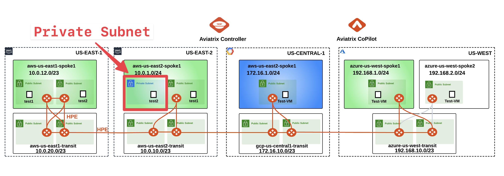
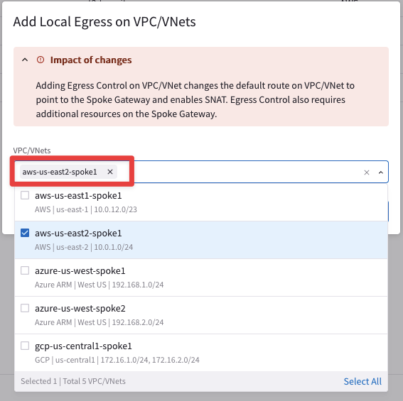

# Lab 5 - EGRESS

## 1. OBJECTIVE

In this lab, we will demonstrate how to enable the `Egress Control` (that is one of the features that belong to the Distributed Cloud Firewall service) on the VPC that we want to target. Of course, the selected VPC should have subnets associated into Private Routing tables (i.e. without a default route pointing to the IGW). The Controller will reroute the traffic through the Aviatrix Spoke Gateway. The Egress Conbtrol can guarantee immediately better visibility and better control in order to replace the **CSP Native NAT Gateways**. <ins>The Egress Control allows to reduce the cloud costs and at the same, improve the security without impacting the architecture</ins>.

## 2. TOPOLOGY

Let's pinpoint the right candidate VPC, where would be possible to enable the Egress Control.


_Figure 138: Lab 6 Initial Topology_

The VPC **aws-us-east2-spoke1** has a private subnet, whereby the Egress Control can be activated in this specific VPC.

- Explore the Private Routing Tables inside the VPV **aws-us-east2-spoke1**

```{tip}
Go to **CoPilot > Cloud Fabric > Gateways > Transit Gateways** and select the **_aws-us-east2-spoke1 GW_**, then click on the VPC/VNet Route Tables tab, then select any of the Private RTBs fron the Route table field.
```


_Figure 139: Select the Spoke GW in US-EAST-2_


_Figure 140: Check the private RTB_

You will notice that any private RTBs has the local cidr pointing to local and the three RFC19178 routes. The EC2 instance can't reach the internet public zone, because of the absence of a default route.

## 3. SSH TO THE EC2 INSTANCE IN THE PRIVATE SUBNET

- SSH to the **_aws-us-east2-spoke1-test1_** instance from your laptop. Refer to your POD portal or alternatively, you can retrieve the Public IP from the CoPilot's Topology.


_Figure 141: SSH to aws-us-east2-spoke1-test1_

- Then from the **_aws-us-east2-spoke1-test1_** instance SSH to the **_aws-us-east2-spoke1-test2_** instance.

```{tip}
Retrieve the Private IP of the **_aws-us-east2-spoke1-test2_** from the Topology
```


_Figure 142: Retrieve the private IP_

- Then from the **_aws-us-east2-spoke1-test1_** instance SSH to the **_aws-us-east2-spoke1-test2_** instance.

## 4. EGRESS CONTROL
### 4.1 ENABLE THE EGRESS CONTROL

Now let's enable the egress within the VPC that is hosting the **_aws-us-east2-spoke1-test2_** instance.

```{note}
Go to **CoPilot > Security > Egress > Egress VPC/VNets** and click on `"+ Local Egress on VPC/VNets"`. then select the **_aws-us-east2-spoke1_** VPC and click on **Add**.
```


_Figure 143: Enable Local Egress_


_Figure 144: Choose the correct VPC_

## 4.2 INSPECT THE PRIVATE RTB

- As soon as the Egress Control has been enabled, a `default route` is injected inside the Private RTBs. Verify any Private RTBs in the aws-us-east2-spoke1 VPC

```{tip}
Go to **CoPilot > Cloud Fabric > Gateways > Transit Gateways** and select the **_aws-us-east2-spoke1 GW_**, then click on the VPC/VNet Route Tables tab, then select any of the Private RTBs fron the Route table field.
```


_Figure 145: Default route has been injected_

```{important}
Now, thanks to the default route, the instance **_aws-us-east2-spoke1-test2_** will be able to generate traffic towards the internet public zone.
```

## 4.3 GENERATE TRAFFIC