# Lab 7 - FIRENET

## 1. Objective

The objective of this lab is to learn how to deploy Palo Alto Networks (aka PAN) VM-series firewalls in the Transit VNet and inspect traffic between the two Spoke VNets using firewall policies.
 
## 2. FireNet Overview (Firewall Nework)

Aviatrix Firewall Network (aka *`FireNet`*) is a turnkey solution to deploy and manage firewall instances in the cloud, as shown in the topology below. Firewall Network significantly simplifies virtual firewall deployment and allows the firewall to inspect VPC/VNet/VCN to VPC/VNet/VCN (East West) traffic, VPC/VNet/VCN to Internet (Egress) traffic, and VPC/VNet/VCN to on-prem including partners and branches (North South) traffic.

In addition, Firewall Network allows you to scale firewall deployment to multi AZ and multi instances/VMs in maximum throughput active/active state without the SNAT requirement.
 
## 3. Topology

Up until now, in Azure you have only worked on **_azure-us-west-spoke1_**. This lab will introduce finally **_azure-us-west-spoke2_**, which is a gateway in the top-right corner of this topology that is already deployed (hence it is red); <ins>there is the attachment that has not been deployed yet</ins>!

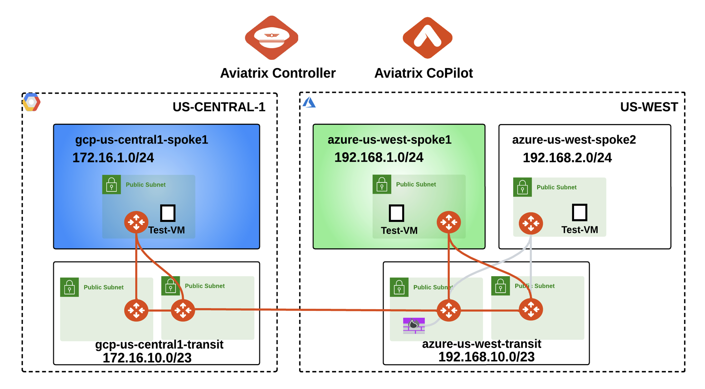
_Figure 160: Lab 7 Initial Topology_

## 4. Configuration
### 4.1. Azure Transit to Spoke Peering

First, you will need to configure the grey Aviatrix Spoke-Transit connection in the topology between **_azure-us-west-spoke2_** and **_azure-us-west-transit_**.

Go to **CoPilot > Cloud Fabric > Gateways > Spoke Gateways** and edit the Spoke Gateway **_azure-us-west-spoke2_**, clicking on the pencil icon:

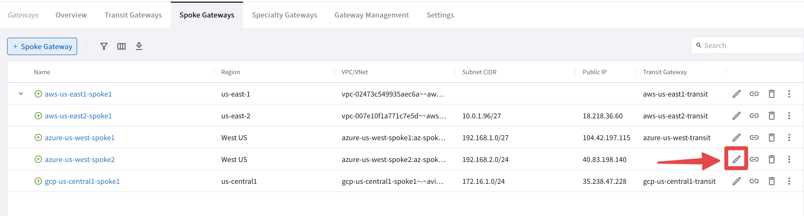
_Figure 161: Edit Spoke GW_

Attach **_azure-us-west-spoke2_** (pre-configured VNet) to **_azure-us-west-transit_** as shown below.
Do not forget to click on **Save**.

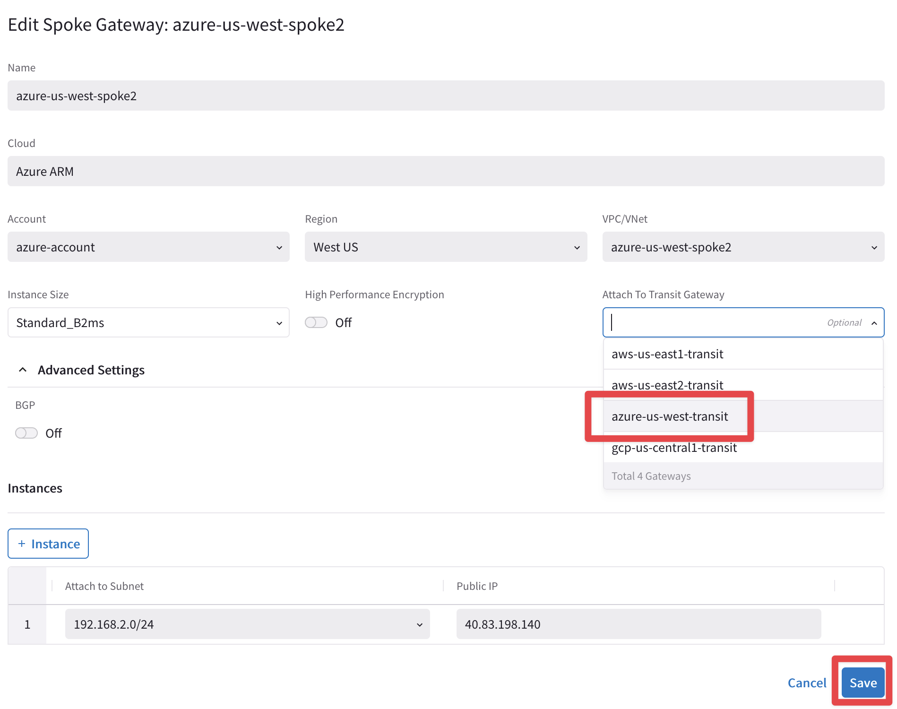
_Figure 162: Attachment_

```{important}
The **_azure-us-west-transit_** is already enabled for FireNet function.
```

### 4.2. PAN Firewall Deployment

In this step you will be deploying a PAN firewall from the Aviatrix CoPilot with a `Bootstrap package`. 

The bootstrap package will take care of the following pre-provisioning on the Firewall:

- Interfaces mapping
- Policies creation
- Logging

Specifically, you will be deploying a firewall image called **Palo Alto Networks VM-Series Next-Generation Firewall Bundle 1**.

Aviatrix has already taken care of the *`subscription`* from the Azure Marketplace.

Go to **CoPilot > Security > FireNet > Firewall**, then click on the `"+ Firewall"` button.


_Figure 163: FireNet_

Deploy a Firewall by entering these settings within the `Deploy Firewall` window:

- **FireNet Instance**: <span style='color:#33ECFF'>azure-us-west-transit</span>
- **Name**: <span style='color:#33ECFF'>azure-us-west-pan</span>
- **Firewall Image**: <span style='color:#33ECFF'>Palo Alto Networks VM-Series Next-Generation Firewall Bundle 1</span>

```{warning}
When you click on the **Firewall Image** drop-down window, you will see a `"Loading"` message. The message means that the Controller is in the middle of contacting the Marketplace through the API calls, therefore, be patient and wait for some seconds.
```


_Figure 164: Marketplace contact under loading_

- **Firewall Image Version**: <span style='color:#33ECFF'>9.1.0</span>
- **Firewall instance Size**: <span style='color:#33ECFF'>Standard_D3_v2</span>
- **Management Interface Subnet**: <span style='color:#33ECFF'>azure-us-west-transit-Public-gateway-and-firewall-mgmt-1</span>
- **Egress Interface Subnet**: <span style='color:#33ECFF'>azure-us-west-transit-Public-FW-ingress-egress-1 [**Note**: Make sure you do not select the subnets that begin with *az-1, az-2, or az-3*]</span>
- **Authentication**: <span style='color:#33ECFF'>Password</span>
- **Username**: <span style='color:#33ECFF'>avxadmin [**Note**: username *admin* is not permitted in Azure]</span>
- **Password**: <span style='color:#33ECFF'>[choose a **strong password** and remember it]</span>
- **Bootstrap Configuration**: <span style='color:#33ECFF'>turn **ON** the knob</span>
- **Storage**: <span style='color:#33ECFF'>Retrieve this from your <ins>pod info</ins></span>
- **Storage Access Key**: <span style='color:#33ECFF'>Retrieve this from your <ins>pod info</ins></span>
- **File-Shared Folder**: <span style='color:#33ECFF'>Retrieve this from your <ins>pod info</ins></span>

Then click on **Deploy**.


_Figure 165: Firenet Deployment Template_

```{warning}
Please be patient - firewall deployment can take a long time, **_up to 20 minutes_**, due to the slow responsiveness of Azure API calls to prepare the firewall. Even after the firewall is created and is assigned a Public IP address, it doesn't mean it can be accessed immediately. If you try accessing it too early, your experience may vary.
```


_Figure 166: Deployment in progress_

At this time, the interface mapping, security policy configuration, and RFC1918 static route creation are all being handled. The **_Aviatrix Controller_** does a lot of magic in orchestrating and manipulating route tables.

You will know the Firewall is created when you see the corresponding entry like this (refresh the page after roughly 10-15 minutes):


_Figure 167: Deployment completed_

Even after that message, it doesn't mean you can access the firewall (i.e. **URL**). Within **5-10 minutes** after you receive confirmation about the firewall being created, you should be able to access it.

Now try to click on the *hyperlink* of the firewall. You should be able to see the page where entering the credentials (refer to you POD portal).

## 4.3. Firewall Configuration

Once you access the firewall in your web browser via **HTTPS**, you might get a warning about an invalid certification based on your browser settings. This is just because it has a **_self-signed certificate_**. Navigate past that to get to the login prompt. Sign in as `avxadmin` as the username and the password you entered earlier.


_Figure 168: PaloAlto Welcome page_

Dismiss the Welcome splash screen. This is an indication that the firewall is ready.

Do not end the firewall's HTTPS session yet. You will return to this web interface later.

## 4.4. Firewall Vendor Integration

Go to **CoPilot > Security > FireNet > FireNet Gateways**, click on the `"three dots"` symbol on the right-hand side of the **_azure-us-west-transit_** raw, and then click on `Vendor Integration`.


_Figure 169: Vendor Integration_

Insert the following paramenters in the `"Vendor Integration"` pop-up window.

- **Management IP Address**: <span style='color:#33ECFF'>**Auto populated**</span>
- **Vendor**: <span style='color:#33ECFF'>Palo Alto Networks VM-Series</span>
- **Username**: <span style='color:#33ECFF'>avxadmin</span>
- **Password**: <span style='color:#33ECFF'>[the password you entered earlier]</span>

Then click on **Save**.


_Figure 170: Vendor Integration template_

```{note}
Wait for some seconds for the Vendor Integration to complete.
```


_Figure 171: Vendor Integration accomplished_

Go to **CoPilot > Security > FireNet > Firewall** and click on the **_azure-us-west-pan_** firewall

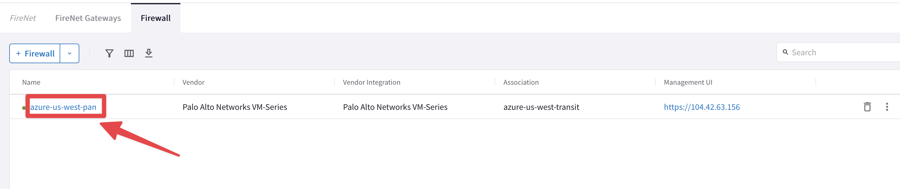
_Figure 172: Click on the Firewall_

You will see the RFC 1918 routes that the Controller automatically programmed on the Firewall, through the `"Vendor Integration"`. Notice how each RFC1918 route has a prefix of `"AVX-"` to show that it is programmed by Aviatrix.


_Figure 173: Vendor Integration outcome_

## 4.5. Verify Routes Installed on Firewall

Verify the same RFC 1918 routes exist on the PAN Firewall.

Back on the **PAN Firewall**, navigate to **Network tab > Virtual Routers >** click on **default**.


_Figure 174: PaloAlto dashboard_

Click on `"Static Routes"` tab. You should be able to see the same RFC 1918 routes with `"AVX-"` prefixes that were programmed by the Aviatrix Controller.


_Figure 175: PaloAlto dashboard_

```{caution}
Do not end the firewall's HTTPS session yet. You will return to this web interface later. 
```

## 4.6. FireNet Policy

Go to **CoPilot > Security > FireNet > FireNet Gateways**, click on the **_azure-us-west-transit_** Transit FireNet GW and then choose the `"Policy"` tab.


_Figure 176: Policy tab_

Then select ach Azure spoke gateway one by one, click on `"Actions"` and choose `"Add"` in order to add a specific VPC inside the **Inspection Policy**.


_Figure 177: Inspection Policy assignment_


_Figure 178: Inspection Policy accomplished_

## 5. Verification

Verify the traffic flows within Azure and Azure to GCP as shown below by following steps 5.1 - 5.2:

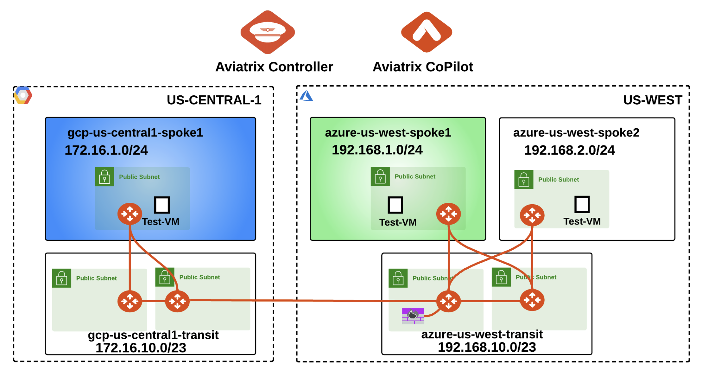
_Figure 179: Lab 7 Topology with FW deplopyed_

## 5.1. Within Azure

Before we can verify connectivity, we need to associate **_azure-us-west-spoke2_** to the <span style='color:lightgreen'>Green</span> Network Domain.

Go to **CoPilot > Networking > Network Segmentation > Network Domains**

Click the *pencil icon* to edit the Green network domain.


_Figure 180: Edit Green_

Select the gateway **_azure-us-west-spoke2_** from the drop-down window, selecting the `"Associations"` field.

Then click **Save**:


_Figure 181: Association_

After this step, this is what Lab 7 topology looks like:

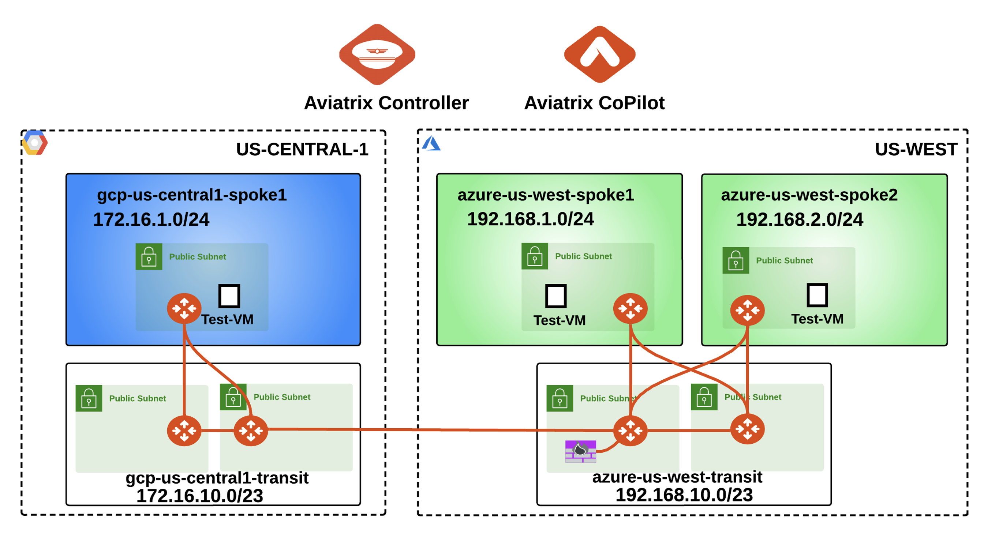
_Figure 182: Lab 7 Final Topology_

```{warning}
On Lab 6 (Egress), the DCF functionality was enabled. The current active rule is the `"Inspect-DNS"`, that is only allowing traffic towards UDP port 53. Before launching any connectivity test, <ins>you need to move on the top of the list of the DCF rules, the **_Greenfield-Rule_** and disassociate the **_Any-Web_** WebGroup</ins>!
```

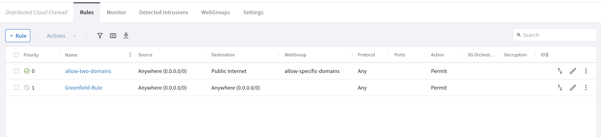
_Figure 183: DCF rules_

- Modify the Greenfield-Rule Priority

```{tip}
Go to **CoPilot > Security > Distributed Cloud Firewall > Rules (default)**, click on the the `"two arrows"` icon on the righ-hand side of the Greenfield-Rule and choose *`"Move Rule"`* at the very **Top**.
Then click on **Save in Draft**.
```


_Figure 184: Move at the Top_

Now click on the **_pencil icon_** of the Greenfield-Rule and then disassociate the **_Any-Web_** WebGroup. Do not forget to click on **Save In Drafts**.

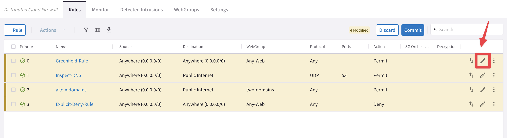
_Figure 185: Edit Greenfield_


_Figure 185: Disassociate Any-Web_

You can proceed in committing your change.

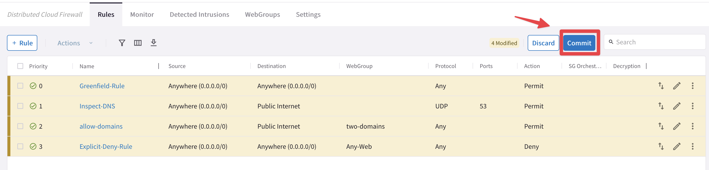
_Figure 185: Final Commit_

### 5.1.1 Luanch connectivity test

**SSH** into **_azure-us-west-spoke1-test1_** and from there, ping **_azure-us-west-spoke2-test1_** on its private IP.

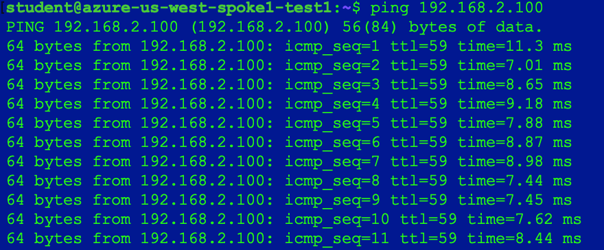
_Figure 186: Ping is successful_

```{note}
Pings are passing because the **`Allow-all`** rule on the Firewall is permitting traffic from any zone to any zone to pass.
```

Back on the PAN firewall, click on the `Monitor` tab. Then paste this string in the filter bar and hit **Enter**, which will apply the filter:

```bash
(addr in 192.168.1.100)
```


_Figure 187: Monitor on the PaloAlto_

Traffic is passing through firewall because **_azure-us-west-spoke1_** and **_azure-us-west-spoke2_** both are in the **Inspection Policy**.

## 5.2. Azure to GCP

While on **_azure-us-west-spoke1-test1_**, ping **_gcp-us-central1-spoke1-test1_**.


_Figure 188: Ping GCP_

This still matches the **`Allow-all`** firewall rule. Moreover, it works because of the Connection Policy we had configured in the **Network Segmentation** Lab.

Back on the PAN firewall, click the **refresh** button in the top-right corner to see the log entries for pinging the GCP spoke test VM.


_Figure 189: Monitoring traffic towards GCP_

After completing this Lab, the overall topology would look like this:

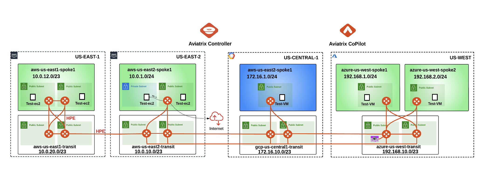
_Figure 190: Final Topology for Lab 7_