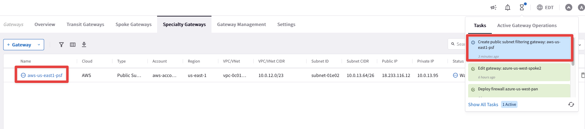
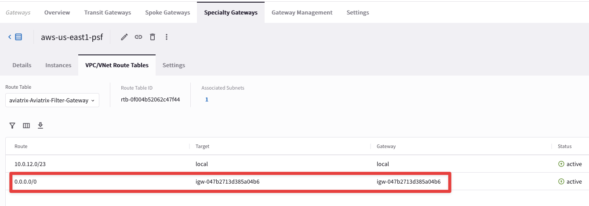
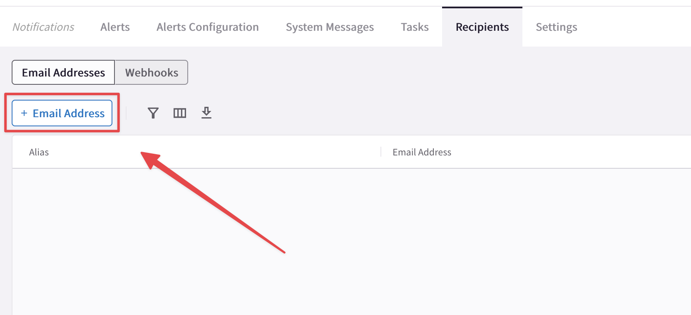
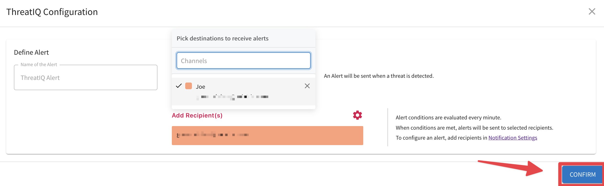
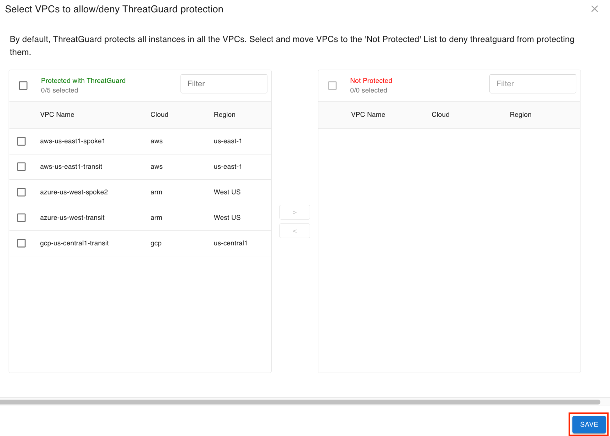
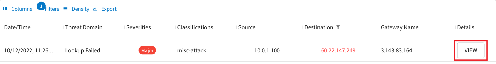
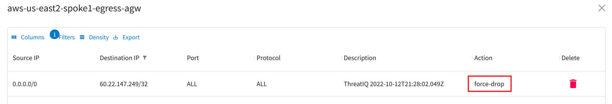
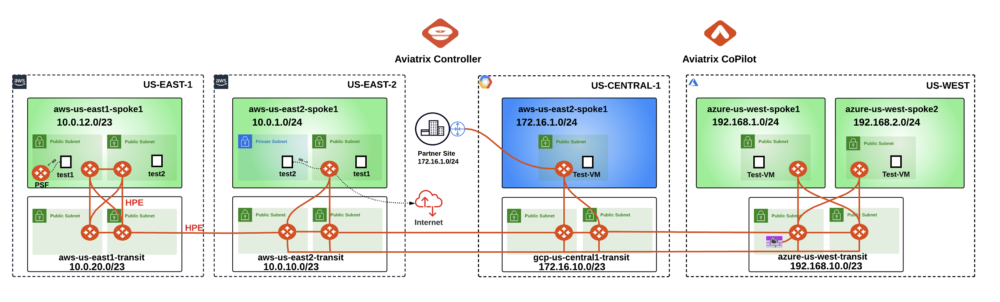

# Lab 9 - THREATIQ & THREATGUARD

## 1. Objective

This lab will demonstrate how `ThreatIQ` and `ThreatGuard` work.
 
## 2. ThreatIQ Overview

Aviatrix gateways send NetFlow data to CoPilot. CoPilot uses this data in many ways. **FlowIQ** is one. **ThreatIQ** is another. ThreatIQ alerts you on Malicious IPs with bad reputations. These IPs are reported in the ThreatIQ database that CoPilot maintains.

```{important}
ThreatIQ and ThreatGuard work as soon as a **_Public Subnet Filtering_** gateway is deployed. This is because the PSF gateway intercepts Ingress traffic.
```

## 3. Topology

In this lab, we will deploy a `“PSF"` gateway in AWS US-EAST-1 region.


_Figure 205: Lab 9 Initial Topology_

## 4. PSF
### 4.1 Deploy the PSF

Go to **CoPilot > Cloud Fabric > Gateways > Specialty Gateways**, then click on the `“+Gateway"` button and then choose the **Public Subnet Filtering Gateway**.


_Figure 205: PSF_

Insert the following parameters:
- **Name**: <span style='color:#33ECFF'>aws-us-east1-psf</span>
- **Account**: <span style='color:#33ECFF'>aws-account</span>
- **Region**: <span style='color:#33ECFF'>us-east-1 (N. Virginia)</span>
- **VPC**: <span style='color:#33ECFF'>aws-us-east1-spoke1</span>
- **Instance Size**: <span style='color:#33ECFF'>t2.medium</span>
- **Attach to Unused Subnet**: <span style='color:#33ECFF'>us-east-1a</span>
- **Instance Size**: <span style='color:#33ECFF'>aws-us-east1-spoke1-rtb-public-a</span>

Do not forget to click on **Save**.


_Figure 205: PSF template_


_Figure 205: PSF template_

```{warning}
Wait for about **8** minutes for the completion of the PSF depl0yment
```

### 4.2 Verification

- Click on the **PSF** gateway, select the **VPC/VNet Route Tables** and then inspect the **_aviatrix-Aviatrix-Filter-Gateway_** Route Table


_Figure 205: PSF template_


_Figure 205: PSF template_

```{note}
The subnet with the PSF gateway is a Public Subnet with 0/0 pointing to IGW. No workload instances should be deployed in this subnet.
```

- Verify one more routing table that we selected while deploying the PSF Gateway: **_aws-us-east1-spoke1-Public-a_**. You can notice that the default route is pointing towards the PSF Gateway (we are verifying this rtb because the test instance’s subnet points to this rtb).


_Figure 205: PSF template_

## 5. Enable ThreatIQ and ThreatGuard

Navigate to **CoPilot > Security > ThreatIQ > Configuration**

Click on **Send Alert**:


_Figure 208: Enable ThreatIQ_

Then click on **Notification Settings**.


_Figure 209: Notification Settings_

Now click on the `"+ Email Address"` button.


_Figure 210: Email_

Choose an **alias**, insert your **personal email** and then click on **Save**:


_Figure 211: Alias and Personal Email_

Navigate back to **CoPilot > Security > ThreatIQ > Configuration**

Click again on **Send Alert**:


_Figure 212: Send Alert Settings_

Click on **Add Recipients**.


_Figure 213: Add Recipient(s)_

Select your email address from the pulldown menu and then click on **Confirm**.


_Figure 214: Add your email_

From this point onwards, if you enter a valid email address, you will receive email notifications about **ThreatIQ** alerts.

Before enabling the blocking, on the far right side, ensure that the **ThreatGuard firewall rules order** is set to `Prepend`.


_Figure 215: Prepend_

Enable Block Threats (i.e. `ThreatGuard`):


_Figure 216: ThreatGuard_

By default, **all** VPCs are enabled for ThreatGuard. 

Click **Save** to continue.


_Figure 217: Select VPC_

Then, click **CONFIRM**.


_Figure 218: Confirm_

## 5. Verification

Wait for the instructor to provide a malicious IP. Let's call it `<malicious-IP>`. 

```{important}
<ins>Note down this IP address!</ins>
```

SSH to the EC2 instance **_aws-us-east1-spoke1-test1_**

- Now test `ThreatGuard` by first issuing this command (make sure to enter **HTTPS**):

```bash
curl https://<malicious-IP>
```


_Figure 219: Curl towards the malicious IP_

Navigate back to **CoPilot > Security > ThreatIQ > Overview**

```{note}
**Wait for some minutes**, before proceeding with the next action. Furthermore, set the **Time Period** to `"Custom"` and then set the end time a bit farther than your current time:
```


_Figure 219: Curl towards the malicious IP_

You should see the IP in the table at the bottom. You can filter based on the destination IP address (insert the malicious IP address):


_Figure 219: Curl towards the malicious IP_


_Figure 219: Curl towards the malicious IP_

Afterwards, click on VIEW under the column Details.

```{note}
The IP we selected might not be deemed a threat when you read this.
```


_Figure 219: Curl towards the malicious IP_


_Figure 219: Curl towards the malicious IP_

Then select **Threat Summary** and pinpoint the metadata "tag" to determine how ThreatIQ has classified this IP.


_Figure 219: Curl towards the malicious IP_

### 5.1. Example of ThreatGuard in action

Navigate to  **CoPilot > Security > ThreatIQ > Configuration**

```{note}
The CoPilot UI frequently changes, and what you see below may differ from your experience. 
```

- Click on **VIEW** under the column View Rules:


_Figure 219: Curl towards the malicious IP_

Filter based on the malicious IP (both on **source** address and **destination** address): you will find out that ThreatGuard applied the enforcement `"force-drop"` in both directions.


_Figure 219: Curl towards the malicious IP_


_Figure 219: Curl towards the malicious IP_

Now try issuing the same curl command once again.


_Figure 219: Curl towards the malicious IP_

ThreatGuard has successfully blocked the malicious IP!

```{warning}
Before ending this lab, remove your email from the notification list!
```

Navigate to **CoPilot > Monitor > Notifications > Alerts Configuration**

Click on the pencil icon for editing the configured alert named `"ThreatIQ Alert"`:


_Figure 219: Curl towards the malicious IP_

- Remove the recipient that is identified based on the alias that you chose before, then click on **Save**.

ThreatIQ will immediately stop sending the alerts to your personal email:


_Figure 219: Curl towards the malicious IP_

After this lab, this is how the overall topology would look like:


_Figure 88:  Final topology for Lab 9_
