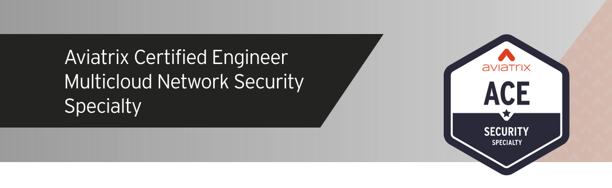
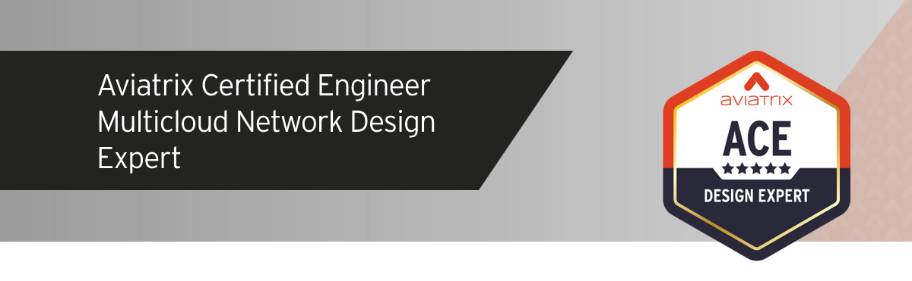
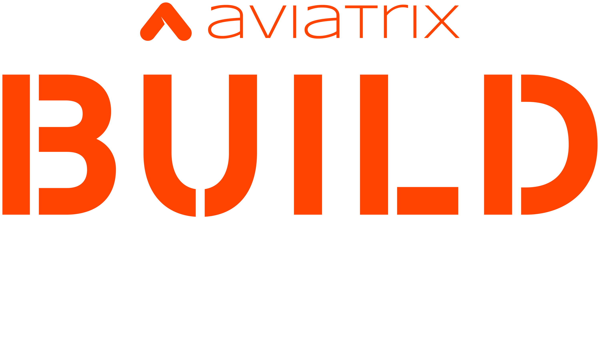

# avxlabs-docs

Lab guides for `aviatrixlabs`, hosted at [https://docs.aviatrixlab.com](https://docs.aviatrixlab.com).

## ACE

### Instructor Led

### Self-paced

### No lab guide

## Build

## Flightschool

