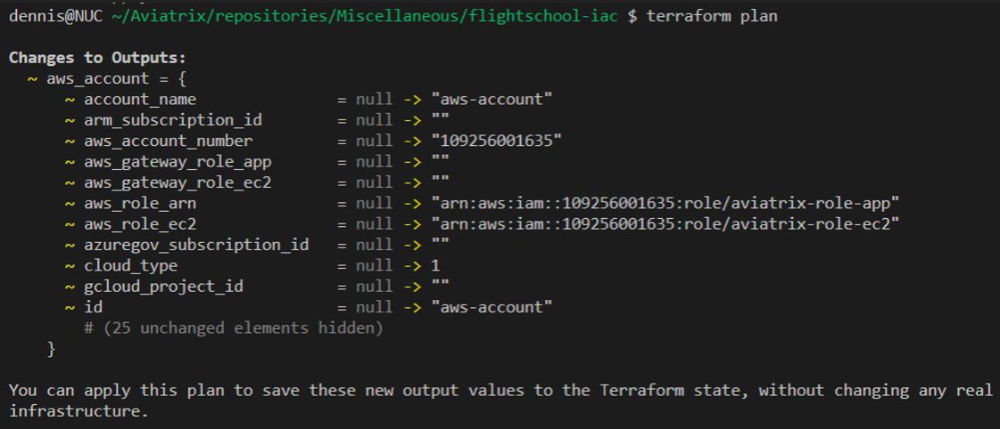

# Lab A

## Exercise A.1 - Aviatrix Controller

### Description

Navigate and login to the Aviatrix Controller.

### Validate

Open your browser and navigate to:

**URL:** ```https://ctrl.pod[x].aviatrixlab.com```  
**User:** ```student```  
**Password:** <span style="color:orange">***Please refer to your portal registration page for the password.***</span>

* _(replace **[x]** with your pod ID)_

### Expected Results

Explore the Dashboard. As you can see, there is already a gateway deployed in Azure.

## Exercise A.2 - Access Accounts

### Description

In order for the controller to be able to access the different CSP environments, we need to provide it with accounts with the correct privileges.

### Validate

Have a look at the access accounts already set up under **_Accounts -> Access Accounts_**

### Expected Results

Accounts in GCP, AWS and Azure have already been onboarded and you should see the three accounts in the list.  The accounts should also be green, meaning the permissions in the accounts are correctly configured.

## Exercise A.3 - CoPilot

### Description

Along with the Aviatrix Controller, CoPilot is also deployed in the Shared Services VPC.  CoPilot will be your best buddy for visualizing and operating the Multicloud environment.

### Validate

You can access CoPilot by logging into the Controller, and clicking on the CoPilot button at the top of the Window.  

  
_Fig. CoPilot_  

Alternatively, you can log in directly to CoPilot using the following details:

**URL:**  ```https://cplt.pod<#>.aviatrixlab.com```  
**Username:**  ```student```  
**Password:** <span style="color:orange">***Please refer to your portal registration page for the password.***</span>  

The Dashboard tab provides a global overview of your Multicloud network, the status, how much traffic is flowing, locations deployed, etc.  

Take a look into `Cloud Fabric-->Topology` which visualizes the connectivity of the Multicloud environment. In the Topology view, all objects within a VPC/VNET are clustered together.  To open up a cluster, simply double-click.  This will display subnets, instances, Aviatrix Gateways, etc within a VPC/VNET.  Topology will also show you latency between links, and allows you to initiate some troubleshooting commands directly from the map.  

Tip: Double click on the blue bubbles for more detail!

### Expected Results

By clicking the CoPilot link in the Controller, you should be redirected to CoPilot and automatically signed in.  You should be able to view Topology and see the current Multicloud Network topology.  Topology should look similar to this:  

  
_Fig. Initial Topology_  

As you can see, there is a VNET already deployed, but we only have one gateway deployed. This is the Azure transit gateway. The reason for this is, so we were able to provision the on-prem VPN gateway with the final IP of the Azure transit gateway. Other than this, no Aviatrix gateways are deployed.

## Exercise A.4 – Set up our IaC environment

We are going to set up our environment to allow interaction with the controller through Terraform.
If you don’t have Terraform set up on your machine, download and install it [here](https://learn.hashicorp.com/tutorials/terraform/install-cli). We’re assuming you’re using Terraform 1.1.0 or newer for this session.

Next create a new folder on your pc/mac to store the Terraform project. I suggest “FlightSchool_IaC”, but your free to choose.

In our Terraform project, we’re going to define which providers Terraform needs to download on initialization.
Create a file called versions.tf and add the following content:

```terraform
terraform {
  required_providers {
    aviatrix = {
      source = "AviatrixSystems/aviatrix"
      version = "~>2.24.0"
    }
  }
}
```

This informs Terraform on to download version 2.24.x of the [Aviatrix terraform provider](https://registry.terraform.io/providers/AviatrixSystems/aviatrix/latest/docs). The `~>` tells Terraform the version is constrained to the latest release of 2.24 and cannot go below or above to e.g. 2.25 or 2.23 This is often called the pessimistic constraint operator. More information on constraint operators can be found [here](https://www.terraform.io/language/expressions/version-constraints). The [Aviatrix provider compatibility](https://registry.terraform.io/providers/AviatrixSystems/aviatrix/latest/docs/guides/release-compatibility) chart is useful in determining which provider version to use.

Next we are going to initialize Terraform and see that the required provider gets installed. Execute the terraform init command from the project folder as shown below:


_Fig. Terraform Init_

Alright, next we need credentials for our Terraform provider to interact with the controller. Lets set these up in the controller. Go to `Accounts` -> `Account Users` and click `+ADD NEW`. Create a user to be used by Terraform later on and record the credentials:

|              |              |
| ------------ | ------------ |
| **Username** | **Password** |
|              |              |
|              |              |

Now we will use these credentials to set up our Terraform provider configuration. There are a couple of different ways to achieve this as you can see on our [documentation page](https://registry.terraform.io/providers/AviatrixSystems/aviatrix/latest/docs#authentication). In a CI/CD pipeline deployment, I would typically advise using the [environmental variables](https://registry.terraform.io/providers/AviatrixSystems/aviatrix/latest/docs#environment-variables) as that way you don’t have to store secrets in your code. But today we’ll use a [tfvars file](https://www.terraform.io/language/values/variables#variable-definitions-tfvars-files). Create the file `terraform.tfvars` in your project folder and add the credentials you just created:

```terraform
controller_ip       = "<pod-hostname, e.g. ctrl.pod50.aviatrixlab.com>"
controller_username = "<username>"
controller_password = "<password>"
```

Make sure to never add this file to your git repo when you are using this method and storing code in a repo (e.g. through `gitignore`).

In order for the provider to use these credentials, we need to define the provider configuration and link to these credentials through variables. Create a file `variables.tf` and add the variable definitions in like this:

```terraform
variable "controller_ip" {
  type        = string
  description = "The IP or hostname of the Aviatrix controller we want to interact with"
}

variable "controller_username" {
  type        = string
  description = "The Username for the Aviatrix controller we want to interact with"
}

variable "controller_password" {
  type        = string
  description = "The password for the Aviatrix controller we want to interact with"
}
```

Now let’s configure the Aviatrix terraform provider in a new file called `providers.tf` by referring to the variables we just declared:

```terraform
provider "aviatrix" {
  controller_ip = var.controller_ip
  username      = var.controller_username
  password      = var.controller_password
}
```

To test our provider configuration, lets test if we can query information from the controller using a [data source](https://www.terraform.io/language/data-sources). Let’s create a new file which will hold our actual code later. Name it `main.tf` and add the aviatrix_account data source to query information about one of the access accounts we noted down in lab A.1 and output it to console using an output.

```terraform
data "aviatrix_account" "aws_account" {
  account_name = "aws-account"
}

output "aws_account" {
  value = data.aviatrix_account.aws_account
}
```

When we execute a Terraform plan, we should get back the account details. As shown below:

  
_Fig. Terraform Output_

Great, we now have our provider set up and are ready to start deploying our infrastructure! Feel free to remove the data source and output if you don’t want to see this information displayed every time we execute another apply.
