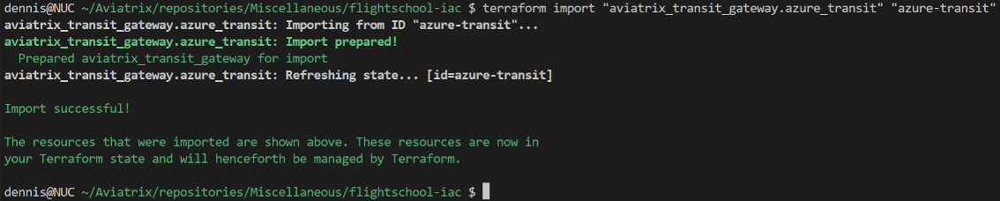

# Lab B

## Import the existing Azure transit into Terraform

As you can see in the lab diagram and controller, the Azure transit was already provisioned. In this exercise we are going to import it into our Terraform state and code. Luckily, our controller makes life easy for us and can export the existing objects into Terraform code and generate an import script.

### Exercise B.1

Go to `Useful Tools` -> `Export to Terraform`. Find the Transit Gateway section under Multicloud Transit and hit `Download TF`.

In the downloaded zip archive, you will find two files. The `transit_gateway.tf` file contains the Terraform code for the gateway. Go ahead and paste the contents of this file to your `main.tf`. Rename the resource to azure_transit (instead of transit_gateway_1) and save your file.

If we would execute Terraform apply now, we would try to create an additional gateway. That’s not the desired outcome, so we need to tell Terraform to import the existing gateway in the controller, against the resource we just pasted in “main.tf”. This is where the second file comes in.

Open the file and copy the import command. Edit the command to rename transit_gateway_2 to azure_transit and run it in your folder where the project is stored.

This should look like this:

_Fig. Terraform Import_

If we would not have edited the name, we could also have executed the `.sh` file as is.
