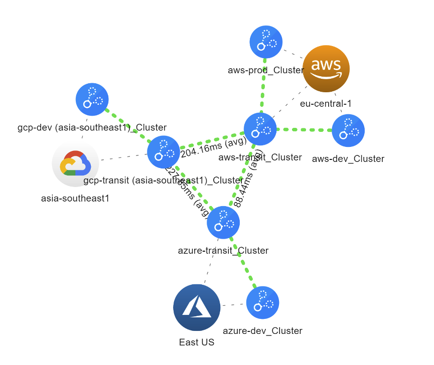

---
jupytext:
  formats: md:myst
  text_representation:
    extension: .md
    format_name: myst
kernelspec:
  display_name: Terraform
  language: terraform
  name: terraform
---

# Lab C

## Create VPCs/VNets and deploy Aviatrix gateways

## Exercise C.1 – Deploy the AWS transit VPC and Transit Gateway

In this exercise we will use the individual resources in our Terraform provider to [create a VPC](https://registry.terraform.io/providers/AviatrixSystems/aviatrix/latest/docs/resources/aviatrix_vpc) as well as an [Aviatrix transit gateway](https://registry.terraform.io/providers/AviatrixSystems/aviatrix/latest/docs/resources/aviatrix_transit_gateway). Use the settings below and use the resource documentation to create the resources in the “main.tf” file.

|                   |                     |
| ----------------- | ------------------- |
| Argument          | Value               |
| Name              | aws-transit         |
| Region            | eu-central-1        |
| CIDR              | 10.`[pod#]`.40.0/23 |
| Account           | aws-account         |
| Firenet VPC       | true                |
| Instance Size     | t2.micro            |
| Connected transit | true                |

Spoiler code: (make sure to adjust the CIDR for the VPC to your lab CIDR):

---

```{code-cell} terraform
:tags: [hide-cell]
resource "aviatrix_vpc" "aws_vpc" {
    cloud_type           = 1
    account_name         = "aws-account"
    region               = "eu-central-1"
    name                 = "aws-transit"
    cidr                 = "10.50.40.0/23"
    aviatrix_firenet_vpc = true
  }

  resource "aviatrix_transit_gateway" "aws_transit_gateway" {
    cloud_type        = 1
    account_name      = "aws-account"
    gw_name           = "aws-transit"
    vpc_id            = aviatrix_vpc.aws_vpc.vpc_id
    vpc_reg           = "eu-central-1"
    gw_size           = "t2.micro"
    subnet            = aviatrix_vpc.aws_vpc.public_subnets[0].cidr
    connected_transit = true
  }
```

---

Next, run a `terraform apply` to execute the changes. Review the plan and then type yes to confirm and execute the changes.

As you can see, we can deploy this building block through the Terraform resources of the Aviatrix provider. However, we still had to link some things together, figure out specific details, like cloud_type and when deploying a more advanced transit with HA or Firenet, we have a whole lot more things to do. This is why for these common patterns, we have of the shelf building blocks, called modules. For the next exercise we will use those.

## Exercise C.2 – Redeploy the AWS transit with the mc-transit module

In order to remove the transit we’ve build in exercise B.1, delete the aviatrix_vpc and aviatrix_transit_gateway resources from the “main.tf” file, and run a “terraform apply” again. You should see in the plan that everything gets deleted and confirm to execute this changes.

Next, have a look at the [Aviatrix mc-transit module](https://registry.terraform.io/modules/terraform-aviatrix-modules/mc-transit/aviatrix/latest/examples/azure_ha) on the Terraform Registry. Use this module (v2.3.0), with the examples provided, to achieve the same result as before. Make sure to deploy an HA cluster this time! Let the instance size be automatically determined by the module. As we are inserting this module, we need to execute a `terraform init` first, before we can apply. This allows Terraform to download the module.

Spoiler code:

---

```{code-cell} terraform
:tags: [hide-cell]
  module "aws_transit" {
    source  = "terraform-aviatrix-modules/mc-transit/aviatrix"
    version = "2.3.0"

    name    = "aws-transit"
    cloud   = "aws"
    region  = "eu-central-1"
    cidr    = "10.50.40.0/23"
    account = "aws-account"
  }
```

---

As you can see, that was quite easy. The modules are opinionated. Meaning they have certain settings that are considered best practice enabled by default. As such we didn’t have to do anything in addition to make HA work, nor did we have to manually add connected transit as an option. When using the modules, you will mostly get the desired result without having to provide a lot of optional arguments.

## Exercise C.3 – Deploy GCP transit

Use the information below to deploy the GCP transit in the same way. Make sure to execute `terraform init` again before you run `terraform apply`.

|          |                     |
| -------- | ------------------- |
| Argument | Value               |
| Name     | gcp-transit         |
| Region   | asia-southeast1     |
| CIDR     | 10.`[pod#]`.60.0/23 |
| Account  | gcp-account         |

Spoiler code:

---

```{code-cell} terraform
:tags: [hide-cell]
module "gcp_transit" {
  source  = "terraform-aviatrix-modules/mc-transit/aviatrix"
  version = "2.3.0"

  name    = "gcp-transit"
  cloud   = "gcp"
  region  = "asia-southeast1"
  cidr    = "10.50.60.0/23"
  account = "gcp-account"
}
```

---

Isn’t the resemblance between the AWS and GCP deployment striking? Despite the fact that these clouds differ greatly, the modules and Aviatrix platform have made code reusability between cloud platforms a breeze.

## Exercise C.4 – Peering the transits

Right now, the transits are disconnected from each other as you can see in CoPilot. Let’s create our full-mesh peering between these 3 transits. Use the [transit peering](https://registry.terraform.io/providers/AviatrixSystems/aviatrix/latest/docs/resources/aviatrix_transit_gateway_peering) resource to accomplish this. Check the transit module documentation to find the output for the transit gateway’s name. For the Azure transit, check the [documentation for the aviatrix_transit_gateway resource](https://registry.terraform.io/providers/AviatrixSystems/aviatrix/latest/docs/resources/aviatrix_transit_gateway), as that is how we imported it. After applying the change, check the topology view in CoPilot.

If you’re having trouble, check the spoiler code:

---

```{code-cell} terraform
:tags: [hide-cell]
resource "aviatrix_transit_gateway_peering" "aws_azure" {
  transit_gateway_name1 = module.aws_transit.transit_gateway.gw_name
  transit_gateway_name2 = aviatrix_transit_gateway.azure_transit.gw_name
}

resource "aviatrix_transit_gateway_peering" "gcp_azure" {
  transit_gateway_name1 = module.gcp_transit.transit_gateway.gw_name
  transit_gateway_name2 = aviatrix_transit_gateway.azure_transit.gw_name
}

resource "aviatrix_transit_gateway_peering" "aws_gcp" {
  transit_gateway_name1 = module.aws_transit.transit_gateway.gw_name
  transit_gateway_name2 = module.gcp_transit.transit_gateway.gw_name
}
```

---

Now, with 3 transits, this is easy. However, each transit we add, requires us to add he previous amount of transit gateways in peerings, to achieve a full mesh. To make life easier for that use case, we have another module available. The [mc-transit-peering module](https://registry.terraform.io/modules/terraform-aviatrix-modules/mc-transit-peering/aviatrix/latest). Delete the transit peerings we’ve just created and run `terraform apply` again to remove them.

Recreate the peerings with the [peering module](https://registry.terraform.io/modules/terraform-aviatrix-modules/mc-transit-peering/aviatrix/latest).

Spoiler code:

---

```{code-cell} terraform
:tags: [hide-cell]
module "transit_peering" {
  source  = "terraform-aviatrix-modules/mc-transit-peering/aviatrix"
  version = "1.0.8"

  transit_gateways = [
    module.aws_transit.transit_gateway.gw_name,
    module.gcp_transit.transit_gateway.gw_name,
    aviatrix_transit_gateway.azure_transit.gw_name,
  ]
}
```

---

## Exercise C.5 Deploy and connect the spokes

In this lab, we’re going to be deploying the spoke gateways in existing VPC’s and VNET, as is not uncommon in a real world scenario. In order to do so, we need to collect some information on these VPC’s (ID’s and subnets). As these VPC’s were created by the controller, we can use the [aviatrix_vpc data source](https://registry.terraform.io/providers/AviatrixSystems/aviatrix/latest/docs/data-sources/aviatrix_vpc) to query these attributes! Set up your data sources to gather all VPC details (aws-dev, aws-prod, azure-dev and gcp-dev).

Spoiler code:

---

```{code-cell} terraform
:tags: [hide-cell]
data "aviatrix_vpc" "aws_dev" {
  name = "aws-dev"
}

data "aviatrix_vpc" "aws_prod" {
  name = "aws-prod"
}

data "aviatrix_vpc" "azure_dev" {
  name = "azure-dev"
}

data "aviatrix_vpc" "gcp_dev" {
  name = "gcp-dev"
}
```

---

Now that we have all VPC details, we can deploy the spoke gateways. Deploy the spoke gateways using the [MC-Spoke module](https://registry.terraform.io/modules/terraform-aviatrix-modules/mc-spoke/aviatrix/latest/examples/aws_existing_vpc_spoke) v1.4.1 and the settings below (hint, look at the examples for how to use with existing VPC’s). Make sure to deploy a non-ha gateway (to save some time). Since we are bringing in new modules, make sure to execute a “terraform init” before you apply.

Tip: look at your state file and find the VPC data sources. Look at what attributes you can leverage as inputs to configure the spoke module. The gw subnets we are using, are the first entry in public_subnets, except in GCP, where we just use the first entry of subnets.

|              |                      |
| ------------ | -------------------- |
| **Argument** | **Value**            |
| Name         | aws-dev              |
| Region       | eu-central-1         |
| Gw Subnet    | 10.`[pod#]`.43.48/28 |
| Account      | aws-account          |
| Ha_gw        | False                |
| Transit GW   | aws-transit          |

|              |                      |
| ------------ | -------------------- |
| **Argument** | **Value**            |
| Name         | aws-prod             |
| Region       | eu-central-1         |
| Gw Subnet    | 10.`[pod#]`.42.48/28 |
| Account      | aws-account          |
| Ha_gw        | False                |
| Transit GW   | aws-transit          |

|              |                     |
| ------------ | ------------------- |
| **Argument** | **Value**           |
| Name         | azure-dev           |
| Region       | East US             |
| Gw Subnet    | 10.`[pod#]`.53.0/28 |
| Account      | azure-account       |
| Ha_gw        | False               |
| Transit GW   | azure-transit       |

|              |                     |
| ------------ | ------------------- |
| **Argument** | **Value**           |
| Name         | gcp-dev             |
| Region       | eu-central-1        |
| Gw Subnet    | 10.`[pod#]`.62.0/24 |
| Account      | aws-account         |
| Ha_gw        | False               |
| Transit GW   | gcp-transit         |

Spoiler code:

---

```{code-cell} terraform
:tags: [hide-cell]
module "aws_dev" {
  source  = "terraform-aviatrix-modules/mc-spoke/aviatrix"
  version = "1.4.1"

  cloud            = "AWS"
  name             = "aws-dev"
  region           = data.aviatrix_vpc.aws_dev.region
  account          = "aws-account"
  ha_gw            = false
  transit_gw       = module.aws_transit.transit_gateway.gw_name
  use_existing_vpc = true
  vpc_id           = data.aviatrix_vpc.aws_dev.vpc_id
  gw_subnet        = data.aviatrix_vpc.aws_dev.public_subnets[0].cidr
}

module "aws_prod" {
  source  = "terraform-aviatrix-modules/mc-spoke/aviatrix"
  version = "1.4.1"

  cloud            = "AWS"
  name             = "aws-prod"
  region           = data.aviatrix_vpc.aws_prod.region
  account          = "aws-account"
  ha_gw            = false
  transit_gw       = module.aws_transit.transit_gateway.gw_name
  use_existing_vpc = true
  vpc_id           = data.aviatrix_vpc.aws_prod.vpc_id
  gw_subnet        = data.aviatrix_vpc.aws_prod.public_subnets[0].cidr
}

module "azure_dev" {
  source  = "terraform-aviatrix-modules/mc-spoke/aviatrix"
  version = "1.4.1"

  cloud            = "Azure"
  name             = "azure-dev"
  region           = data.aviatrix_vpc.azure_dev.region
  account          = "azure-account"
  ha_gw            = false
  transit_gw       = aviatrix_transit_gateway.azure_transit.gw_name
  use_existing_vpc = true
  vpc_id           = data.aviatrix_vpc.azure_dev.vpc_id
  gw_subnet        = data.aviatrix_vpc.azure_dev.public_subnets[0].cidr
}

module "gcp_dev" {
  source  = "terraform-aviatrix-modules/mc-spoke/aviatrix"
  version = "1.4.1"

  cloud            = "GCP"
  name             = "gcp-dev"
  region           = data.aviatrix_vpc.gcp_dev.region
  account          = "gcp-account"
  ha_gw            = false
  transit_gw       = module.gcp_transit.transit_gateway.gw_name
  use_existing_vpc = true
  vpc_id           = data.aviatrix_vpc.gcp_dev.vpc_id
  gw_subnet        = data.aviatrix_vpc.gcp_dev.subnets[0].cidr
}
```

---

At this point, all cloud resources should be connected and able to communicate with one another. Check the topology map in CoPilot and make sure all VPC’s are connected to the right transit as per diagram below.


_Fig. Completed Topology_
